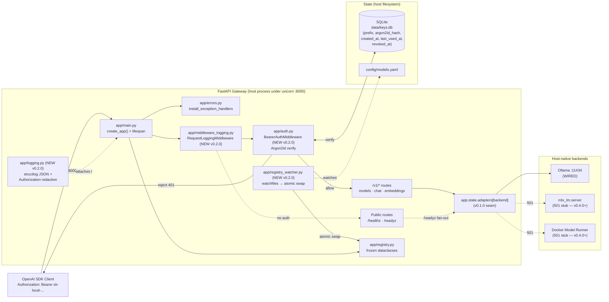
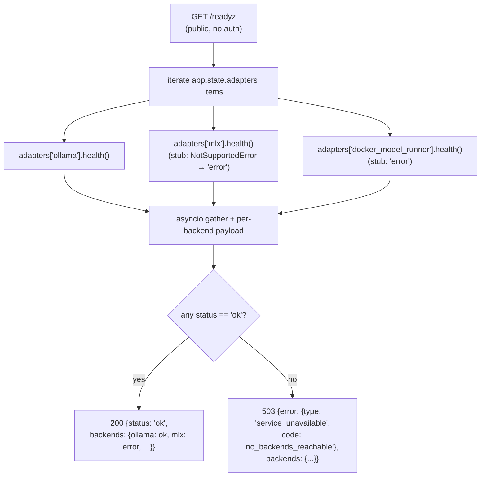
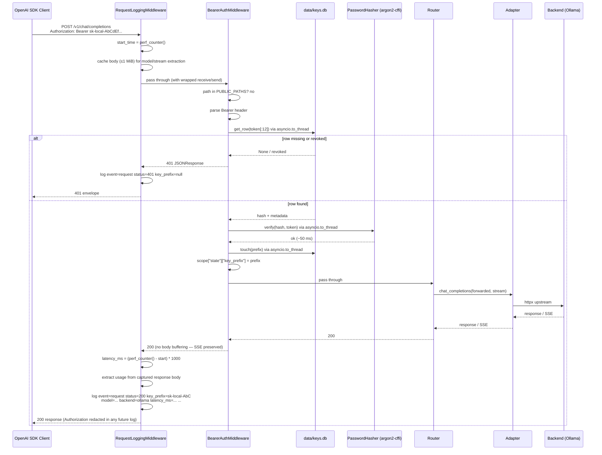
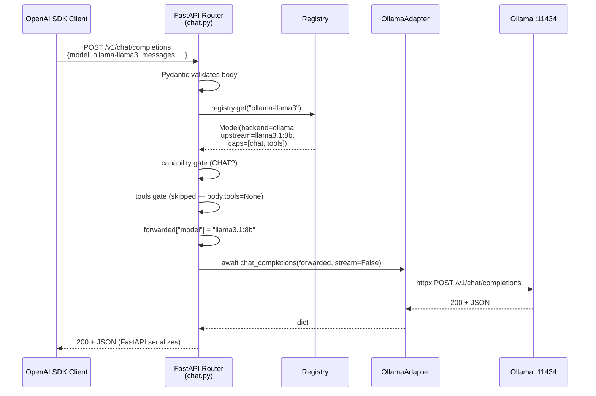
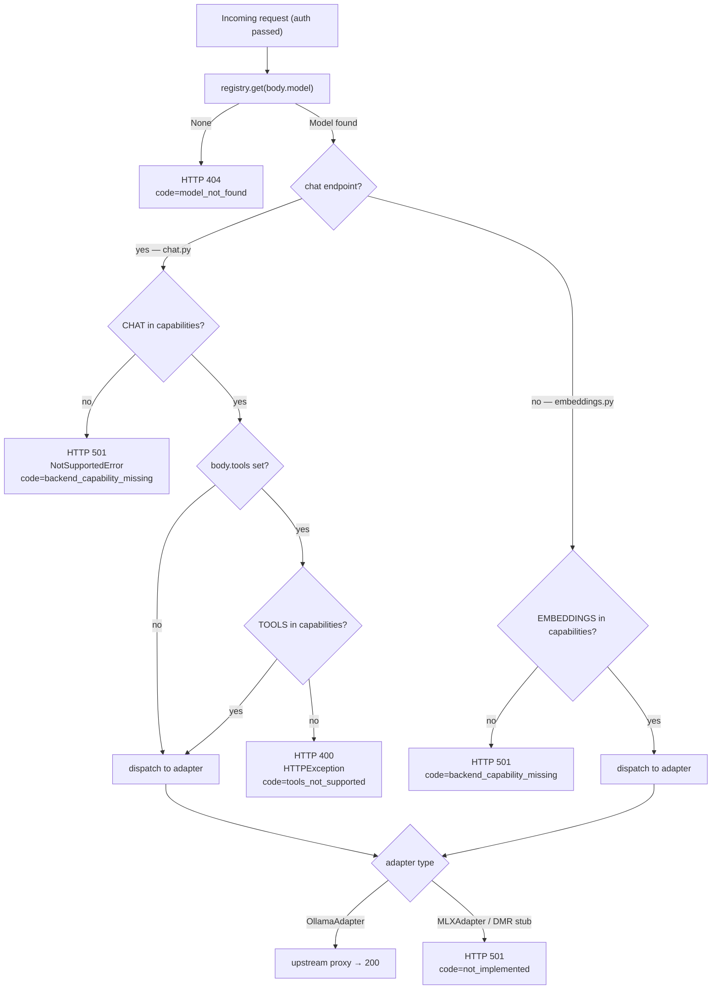

# Architecture

**Project**: local-ai-server
**Version**: v0.2.0

> **Changed in v0.2.0**: this document now reflects the v0.2.0
> auth + observability layer on top of the v0.1.0 baseline.
> The v0.1.0 baseline diagram and components are preserved below; new
> in v0.2.0 are `BearerAuthMiddleware`, `RequestLoggingMiddleware`,
> `app/logging.py` (structlog), `app/registry_watcher.py` (watchfiles
> hot-reload), and the `GET /readyz` route.

This document is the public-facing summary of how `local-ai-server`
v0.2.0 is built. For version-level scope and architecture history, see:

- [`v0.1.0-scope-and-architecture.md`](v0.1.0-scope-and-architecture.md)
  - first gateway slice: ABC, registry, OpenAI-compatible routers,
  Ollama adapter, SSE passthrough, and 501 stubs.
- [`v0.2.0-scope-and-architecture.md`](v0.2.0-scope-and-architecture.md)
  - auth foundation, SQLite key store, Argon2id verification,
  structlog, request logging, `/readyz`, and registry hot-reload.

The long-term v1 design (Caddy, TLS, container/Compose, host-side
Makefile, real MLX / Docker Model Runner adapters) lives in
[`spec.md`](spec.md).

---

## System overview

v0.2.0 is a single FastAPI process under uvicorn that proxies
OpenAI-shaped HTTP requests to local LLM backends. The Ollama backend
is wired end-to-end; MLX and Docker Model Runner are stubbed at
HTTP 501 to lock the routing seam for future versions. v0.2.0 layers
bearer-token authentication, structured JSON logging with
`Authorization` redaction, a per-backend readiness probe, and
filesystem-driven registry hot-reload on top of that baseline.



---

## Components

### Gateway entry point (`app/main.py`)

`uv run uvicorn app.main:app` boots the FastAPI app built by
`create_app()` (`app/main.py:70-95`). The factory wires four layers
in this order (Starlette's `add_middleware` is LIFO at request time —
see the install-order section below):

1. `install_exception_handlers(app)` — registers the v0.1.0
   exception handlers (`HTTPException`, `NotSupportedError`,
   `RequestValidationError`, catch-all).
2. `app.add_middleware(RequestLoggingMiddleware)` — added first,
   ends up **outermost** at request time.
3. `app.add_middleware(BearerAuthMiddleware, keys_db_path=...)` —
   added second, ends up **inside** RequestLogging.
4. Routers: `health` (no prefix), `models`/`chat`/`embeddings`
   under `/v1`.

The lifespan (`app/main.py:22-67`) configures structlog at the
requested level, loads the registry, builds adapters, stashes them
on `app.state`, starts the registry-watcher task, and on shutdown
cancels the watcher and closes every adapter.

### `BearerAuthMiddleware` (`app/auth.py`) — NEW in v0.2.0

A pure ASGI middleware (not a `BaseHTTPMiddleware` subclass — that
would buffer the response body and break SSE streaming). Responsibility:

- Non-`http` scopes (lifespan, websocket) pass through unguarded.
- Paths in `PUBLIC_PATHS` (`/healthz`, `/readyz`, `/docs`,
  `/openapi.json`, `/redoc`) pass through unguarded. Exact-string
  match only.
- Other paths require an `Authorization: Bearer <token>` header.
  The bearer regex (`_BEARER_RE`) is case-insensitive on the
  scheme.
- The first 12 characters of the token form the prefix; the
  middleware looks it up in `data/keys.db` via
  `asyncio.to_thread(get_row, ...)`. Missing or revoked → 401.
- Argon2id verify via `asyncio.to_thread(_HASHER.verify, ...)`
  (`_HASHER` is a module-level `argon2.PasswordHasher()`). Mismatch
  or any verification error → 401.
- Successful verify touches `last_used_at` and writes
  `scope["state"]["key_prefix"] = prefix` for the logging middleware
  to read.

All five 401 paths emit the same OpenAI envelope shape (only the
`message` field varies). See the API reference for the verbatim JSON.

### `RequestLoggingMiddleware` (`app/middleware_logging.py`) — NEW in v0.2.0

Pure ASGI middleware. Emits exactly one structured log line per HTTP
request, with `event="request"`. Body capture is bounded
(`_MAX_CACHED_BODY = 1 MiB`, `_MAX_CAPTURED_RESPONSE = 256 KiB`) to
keep memory predictable; for `POST /v1/chat/completions` and
`POST /v1/embeddings` the middleware reads the body once and replays
it to the downstream router via a single-shot replay-receive shim
so the router still sees an unconsumed body.

`latency_ms` is measured around the full inner chain — because the
logging middleware is outermost, it includes the Argon2id verify
cost (~50 ms on default parameters) in the reported latency.

For streaming responses, the middleware retains only the most recent
non-empty SSE chunk and parses it post-hoc for an upstream `usage`
block. When upstream does not emit one (Ollama's behavior is
version-dependent), `prompt_tokens` and `completion_tokens` are
emitted as JSON `null` — the gateway never synthesizes counts.

The middleware never raises from its own logic; the final
`_log.info(...)` is wrapped in a defense-in-depth try/except that
falls back to a stdlib `logging.getLogger(...).error(...)` call on
any structlog failure.

### structlog wiring (`app/logging.py`) — NEW in v0.2.0

`configure_structlog(level)` (`app/logging.py:78-128`) sets up:

- A shared processor chain: `merge_contextvars`, `add_log_level`,
  `TimeStamper(fmt="iso", utc=True, key="ts")`,
  `EventRenamer(to="event")`, `redact_authorization`.
- structlog's renderer chain ending in
  `ProcessorFormatter.wrap_for_formatter` so stdlib `logging` records
  flow through the same processors.
- A stdlib bridge: the root `logging.Logger` gets a single
  `StreamHandler(sys.stdout)` whose formatter is
  `structlog.stdlib.ProcessorFormatter(foreign_pre_chain=shared_processors, processors=[remove_processors_meta, JSONRenderer()])`.

Net effect: existing `logging.getLogger("app.errors").error(...)`
and similar stdlib call sites in `app/auth.py`, `app/errors.py`, and
`app/adapters/ollama.py` continue to work and emit JSON automatically
via the bridge. New code uses `structlog.get_logger(__name__)`
directly.

#### `Authorization` redaction processor

`redact_authorization` (`app/logging.py:32-75`) runs last in the
shared chain so it sees the final event_dict. Two rules in a single
pass over the top-level keys:

1. **Key match (case-insensitive)** — any key whose lowercase form
   is `"authorization"` has its value scrubbed via `_scrub()`.
2. **Value match** — any string value starting with `Bearer `
   (case-insensitive scheme) is scrubbed regardless of its key.

`_scrub(value)` returns `<redacted: sk-local-XXX>` when a 12-char
prefix is extractable, else `<redacted>`. Nested dicts and lists
are **not** walked — top-level only. This is a documented v0.2.0
limitation; current call sites do not log nested header dicts.

### Registry hot-reload (`app/registry_watcher.py`) — NEW in v0.2.0

`start_registry_watcher(app, settings)` schedules an `asyncio.Task`
that iterates `watchfiles.awatch(MODELS_YAML_PATH, recursive=False)`.
Any change event triggers `_try_reload()`, which:

- Calls `load_registry(path)` (synchronous; no `to_thread` — the
  YAML is small).
- On `FileNotFoundError`, `RegistryError`, or any other exception:
  emits `event="registry_reload_failed"` with a `reason`
  discriminator and keeps the previous registry live. The watcher
  itself does not crash.
- On success: performs the atomic swap (see below) and emits
  `event="registry_reloaded"` (or `"registry_reloaded_unchanged"`
  when ids are unchanged byte-for-byte).

The watcher is cancelled in the lifespan shutdown; `CancelledError`
propagates through `awatch`'s async iterator and is swallowed at the
lifespan boundary.

**Locked v0.2.0 limitation**: the watcher does NOT call
`build_adapters(...)`. Adding/editing/removing models that target an
*existing* backend (`ollama`) works without restart. Adding a model
with a NEW backend type that wasn't present at startup would
`KeyError` on the next request to that model. Real MLX / Docker
Model Runner adapter implementations and adapter rebuild on
hot-reload both land in v0.4.0+.

### `/readyz` route (`app/routers/health.py`) — NEW in v0.2.0

Public endpoint. Fans out over `app.state.adapters` via
`asyncio.gather(*adapter.health() for ..., return_exceptions=True)`,
aggregates per-backend payloads into
`{"backends": {<name>: <payload-or-error>}}`, and decides the HTTP
status:

- 200 with `{"status": "ok", "backends": {...}}` if at least one
  backend payload contains `status == "ok"`.
- 503 with the OpenAI envelope (`type=service_unavailable`,
  `code=no_backends_reachable`) plus a top-level `backends`
  extension otherwise.

The aggregation is binary: there is no `"degraded"` intermediate
state. The 503 response's `error` block matches the OpenAI envelope
shape exactly; the `backends` key is a v0.2.0 extension for ops
debugging and is ignored by SDK clients.

### Routers, registry, adapters, schemas, error handling (v0.1.0 baseline)

These layers are unchanged from v0.1.0:

| Module | Endpoint | Responsibility |
|---|---|---|
| `app/routers/health.py` | `GET /healthz` (+ `/readyz` new in v0.2.0) | Liveness/readiness only. No auth. |
| `app/routers/models.py` | `GET /v1/models` | Emits the registry as an OpenAI list. |
| `app/routers/chat.py` | `POST /v1/chat/completions` | Capability + tools gating; non-stream JSON or SSE streaming. |
| `app/routers/embeddings.py` | `POST /v1/embeddings` | Capability gating; forwards to adapter. |

`app/registry.py` parses `config/models.yaml` into immutable, frozen
`Model` and `Registry` dataclasses. `app/adapters/base.py` defines
`BackendAdapter` ABC + `NotSupportedError`. `OllamaAdapter` is wired;
`MLXAdapter` and `DockerModelRunnerAdapter` are 501 stubs.
`app/schemas.py` provides Pydantic v2 mirrors of OpenAI v1 shapes
(`extra="allow"`). `app/errors.py` provides `make_error()` and
four exception handlers.

---

## Middleware install order

The order in `create_app()` is **load-bearing** and worth pinning
explicitly. In Starlette, `add_middleware` is LIFO at request time:
the middleware added LAST wraps closest to the app. Exception
handlers wrap outside all middleware.

Install order (per `app/main.py:82-90`):

1. `install_exception_handlers(app)`
2. `app.add_middleware(RequestLoggingMiddleware)`
3. `app.add_middleware(BearerAuthMiddleware, keys_db_path=...)`
4. `app.include_router(...)` × 4

Execution order on a request (outer → inner):

```
client
  → exception handler stack          (outermost wrap; only fires on raise)
  → RequestLoggingMiddleware         (outermost middleware; starts the timer)
  → BearerAuthMiddleware             (inner middleware; verifies token)
  → router                           (application logic)
  → BearerAuthMiddleware             (touches last_used_at; sets key_prefix)
  → RequestLoggingMiddleware         (stops the timer; emits the log line)
  → exception handler stack
  → client
```

Two consequences worth calling out:

- **`latency_ms` includes auth verify time.** The logging middleware
  starts its timer before auth runs.
- **`key_prefix` is bound by the time logging reads it.** The
  logging middleware reads `scope["state"]["key_prefix"]` in its
  FINALLY block, after auth has populated it. This means even a 422
  validation failure on a `/v1/*` route carries `key_prefix` in its
  log line (auth ran first, then validation rejected).

A 401 emitted by `BearerAuthMiddleware` itself returns directly via
`JSONResponse(401, ...)` without going through the exception handler
stack — but it still flows through `RequestLoggingMiddleware` (which
records `status=401` in the log line) on the way out.

---

## Key store (SQLite)

**Path**: `KEYS_DB_PATH` (default `./data/keys.db`; gitignored).

**Schema** (per `app/auth.py:39-56`; matches spec §7.2 verbatim):

```sql
CREATE TABLE IF NOT EXISTS api_keys (
  prefix       TEXT PRIMARY KEY,        -- first 12 chars of plaintext token
  hash         TEXT NOT NULL,           -- Argon2id encoded form (full string)
  name         TEXT,                    -- human-readable label
  created_at   INTEGER NOT NULL,        -- Unix epoch seconds
  last_used_at INTEGER,
  revoked_at   INTEGER
);
```

The schema is idempotently created by `_init_db()` (called at the top
of every key-store helper) so the file and parent directory bootstrap
on first run.

**Helpers** (`app/auth.py`):

- `insert(db_path, *, prefix, hash_, name)` — `INSERT` row;
  `created_at = int(time.time())`; raises `sqlite3.IntegrityError`
  on prefix collision.
- `get_row(db_path, prefix) -> KeyRow | None` — `SELECT`; returns
  `None` on no match.
- `touch(db_path, prefix)` — `UPDATE` `last_used_at`; silent on
  missing row.
- `revoke(db_path, prefix) -> bool` — `UPDATE` `revoked_at` `WHERE
  prefix = ? AND revoked_at IS NULL`; returns `True` iff a row was
  updated. Idempotent (a second call against the same prefix
  returns `False`).

**Connection lifecycle**: each helper opens its own short-lived
`sqlite3.Connection` (no pool). Rationale: keys.db is low-traffic;
Argon2 verify (~50 ms) dwarfs SQLite's open-cost (<1 ms). The auth
middleware wraps each helper call in `asyncio.to_thread(...)` so the
synchronous `sqlite3` access doesn't block the event loop.

**Argon2id verify discipline**: `_HASHER = PasswordHasher()` is
instantiated once at module import (stateless and thread-safe for
`verify()`). Library defaults are kept (`time_cost=2`,
`memory_cost=65536`, `parallelism=8` as of `argon2-cffi` 23.1) —
above OWASP's current recommended minimums. Verify cost is
~50 ms per request on default parameters; this is a deliberate
per-request budget, not a hot-loop primitive.

---

## Hot-reload swap discipline

The hot-reload contract is whole-instance reference swap, never
in-place mutation. From `app/registry_watcher.py:106-110`:

```python
old_registry = cast(Registry, app.state.registry)
app.state.registry = new_registry
```

Python attribute assignment is one `STORE_ATTR` bytecode op against
the underlying `dict.__setitem__` of `app.state.__dict__`. Under the
GIL this is atomic relative to concurrent `LOAD_ATTR` reads.

```mermaid
sequenceDiagram
    participant FS as filesystem
    participant W as watchfiles task
    participant State as app.state
    participant Req as in-flight request

    Note over W: started in lifespan startup;<br/>cancelled in lifespan shutdown
    Req->>State: enter handler — snapshot reg = app.state.registry
    FS->>W: change event on config/models.yaml
    W->>W: load_registry(path) → new_reg
    alt parse failure
        W->>W: log registry_reload_failed; keep current registry
    else parse ok
        W->>State: app.state.registry = new_reg (atomic ref swap)
    end
    Req->>Req: continues with old reg (no torn read)
    Note over Req: subsequent requests see new_reg
```

Routers read `request.app.state.registry` once at handler entry and
hold the reference for the rest of the request. The `Registry`
dataclass is `frozen=True, slots=True` so even a long-held reference
cannot be mutated by a concurrent reload. Torn reads are impossible.

**What works without restart**: adding, editing, or removing a model
whose `backend` is already represented in `app.state.adapters`.

**What requires a restart**: adding a model with a `backend` value
that was not in the registry at startup (e.g., the first-ever `mlx`
entry on a deployment that booted with only Ollama models). The
watcher does not rebuild adapters in v0.2.0.

---

## `/readyz` aggregation rules



Per-backend payload shapes:

| Adapter outcome | Payload under `backends[name]` |
|---|---|
| `OllamaAdapter.health()` returns `{"status": "ok", "models": [...]}` | echoed verbatim |
| `OllamaAdapter.health()` returns `{"status": "unreachable", "error": "..."}` | echoed verbatim (httpx errors are caught inside the adapter and translated to this shape) |
| `MLXAdapter.health()` raises `NotSupportedError(...)` | `{"status": "error", "error": "NotSupportedError: ..."}` |
| `DockerModelRunnerAdapter.health()` raises `NotSupportedError(...)` | `{"status": "error", "error": "NotSupportedError: ..."}` |
| Future adapter returns a non-dict | `{"status": "error", "error": "unexpected health() return type: <type>"}` |

The aggregation is binary by design. There is no
`"status": "degraded"` value at the top level when some backends are
up and others are down — graceful degradation is the operational
default, and the per-backend `backends` map already conveys the
fine-grained state.

---

## Authenticated request sequence



---

## Request lifecycle (v0.1.0 baseline, preserved)

### Non-streaming chat



### Capability and tools gating



### Streaming implementation contract (unchanged from v0.1.0)

Three rules keep the SSE path correct:

1. **Use `aiter_raw()`, not `aiter_lines()`.** Line buffering breaks
   UTF-8 mid-token.
2. **Pass through `data: [DONE]\n\n` verbatim.** The terminator is
   forwarded from Ollama; the gateway never synthesizes it.
3. **Return an async iterator without awaiting it first.** The
   adapter's streaming branch yields bytes through an
   `async with self._client.stream(...)` block; cancel-safety
   ensures the upstream connection closes when the client
   disconnects.

`RequestLoggingMiddleware`'s response-body capture treats streaming
responses specially (retains only the most recent non-empty chunk
for post-hoc `usage` parsing) so streaming is **not** buffered for
the client — chunks reach the client as they arrive.

---

## Lifespan

`app/main.py:22-67` implements the lifespan context manager. The
v0.2.0 sequence is:

1. **Startup** — `get_settings()` loads env vars + `config/.env`;
   `configure_structlog(settings.log_level)` replaces stdlib
   `basicConfig`; `structlog.get_logger("app.main")` is the local
   logger.
2. **Registry load** — `load_registry(settings.models_yaml_path)`
   parses `config/models.yaml`. A `RegistryError` here fails the
   boot fast.
3. **Adapter factory** — `build_adapters(registry, settings)`
   constructs one adapter per distinct backend referenced by the
   registry.
4. **State stash** — `app.state.registry`, `app.state.settings`,
   and `app.state.adapters` are set.
5. **Startup log** — `log.info("registry_loaded", n_models=...,
   ids=..., adapters=...)` (was a stdlib f-string in v0.1.0;
   rewritten as a structlog event in v0.2.0).
6. **Watcher start** — `start_registry_watcher(app, settings)`
   schedules the background watcher task.
7. **Yield** — uvicorn accepts requests.
8. **Shutdown** — `watcher_task.cancel()` then awaited (swallowing
   `CancelledError`); then every adapter's `close()` via
   `asyncio.gather(..., return_exceptions=True)`; failures logged
   at `WARNING` level. Final `log.info("gateway_shutdown_complete")`.

---

## Configuration

| File | Purpose |
|---|---|
| `config/models.yaml` | Model registry. Watched in v0.2.0 — edits are picked up within ~1s without restart. |
| `config/.env.example` | Template env file. Copy to `config/.env` to override defaults. |
| `pyproject.toml` | uv-managed runtime + dev deps + pytest config. v0.2.0 deps: `argon2-cffi`, `structlog`, `watchfiles`. |
| `ruff.toml` | Line-length 79, format quote-style, exclude list. |

Environment variables (loaded by `app/config.py:8-44`):

| Variable | Default | Purpose |
|---|---|---|
| `GATEWAY_HOST` | `127.0.0.1` | uvicorn bind host. v0.2.0 still binds loopback only. |
| `GATEWAY_PORT` | `8000` | uvicorn bind port. |
| `MODELS_YAML_PATH` | `config/models.yaml` | Path to registry YAML. Watched by `watchfiles` in v0.2.0. |
| `LOG_LEVEL` | `INFO` | Log level fed to `configure_structlog(...)`. |
| `OLLAMA_BASE_URL` | `http://localhost:11434` | Upstream Ollama URL. |
| **`KEYS_DB_PATH`** | `./data/keys.db` | **NEW in v0.2.0.** SQLite path for the API-key store. |

`CORS_ORIGINS` and `LAN_IP` are documented in [`spec.md`](spec.md)
but defer to v0.3.0 when Caddy lands.

---

## Infrastructure

v0.2.0 runs as a **plain host process** under
`uv run uvicorn app.main:app`. There is no Docker image, no Compose
file, no Caddy, and no TLS. The gateway binds to `127.0.0.1:8000`
by default.

State on the host filesystem:

- `data/keys.db` — SQLite key store, created by
  `scripts/generate_api_key.py` on first run; gitignored.
- `config/models.yaml` — registry source; watched.

The dev container under `.devcontainer/` is unchanged; the runtime
deps are mirrored into `docker/requirements.txt` so `import fastapi`,
`import argon2`, `import structlog`, `import watchfiles`, and
`pytest` work inside the dev container without a separate venv.

The full v1 design (Dockerfile.gateway, compose.yaml, Caddy with
`tls internal` on a LAN IP, host-side Makefile) lands in v0.3.0 and
v0.4.0+ — see the version roadmap in the [README](../README.md).

---

## Design decisions

| Decision | Choice | Rationale |
|---|---|---|
| Auth scheme | Bearer `sk-local-...` + 32 urlsafe bytes; Argon2id hash | Spec §7.1 — matches OpenAI's bearer pattern so SDKs work unchanged; Argon2id is the OWASP-current default. |
| Key store backend | SQLite at `KEYS_DB_PATH` (default `./data/keys.db`) | Single-file, no service to run; perfect for low-volume key checks. Container path move lands in v0.3.0 with Compose. |
| Auth middleware kind | Pure ASGI (not `BaseHTTPMiddleware`) | `BaseHTTPMiddleware` buffers the response body, breaking SSE streaming on `/v1/chat/completions`. |
| Verify per request | Argon2id `verify()` (~50 ms) is fine in the auth path | Per-request gate, not a hot-loop primitive. Documented as a budget; future caching is a deliberate choice. |
| Middleware install order | exception handlers → `RequestLoggingMiddleware` → `BearerAuthMiddleware` → routers | Logging is OUTER so `latency_ms` includes auth; logging reads `key_prefix` in its FINALLY block after auth populates it. |
| Public-path allowlist | `/healthz`, `/readyz`, `/docs`, `/openapi.json`, `/redoc` (exact match) | Health is operational; OpenAPI docs are convenient for dev. Exact match avoids `/healthz/anything` traversal. |
| 401 envelope | `type=invalid_request_error`, `code=invalid_api_key`, `param=Authorization` | Matches OpenAI's documented 401 shape so SDK retry/backoff logic treats it identically to upstream OpenAI. |
| Identical message for unknown vs revoked | Both emit `"Invalid API key"` | OWASP guidance: do not reveal whether a prefix exists. |
| Logging stack | `structlog` JSON renderer + stdlib bridge | Single source of truth for redaction; existing stdlib `logging.getLogger` call sites keep working unchanged. |
| Output stream | `sys.stdout` | Spec §8 mandates stdout; matches uvicorn's own access log stream. |
| Authorization redaction | Top-level event_dict; key-match + value-match; preserves 12-char prefix | Defense-in-depth at the renderer. Nested dicts/lists are not walked in v0.2.0 (documented limitation). |
| Streaming token capture | Best-effort parse of last SSE chunk; `null` when upstream omits `usage` | Locked punt. Gateway never synthesizes or estimates counts. |
| `/readyz` aggregation | Binary: 200 if any backend `ok`, 503 only if none | Spec §4.4. No `"degraded"` intermediate state. |
| `/readyz` 503 envelope extension | OpenAI envelope under `error` + top-level `backends` map for ops | SDKs ignore unknown top-level keys; ops gain per-backend visibility. |
| Hot-reload swap | `app.state.registry = new_reg` (whole-instance ref swap) | Single STORE_ATTR is atomic under the GIL; routers snapshot the reference at handler entry. |
| Hot-reload scope | Models targeting existing backends only | Adding a NEW backend type requires restart in v0.2.0. Documented limitation; adapter rebuild lands in v0.4.0+. |
| Reload failure handling | Log `event="registry_reload_failed"` with `reason` discriminator; keep previous registry | Watcher errors never bring down the app. |
| Test isolation for auth | Temp SQLite via `temp_keys_db` fixture; Argon2 test params (~1 ms verify) | Production keys never touched; suite stays fast. |
| Caddy / TLS / Compose | Still deferred to v0.3.0 | v0.2.0 is auth + observability only. |
| Real MLX / DMR adapters | Still deferred to v0.4.0+ | The 501 stubs already exercise the `/readyz` `"error"` payload path. |

---

## Adapter contract (unchanged from v0.1.0)

Every concrete adapter implements `BackendAdapter`
(`app/adapters/base.py`):

```python
class BackendAdapter(ABC):
    name: str
    base_url: str

    async def chat_completions(
        self, body: dict[str, Any], stream: bool
    ) -> dict[str, Any] | AsyncIterator[bytes]: ...

    async def embeddings(self, body: dict[str, Any]) -> dict[str, Any]: ...

    async def health(self) -> dict[str, Any]: ...

    async def close(self) -> None: ...
```

**Error translation contract**:

- Raising `NotSupportedError` is the documented way to signal "this
  operation isn't available on this backend". The handler in
  `app/errors.py` translates it into a 501 with the OpenAI envelope.
- Any other exception bubbles up to the catch-all 500 handler.

**`health()` non-raising contract**:

`OllamaAdapter.health()` catches `httpx.RequestError` and
`httpx.HTTPStatusError` and returns
`{"status": "unreachable", "error": ...}` instead of raising. This
lets `/readyz` aggregate adapter health without try/except at every
call site. The MLX and DMR stub `health()` methods DO raise
`NotSupportedError`; the `/readyz` route catches via
`asyncio.gather(return_exceptions=True)` and maps to
`{"status": "error", "error": "NotSupportedError: ..."}`.

---

## Extension points (v0.3.0+)

| Seam | Where it lands | Future work |
|---|---|---|
| **Caddy + TLS + Compose** | New `caddy/Caddyfile`, `compose.yaml`, `docker/Dockerfile.gateway` | v0.3.0; the gateway gains a published port behind Caddy on the LAN IP only. The key store path moves to `/var/lib/local-ai-server/keys.db`. |
| **CORS** | `app/main.py:create_app` | v0.3.0 wires `CORS_ORIGINS` (default deny). |
| **Real MLX adapter** | `app/adapters/mlx.py` | v0.4.0 replaces the stub with a real `httpx.AsyncClient` against `mlx_lm.server`. The `build_adapters` factory may also need to re-key by model id rather than by backend to support multiple MLX processes on different ports. |
| **Real Docker Model Runner adapter** | `app/adapters/docker_model_runner.py` | Same shape as MLX. |
| **Adapter rebuild on hot-reload** | `app/registry_watcher.py:_try_reload` | v0.4.0 — required once MLX/DMR become real and a new backend can be added via YAML edit. |
| **Per-key rate limits / quotas** | `BearerAuthMiddleware` or a downstream middleware | Post-v1. Hooks into `KeyRow` are already in place. |
| **Prometheus metrics endpoint** | New `app/routers/metrics.py` | Post-v1. |
| **MLX tool-call normalization** | `app/adapters/mlx.py` | Post-v1 (spec §15). |
