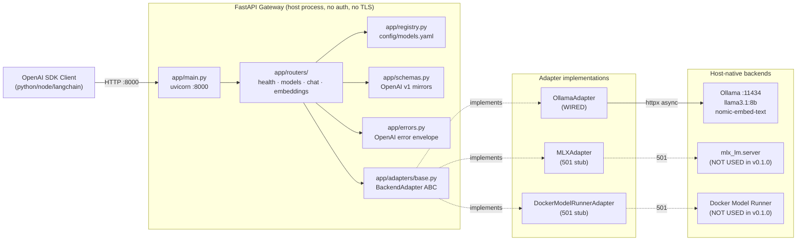
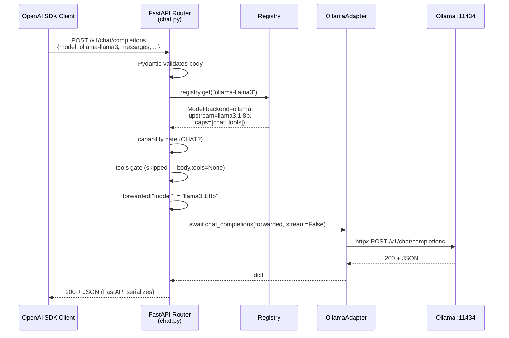
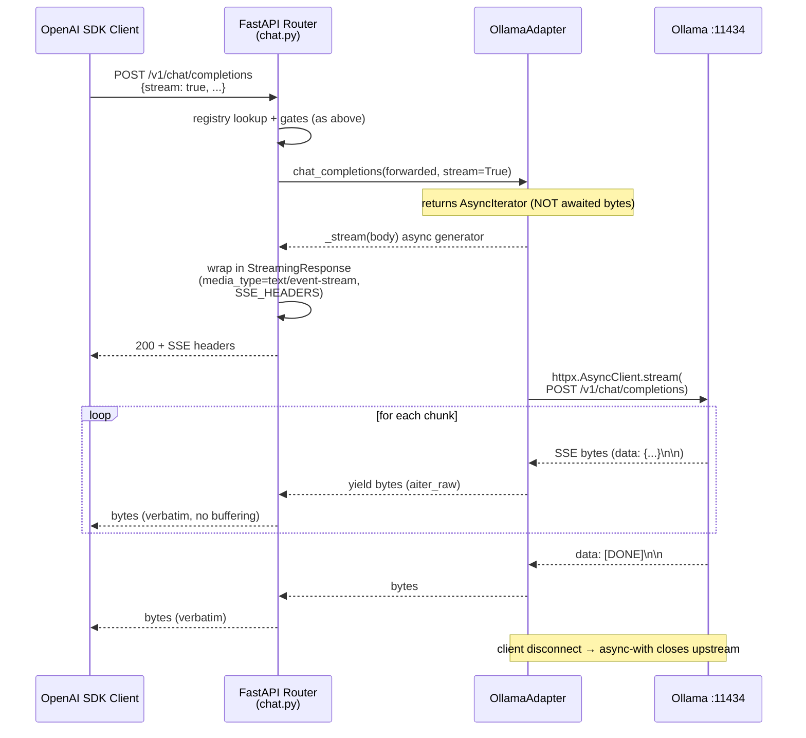
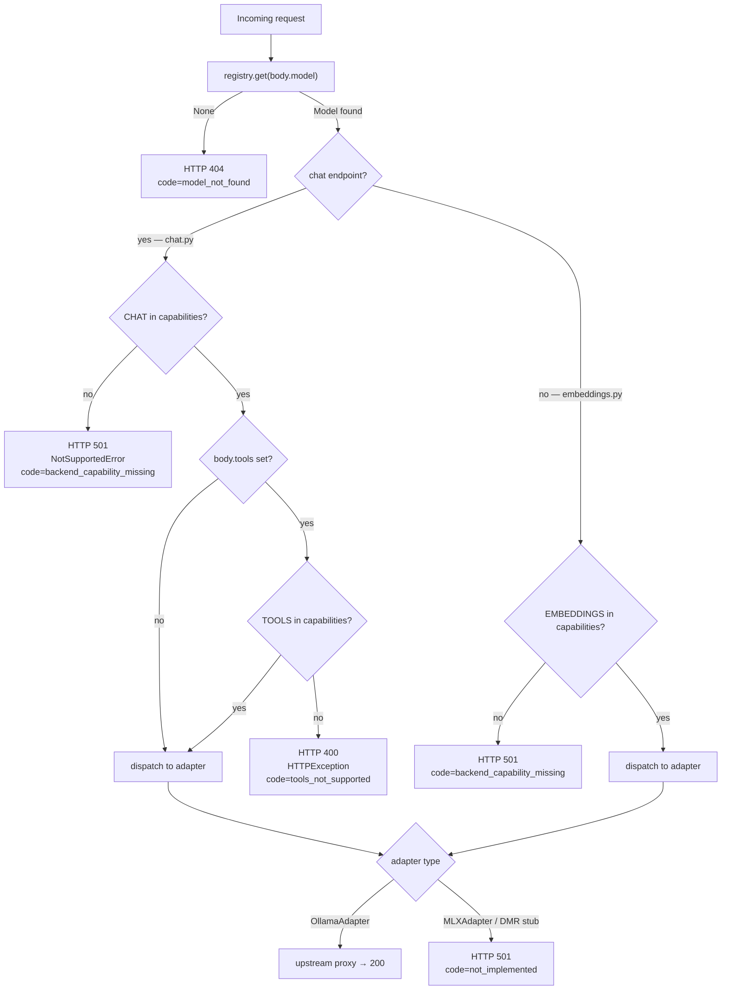

# Architecture

This document is the public-facing summary of how `local-ai-server`
v0.1.0 is built. For the deeper module-by-module specification, see
the phase architecture documents:

- `pm/v0_1_0/phase-1-architecture.md` — skeleton: ABC, registry,
  schemas, error envelope, lifespan.
- `pm/v0_1_0/phase-2-architecture.md` — endpoints: wired Ollama
  adapter, the three `/v1` routers, the adapter factory.
- `pm/v0_1_0/phase-3-architecture.md` — tests, dev-container deps,
  README, ruff/`.gitignore` housekeeping.

The long-term v1 design (auth, Caddy, TLS, container/Compose,
host-side Makefile) lives in [`spec.md`](spec.md).

---

## System overview

v0.1.0 is a single FastAPI process that proxies OpenAI-shaped HTTP
requests to local LLM backends. Only the Ollama backend is wired
end-to-end; MLX and Docker Model Runner are stubbed at HTTP 501 to
lock the routing seam for future versions.



---

## Components

### Gateway (`app/main.py`)

Entry point for `uvicorn app.main:app`. Builds the FastAPI app via
`create_app()` (`app/main.py:57-73`), installs exception handlers,
mounts the routers, and runs the lifespan. Mounts `health_router`
without a prefix and the three `/v1` routers under `/v1`.

### Routers (`app/routers/`)

| Module | Endpoint | Responsibility |
|---|---|---|
| `health.py` | `GET /healthz` | Liveness only. No auth, no upstream pings. |
| `models.py` | `GET /v1/models` | Emits the registry as an OpenAI list. |
| `chat.py` | `POST /v1/chat/completions` | Capability + tools gating; non-stream JSON or SSE streaming. |
| `embeddings.py` | `POST /v1/embeddings` | Capability gating; forwards to adapter. |

Routers read `request.app.state.registry` and
`request.app.state.adapters`, both populated during lifespan startup.

### Registry (`app/registry.py`)

Parses `config/models.yaml` into immutable, frozen `Model` and
`Registry` dataclasses. One-shot load at lifespan startup; no
hot-reload in v0.1.0 (lands in v0.2.0 with `watchfiles`). Provides
O(1) `get(model_id)` lookup. Validation rejects malformed YAML,
duplicate ids, missing required fields, and unknown capabilities,
all surfaced as `RegistryError` with path-prefixed messages
(`models[N]: ...`).

### Adapter layer (`app/adapters/`)

`BackendAdapter` ABC (`app/adapters/base.py:27-70`) defines the
contract: `chat_completions`, `embeddings`, `health`, and `close`.
Three concrete classes implement it:

- `OllamaAdapter` — wired; owns a long-lived `httpx.AsyncClient`.
- `MLXAdapter` — stub; every method raises `NotSupportedError`.
- `DockerModelRunnerAdapter` — stub; every method raises
  `NotSupportedError`.

The `build_adapters` factory (`app/adapters/__init__.py:15-48`)
constructs one adapter per distinct backend in the registry,
honoring per-model `base_url` overrides.

### Error handling (`app/errors.py`)

`make_error()` produces the OpenAI envelope dict. Four exception
handlers translate exceptions into envelope responses:

| Handler | Triggers on | Status |
|---|---|---|
| `http_exception_handler` | `HTTPException` (400 tools-gate, 404 model-not-found) | matches `exc.status_code` |
| `not_supported_handler` | `NotSupportedError` from any adapter or capability gate | 501 |
| `validation_exception_handler` | `RequestValidationError` from Pydantic | 422 |
| `unhandled_exception_handler` | catch-all for everything else | 500 |

The catch-all is registered last; order matters in Starlette
(`app/errors.py:138-153`).

### Schemas (`app/schemas.py`)

Pydantic v2 mirrors of OpenAI v1 wire shapes. All inherit from
`_OpenAIModel` (`app/schemas.py:6-10`), which sets
`extra="allow"` so unknown vendor fields pass through unchanged.

---

## Request lifecycle

### Non-streaming chat



### Streaming chat



### Capability and tools gating

The decision graph below is locked by tests in
`tests/test_chat.py` and `tests/test_embeddings.py`. The capability
gate always fires before the tools gate.



---

## Lifespan

`app/main.py:17-54` implements the lifespan context manager. The
sequence is:

1. **Startup** — `get_settings()` loads env vars + `config/.env`;
   stdlib logging is configured at the requested level.
2. **Registry load** — `load_registry(settings.models_yaml_path)`
   parses `config/models.yaml`. A `RegistryError` here fails the
   boot fast — uvicorn does not start.
3. **Adapter factory** — `build_adapters(registry, settings)`
   constructs one adapter per distinct backend referenced by the
   registry. The factory's `base_url` resolution rules (in priority
   order):
   1. First registry `model.base_url` non-None for that backend.
   2. `settings.ollama_base_url` if backend is `ollama`.
   3. The adapter class's hard-coded `__init__` default.
   An unknown backend string raises `ValueError`, also failing boot.
4. **State stash** — `app.state.registry`, `app.state.settings`, and
   `app.state.adapters` are set. Routers read them via
   `request.app.state.<name>`.
5. **Yield** — uvicorn accepts requests.
6. **Shutdown** — every adapter's `close()` is awaited via
   `asyncio.gather(..., return_exceptions=True)`. Failures are
   logged at WARNING; one adapter's failure doesn't block the others.

---

## Streaming implementation contract

The streaming path is the most subtle part of v0.1.0. Three rules
keep it correct:

1. **Use `aiter_raw()`, not `aiter_lines()`.** Line buffering breaks
   UTF-8 mid-token; multi-byte characters split across TCP reads
   would corrupt the output. See `app/adapters/ollama.py:50-67`.
2. **Pass through `data: [DONE]\n\n` verbatim.** The terminator is
   forwarded from Ollama; the gateway never synthesizes it. SDK
   clients depend on this exact byte sequence to detect end-of-stream.
3. **Return an async iterator without awaiting it first.** The
   adapter's streaming branch returns `self._stream(body)` (an
   async generator), not the result of `await self._stream(body)`.
   The router's `await adapter.chat_completions(...)` unwraps the
   coroutine and yields the iterator, which is then consumed by
   `StreamingResponse`. Entering the upstream stream's context
   manager inside the generator is critical: the
   `async with self._client.stream(...)` block runs its exit
   handler when the consumer disconnects, closing the upstream
   connection cleanly.

The `try/finally` around `async with` in `_stream` is the
documented cancel-safety seam: when `StreamingResponse` is cancelled
(client disconnects mid-stream), `GeneratorExit` propagates through
the generator, the `async with` exit runs, and the upstream
`Response` is closed. No upstream connection is leaked.

The router adds three SSE headers
(`app/routers/chat.py:9-13`) to defeat upstream/middlebox buffering:

```
Cache-Control: no-cache
X-Accel-Buffering: no
Connection: keep-alive
```

---

## Adapter contract

Every concrete adapter implements `BackendAdapter`
(`app/adapters/base.py:27-70`):

```python
class BackendAdapter(ABC):
    name: str
    base_url: str

    async def chat_completions(
        self, body: dict, stream: bool
    ) -> dict | AsyncIterator[bytes]: ...

    async def embeddings(self, body: dict) -> dict: ...

    async def health(self) -> dict: ...

    async def close(self) -> None: ...
```

**Error translation contract:**

- Raising `NotSupportedError` (`app/adapters/base.py:5-24`) is the
  documented way to signal "this operation isn't available on this
  backend". The handler in `app/errors.py:83-93` translates it into
  a 501 with the OpenAI envelope, populating the envelope's
  `param`, `code`, and `message` from the exception fields.
- Any other exception bubbles up to the catch-all 500 handler,
  which logs the traceback at ERROR level and returns a generic
  `internal_error` envelope.

**`close()` contract:**

- Adapters that own resources (Ollama owns an `httpx.AsyncClient`)
  override `close()` to release them.
- Stub adapters use the default no-op.
- `close()` must be idempotent — the lifespan's `asyncio.gather`
  may call it multiple times across edge cases.

**`health()` non-raising contract:**

`OllamaAdapter.health()` (`app/adapters/ollama.py:76-93`) catches
`httpx.RequestError` and `httpx.HTTPStatusError` and returns a
`{"status": "unreachable", "error": ...}` shape instead of raising.
This lets a future `/readyz` aggregate adapter health without
try/except at every call site. The MLX and DMR stub `health()`
methods do raise — `/readyz` would have to special-case them, which
v0.2.0 will do when the route lands.

---

## Configuration

| File | Purpose |
|---|---|
| `config/models.yaml` | Model registry (4 sample entries). Required at lifespan startup. |
| `config/.env.example` | Template env file. Copy to `config/.env` to override defaults. |
| `pyproject.toml` | uv-managed runtime + dev deps + pytest config. |
| `ruff.toml` | Line-length 79, format quote-style, exclude list. |

Environment variables (loaded by `app/config.py:8-34`):

| Variable | Default | Purpose |
|---|---|---|
| `GATEWAY_HOST` | `127.0.0.1` | uvicorn bind host. |
| `GATEWAY_PORT` | `8000` | uvicorn bind port. |
| `MODELS_YAML_PATH` | `config/models.yaml` | Path to registry YAML. |
| `LOG_LEVEL` | `INFO` | stdlib logging level. |
| `OLLAMA_BASE_URL` | `http://localhost:11434` | Upstream Ollama URL. |

---

## Infrastructure

v0.1.0 runs as a **plain host process** under
`uv run uvicorn app.main:app`. There is no Docker image, no Compose
file, no Caddy, no TLS, and no auth. The gateway binds to
`127.0.0.1:8000` by default.

The dev container under `.devcontainer/` is unchanged; the runtime
deps are mirrored into `docker/requirements.txt` so `import fastapi`,
`import httpx`, and `pytest` work inside the dev container without
a separate venv.

The full v1 design includes:
- A `Dockerfile.gateway` for the runtime image.
- A `compose.yaml` running the gateway and a Caddy reverse proxy.
- TLS via Caddy `tls internal`, bound to a LAN IP only.
- API-key auth (Argon2id + SQLite).
- A host `Makefile` to manage native Ollama / MLX / Docker Model
  Runner processes (Compose can't reach host-native processes on
  Mac, and MLX has no Linux wheels — see
  [`spec.md`](spec.md) §1 for the architecture rationale).

These all land in v0.2.0, v0.3.0, and v0.4.0+ — see the version
roadmap in the [README](../README.md).

---

## Design decisions

| Decision | Choice | Rationale |
|---|---|---|
| Adapter pattern | `BackendAdapter` ABC + 3 concrete classes (1 wired, 2 stubs) | Locks the routing seam early so v0.4.0+ can fill in MLX / DMR without touching routers. |
| OpenAI compatibility | Mirror v1 wire shapes verbatim with `extra="allow"` | SDK clients work unchanged; vendor extensions pass through. |
| SSE streaming | `httpx.stream()` + `aiter_raw()` + try/finally | Line buffering breaks UTF-8 mid-token; cancel-safety prevents upstream connection leaks. |
| Error envelope | OpenAI-compatible `{"error": {...}}` | SDK retry/backoff treats our errors normally. |
| Hot-reload of `models.yaml` | Deferred to v0.2.0 | Keeps dependency surface tight (no `watchfiles`); registry is read once at startup in v0.1.0. |
| Auth | Deferred to v0.2.0 | Validating the OpenAI seam and routing layer is higher priority. |
| Caddy / TLS / Compose | Deferred to v0.3.0 | Host-process iteration is faster during the early build-out. |
| Logging | stdlib `logging` only | `structlog` lands in v0.2.0 with auth observability. |
| Test strategy | Live integration against real Ollama | Mocking the SSE/streaming path would mask the bugs the test suite is designed to catch. |
| Stub adapter testing | `pytest-httpx` mocks for the rare offline check | Stubs raise immediately; the offline `health()` test is the only place mocks are needed. |
| Tool-call surface | `supports_tools` boolean gate; HTTP 400 if violated | Cross-backend tool-call normalization is out of v1 scope. |

---

## Extension points (v0.2.0+)

The seams below are designed to absorb future versions without
disturbing the existing routes or adapters.

| Seam | Where it lands | Future work |
|---|---|---|
| **Auth middleware** | `app/main.py:create_app` after `install_exception_handlers` | v0.2.0 inserts an API-key middleware that authenticates `/v1/*` routes; `/healthz` and `/readyz` stay public. The Pydantic `Settings` already has space for `KEYS_DB_PATH` (commented out). |
| **`/readyz` route** | New `app/routers/health.py` route alongside `/healthz` | v0.2.0 aggregates `adapter.health()` from every entry in `app.state.adapters`. The non-raising contract on `OllamaAdapter.health()` makes the aggregator straightforward. |
| **Hot-reload of registry** | `app/main.py` lifespan `try: yield` block | v0.2.0 spawns a `watchfiles.awatch(...)` task that rebuilds `app.state.registry` (and rebuilds adapters via `build_adapters`) atomically on YAML changes. |
| **Real MLX adapter** | `app/adapters/mlx.py` | v0.4.0 replaces the stub with a real `httpx.AsyncClient` against `mlx_lm.server`; the ABC and the `MLXAdapter` constructor signature are stable. The `build_adapters` factory may also need to re-key by model id rather than by backend to support multiple MLX processes on different ports — see `phase-2-architecture.md` §13 row 3. |
| **Real Docker Model Runner adapter** | `app/adapters/docker_model_runner.py` | Same shape as MLX; the upstream lives at `model-runner.docker.internal/engines/v1` from inside a container (v0.3.0+), or at `localhost:12434/engines/v1` from the host. |
| **Structured JSON logging** | `app/main.py` lifespan, replacing `logging.basicConfig` | v0.2.0 swaps in `structlog`; per-request fields land per [`spec.md`](spec.md) §8. |
| **Caddy + TLS + Compose** | New `caddy/Caddyfile`, `compose.yaml`, `docker/Dockerfile.gateway` | v0.3.0; the gateway gains a published port behind Caddy on the LAN IP only. |

The `app.state.adapters` dict and the `BackendAdapter` ABC are the
two contracts that v0.4.0 will lean on hardest. Both are stable
across v0.1.0 changes; the adapter factory's "first non-None
`base_url` wins per backend" rule is the one explicit limitation
documented for revisit when MLX gets a real implementation.
