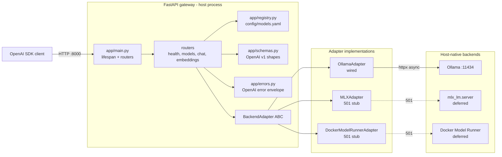

# local-ai-server v0.1.0 Scope and Architecture

**Status**: shipped 2026-06-18  
**Purpose**: first working vertical slice of the local AI gateway  
**Primary backend**: Ollama  
**Runtime shape**: host process under uvicorn, no auth, no Caddy, no Docker runtime

This document preserves the useful project memory from the retired
`pm/v0_1_0` folder. It is intended as future reference for what v0.1.0
was meant to prove and where its architecture boundaries were drawn.

## Version Scope

v0.1.0 established the baseline gateway: a FastAPI service that exposes
OpenAI-compatible HTTP endpoints and routes them to local model backends
through an adapter abstraction.

The release deliberately focused on one end-to-end path: OpenAI SDK
client -> FastAPI gateway -> Ollama -> OpenAI-shaped response. MLX and
Docker Model Runner were represented only as stubs so the routing seam
could be tested without committing to their implementations.

## In Scope

- FastAPI application skeleton with lifespan startup/shutdown.
- OpenAI-compatible endpoints:
  - `GET /v1/models`
  - `POST /v1/chat/completions`
  - `POST /v1/embeddings`
  - `GET /healthz`
- Ollama adapter wired for chat, streaming chat, embeddings, and health.
- `BackendAdapter` ABC plus concrete adapter classes for Ollama, MLX, and
  Docker Model Runner.
- MLX and Docker Model Runner adapters returning HTTP 501 via
  `NotSupportedError`.
- YAML model registry in `config/models.yaml`.
- Capability gating for chat, embeddings, and tools.
- OpenAI-compatible error envelope for gateway errors.
- Server-sent event passthrough for streaming chat.
- Live integration tests against a host-native Ollama process.
- Demo notebook for the v0.1.0 user-facing endpoint flow.

## Out of Scope

- API-key authentication.
- SQLite key store and key-management scripts.
- `/readyz`.
- Structured JSON logging.
- `watchfiles` hot-reload of `config/models.yaml`.
- Caddy, TLS, LAN binding, `compose.yaml`, and gateway Docker runtime.
- Real MLX and Docker Model Runner backend implementations.
- Host-side Makefile for backend lifecycle management.
- Rate limits, quotas, usage metering, and Prometheus metrics.

## Architecture Summary

v0.1.0 is a single FastAPI process that owns request validation,
registry lookup, capability checks, adapter dispatch, error translation,
and response passthrough.



## Request Flow

For chat and embeddings requests, the router validates the OpenAI-shaped
request body, looks up the logical model id in the registry, checks that
the requested capability is allowed, rewrites `model` to the upstream
backend model name, and dispatches to the adapter selected by
`model.backend`.

Streaming chat follows the same path, but the Ollama adapter returns an
async byte iterator backed by `httpx.AsyncClient.stream()`. The gateway
passes raw SSE bytes through to the client and preserves Ollama's
terminal `data: [DONE]\n\n` event.

## Core Components

| Component | Responsibility in v0.1.0 |
|---|---|
| `app/main.py` | Build the FastAPI app, load settings, load registry, build adapters, mount routers, and close adapters on shutdown. |
| `app/config.py` | Load gateway settings such as host, port, model registry path, log level, and Ollama URL. |
| `app/schemas.py` | Define Pydantic v2 request/response models that mirror OpenAI v1 shapes while allowing forward-compatible fields. |
| `app/errors.py` | Normalize HTTP, validation, backend capability, and unexpected errors into the OpenAI-style error envelope. |
| `app/registry.py` | Parse `config/models.yaml` into immutable model records and provide lookup by logical model id. |
| `app/routers/models.py` | Return registered models in OpenAI `list` response format. |
| `app/routers/chat.py` | Handle chat completions, tools gating, stream/non-stream dispatch, and model rewriting. |
| `app/routers/embeddings.py` | Handle embeddings requests with capability gating and model rewriting. |
| `app/routers/health.py` | Provide simple liveness via `GET /healthz`. |
| `app/adapters/base.py` | Define `BackendAdapter` and `NotSupportedError`. |
| `app/adapters/ollama.py` | Proxy OpenAI-compatible chat, streaming chat, embeddings, and model health calls to Ollama. |
| `app/adapters/mlx.py` | Placeholder implementation that raises `NotSupportedError`. |
| `app/adapters/docker_model_runner.py` | Placeholder implementation that raises `NotSupportedError`. |

## Adapter Contract

All backends implement the same gateway-facing contract:

```python
class BackendAdapter(ABC):
    name: str
    base_url: str

    @abstractmethod
    async def chat_completions(
        self, body: dict, stream: bool
    ) -> dict | AsyncIterator[bytes]: ...

    @abstractmethod
    async def embeddings(self, body: dict) -> dict: ...

    @abstractmethod
    async def health(self) -> dict: ...

    async def close(self) -> None: ...
```

This interface is the key v0.1.0 architecture seam. Routers know only
the adapter contract, not the details of Ollama, MLX, or Docker Model
Runner.

## Registry and Capability Model

`config/models.yaml` maps public model ids to backend-specific model
names and capabilities:

```yaml
models:
  - id: ollama-llama3
    backend: ollama
    upstream_model: llama3.1:8b
    capabilities: [chat, tools]
  - id: ollama-nomic-embed
    backend: ollama
    upstream_model: nomic-embed-text
    capabilities: [embeddings]
```

The registry supports three important decisions:

- Unknown model id -> HTTP 404 `model_not_found`.
- Endpoint capability missing -> HTTP 501 `backend_capability_missing`.
- `tools` supplied to a model without tool support -> HTTP 400
  `tools_not_supported`.

## Testing Strategy

v0.1.0 favored live integration coverage for the path that mattered most:
the Ollama path. Tests expected a local Ollama process with
`llama3.1:8b` and `nomic-embed-text` available. Stub adapters were tested
offline by asserting they raise `NotSupportedError` and surface as 501
responses through the routers.

Primary test areas:

- Registry parsing and lookup.
- `/v1/models` response shape.
- Non-streaming chat against Ollama.
- Streaming chat against Ollama, including `data: [DONE]`.
- Embeddings against Ollama.
- Capability and tools gating.
- Stub adapter 501 behavior.
- OpenAI-compatible error envelope.

## Architectural Decisions

- Use OpenAI-compatible upstream paths where possible, especially for
  Ollama, to keep adapters thin.
- Keep the gateway as a host process in this release to avoid mixing the
  first endpoint milestone with container and TLS work.
- Preserve SSE bytes exactly rather than parsing and reconstructing the
  stream.
- Represent future backends as stubs to validate routing and error
  behavior early.
- Keep authentication out of v0.1.0 so SDK compatibility and adapter
  routing could be proven first.

## Resulting Baseline for Later Versions

v0.1.0 left later versions with a working OpenAI-compatible gateway,
immutable model registry, backend adapter contract, Ollama integration,
error envelope, and endpoint test suite. v0.2.0 builds on that baseline
by adding auth, readiness, observability, and registry hot-reload without
changing the public `/v1/*` wire shapes.
