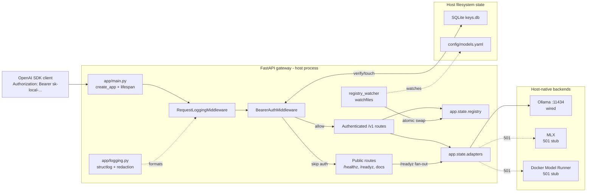

# local-ai-server v0.2.0 Scope and Architecture

**Status**: shipped 2026-06-19  
**Purpose**: authentication, readiness, observability, and registry reload
on top of the v0.1.0 gateway  
**Primary backend**: Ollama, with MLX and Docker Model Runner still stubbed  
**Runtime shape**: host process under uvicorn, authenticated `/v1/*`, no Caddy
or Docker runtime yet

This document preserves the useful project memory from the retired
`pm/v0_2_0` folder. It is intended as future reference for the scope and
architecture decisions added after the v0.1.0 baseline.

## Version Scope

v0.2.0 hardened the working OpenAI-compatible gateway for local LAN-style
use by adding API-key authentication, JSON request logging,
authorization redaction, a readiness endpoint, and hot-reload of the
model registry.

The release was additive: `/v1/models`, `/v1/chat/completions`, and
`/v1/embeddings` kept their OpenAI-compatible wire shapes. Existing
routing, capability gating, Ollama proxying, and stub adapter behavior
remained intact.

## In Scope

- Bearer API-key authentication on all `/v1/*` routes.
- Public unauthenticated paths for `/healthz`, `/readyz`, `/docs`,
  `/openapi.json`, and `/redoc`.
- Argon2id password hashing through `argon2-cffi`.
- SQLite key store at `KEYS_DB_PATH`, defaulting to `./data/keys.db`.
- Key mint and revoke CLIs:
  - `scripts/generate_api_key.py`
  - `scripts/revoke_api_key.py`
- OpenAI-compatible 401 envelope for missing, malformed, unknown, revoked,
  or mismatched keys.
- Structured JSON logging through `structlog`.
- Global top-level `Authorization` redaction.
- Per-request logging fields for model, backend, stream, status, latency,
  key prefix, and usage counts when available.
- Public `/readyz` that composes per-backend `health()` results.
- `watchfiles` hot-reload of `config/models.yaml` with atomic registry
  replacement.
- Type-checking cleanup with `mypy --strict`.
- Tests for auth, readiness, hot-reload, logging redaction, and the
  existing v0.1.0 endpoint behavior.
- Demo notebooks for auth and readiness/hot-reload flows.

## Out of Scope

- Caddy reverse proxy.
- TLS and LAN binding.
- Gateway runtime Docker image and `compose.yaml`.
- Real MLX adapter implementation.
- Real Docker Model Runner adapter implementation.
- Adapter rebuilds when hot-reload introduces a brand-new backend type.
- Per-key rate limits, quotas, expiration, usage metering, and Prometheus.
- Cross-backend tool-call normalization.

## Architecture Summary

v0.2.0 keeps the v0.1.0 router/registry/adapter architecture and adds
two ASGI middleware layers plus two lifecycle-managed services:
structured logging, bearer authentication, a registry watcher, and
readiness fan-out.



## Middleware and Request Order

`create_app()` installs exception handlers, then request logging, then
auth, then routers. At request time, the effective path is:

```text
client
  -> exception handler stack
  -> RequestLoggingMiddleware
  -> BearerAuthMiddleware
  -> router
  -> BearerAuthMiddleware
  -> RequestLoggingMiddleware
  -> exception handler stack
  -> client
```

Important consequences:

- `latency_ms` includes authentication verification time.
- Successful authenticated requests expose `scope["state"].key_prefix`
  for request logging.
- 401 responses generated by `BearerAuthMiddleware` still pass back
  through `RequestLoggingMiddleware`, so auth failures are logged.
- Middleware is implemented as pure ASGI middleware to avoid buffering or
  breaking streaming responses.

## Authentication Architecture

`app/auth.py` owns the bearer-token flow and key-store helpers.

Key format:

```text
sk-local-<urlsafe random token>
```

The first 12 characters are the visible key prefix and SQLite primary
key. The full plaintext is printed once by the generation script and is
never stored.

SQLite schema:

```sql
CREATE TABLE IF NOT EXISTS api_keys (
  prefix       TEXT PRIMARY KEY,
  hash         TEXT NOT NULL,
  name         TEXT,
  created_at   INTEGER NOT NULL,
  last_used_at INTEGER,
  revoked_at   INTEGER
);
```

Auth flow:

1. Skip non-HTTP scopes and public paths.
2. Parse `Authorization: Bearer <token>`.
3. Derive `prefix = token[:12]`.
4. Look up the prefix in SQLite.
5. Reject missing or revoked rows with 401.
6. Verify the full token against the Argon2id hash.
7. Reject mismatch or verification errors with 401.
8. Update `last_used_at`.
9. Store `key_prefix` in request state and continue to the router.

All auth failures share the OpenAI-style code `invalid_api_key` with
`param` set to `Authorization`.

## Observability Architecture

`app/logging.py` configures structlog and bridges stdlib logging into the
same JSON renderer. This lets older stdlib call sites and new structlog
call sites produce one consistent log format.

`RequestLoggingMiddleware` emits one request log event per HTTP request.
For chat and embeddings requests it reads the request body once, caches a
bounded copy, and replays it to the downstream router so model and stream
metadata can be logged without consuming the body.

Expected request fields:

```json
{
  "ts": "2026-06-19T10:11:12Z",
  "level": "info",
  "event": "request",
  "key_prefix": "sk-local-AbC",
  "model": "ollama-llama3",
  "backend": "ollama",
  "stream": true,
  "status": 200,
  "latency_ms": 1843,
  "prompt_tokens": null,
  "completion_tokens": null
}
```

Authorization redaction is top-level and conservative:

- Any event key named `authorization`, case-insensitive, is scrubbed.
- Any top-level string value beginning with `Bearer ` is scrubbed.
- If a token prefix can be extracted, the replacement includes only the
  prefix, for example `<redacted: sk-local-AbC>`.

Nested dictionaries and lists are not recursively walked in v0.2.0.

## Readiness Architecture

`GET /readyz` is public and uses the adapter health seam introduced in
v0.1.0. It calls every adapter's `health()` concurrently and builds a
per-backend response.

Response rules:

- Return 200 with `{"status": "ok", "backends": {...}}` if at least one
  backend reports `status == "ok"`.
- Return 503 with OpenAI-style code `no_backends_reachable` if no
  backend is reachable.
- Include a top-level `backends` map in both cases for operational
  debugging.
- Do not emit a top-level `degraded` state; partial backend failure is
  represented in the per-backend payloads.

This endpoint made the gateway useful for deployment and monitoring
without waiting for Caddy or containers.

## Registry Hot-Reload Architecture

`app/registry_watcher.py` starts an async `watchfiles` task during
FastAPI lifespan startup. It watches `MODELS_YAML_PATH`, reloads the YAML
on change, and replaces the whole registry object on success:

```python
app.state.registry = new_registry
```

The design relies on immutable registry dataclasses and whole-object
assignment. Request handlers read `request.app.state.registry` at handler
entry and keep that reference for the request lifetime. In-flight
requests therefore finish against the registry snapshot they started
with, while later requests see the new registry.

Failure behavior:

- Malformed YAML logs `registry_reload_failed`.
- Missing file or registry validation failure keeps the current registry
  live.
- The watcher itself does not crash the gateway on a bad save.

Known limitation:

- Adapters are built only at lifespan startup. Hot-reload can add, edit,
  or remove models for backends that already exist in `app.state.adapters`.
  Introducing a brand-new backend type requires a process restart.

## Core Components Added or Changed

| Component | Responsibility in v0.2.0 |
|---|---|
| `app/auth.py` | Bearer auth middleware, SQLite key helpers, Argon2id verification, key prefix state. |
| `app/logging.py` | structlog setup, stdlib bridge, JSON renderer, Authorization redaction. |
| `app/middleware_logging.py` | Request timing, bounded request/response capture, per-request structured log event. |
| `app/registry_watcher.py` | Background `watchfiles` task and atomic registry reload. |
| `app/routers/health.py` | Adds `GET /readyz` while preserving `GET /healthz`. |
| `app/main.py` | Starts structlog, loads registry, builds adapters, starts/stops registry watcher, mounts middleware. |
| `app/config.py` | Adds `KEYS_DB_PATH` and keeps existing gateway/backend settings. |
| `scripts/generate_api_key.py` | Creates the key store row and prints the plaintext API key once. |
| `scripts/revoke_api_key.py` | Revokes an existing key prefix by setting `revoked_at`. |
| `pyproject.toml` | Adds `argon2-cffi`, `structlog`, `watchfiles`, and mypy support. |

## Testing Strategy

v0.2.0 retained the v0.1.0 live-test approach for Ollama while adding
offline coverage for the new gateway infrastructure.

Primary test areas:

- Auth success and failure paths.
- Revoked and unknown keys.
- Public path bypass for `/healthz` and `/readyz`.
- SQLite key-store helpers.
- Request logging metadata and Authorization redaction.
- `/readyz` aggregation for reachable and unreachable backends.
- Registry hot-reload success and malformed-YAML failure behavior.
- Existing chat, streaming, embeddings, models, registry, and stub
  adapter behavior.
- `mypy --strict` and `ruff` checks.

## Architectural Decisions

- Keep v0.2.0 additive and preserve all v0.1.0 OpenAI wire shapes.
- Use pure ASGI middleware so streaming stays unbuffered.
- Store only Argon2id hashes; never persist plaintext API keys.
- Keep `/readyz` public because it is a service-health endpoint and is
  needed before auth credentials may be available.
- Treat malformed registry changes as operational warnings, not process
  failures.
- Defer Caddy, TLS, LAN binding, and runtime containers to v0.3.0 so the
  auth and observability layer could be stabilized first.

## Resulting Baseline for Later Versions

v0.2.0 leaves the project with an authenticated, observable local gateway
that still runs as a host process. The next architectural step is v0.3.0:
containerize the gateway, add Caddy/TLS, bind for LAN access, and keep
the host-native backend constraint intact.
