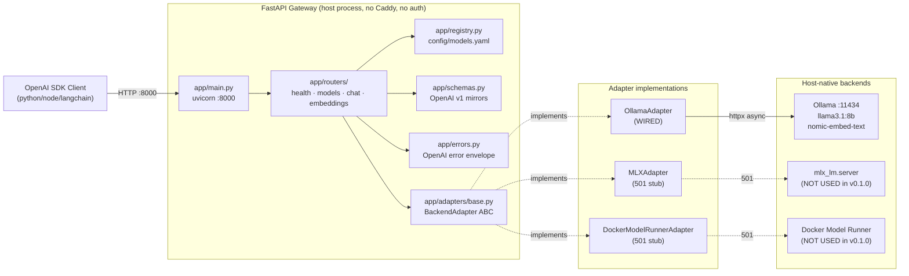
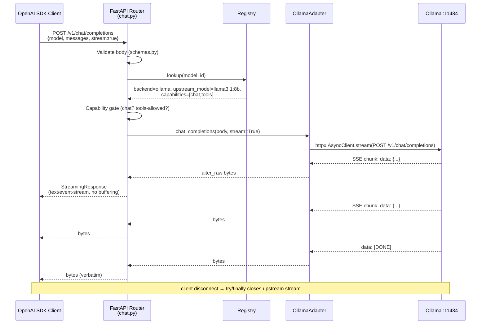
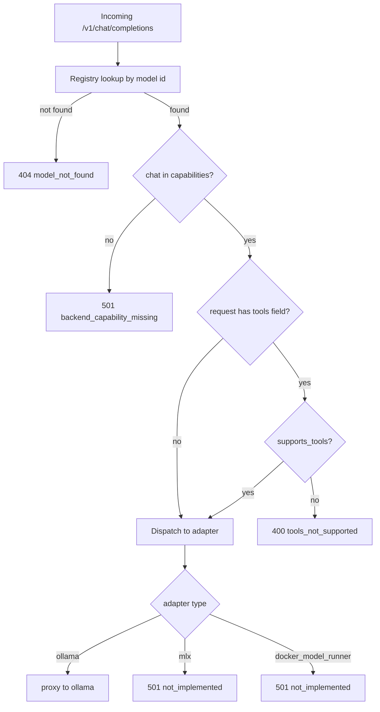
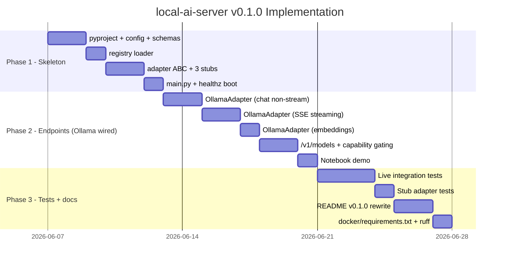

# local-ai-server v0.1.0 — Development Plan

## 1. Overview

**local-ai-server** is a home AI gateway running on a Mac Studio that exposes an **OpenAI-compatible HTTP API** and routes requests to local LLM backends. The full spec targets a TLS-fronted multi-backend service (Ollama + MLX + Docker Model Runner) with API-key auth, Caddy, and host-side process management. **v0.1.0** is the first vertical slice: a FastAPI gateway that wires the **Ollama** backend end-to-end via an `OpenAI` SDK, with `MLXAdapter` and `DockerModelRunnerAdapter` present as 501 stubs to lock the `BackendAdapter` ABC seam. No auth, no Caddy, no Compose, no Makefile in this version — those land in v0.2.0+. The aim is to prove OpenAI compatibility, the registry/adapter routing layer, and SSE streaming behavior against a real local Ollama process.

---

## 2. User Requirements

- **OpenAI compatibility**: Any OpenAI SDK client (Python, Node, LangChain) must work against the gateway with only `base_url` changed; v0.1.0 has no `api_key` requirement yet.
- **Single LAN endpoint**: One FastAPI service fans out to local backends; v0.1.0 wires Ollama only and stubs the rest at HTTP 501.
- **OpenAI v1 wire shapes**: Mirror request/response schemas verbatim — `GET /v1/models`, `POST /v1/chat/completions` (stream + non-stream), `POST /v1/embeddings`.
- **SSE streaming fidelity**: Pass through upstream `data: {json}\n\n` events including the terminal `data: [DONE]\n\n` verbatim; no buffering, no synthesizing.
- **Adapter pattern**: `BackendAdapter` ABC with concrete `OllamaAdapter` (wired), `MLXAdapter` (stub), `DockerModelRunnerAdapter` (stub). Stubs raise `NotSupportedError` translated to HTTP 501.
- **Capability gating**: `models.yaml` declares per-model capabilities (`chat`, `embeddings`, `tools`); embeddings call against a chat-only model returns HTTP 501; tools field against a non-`supports_tools` model returns HTTP 400 before backend dispatch.
- **Live integration tests**: Tests assume a real Ollama is running on the host with `llama3.1:8b` and `nomic-embed-text` pulled; pytest-httpx mocks are reserved for the trivial 501 stubs.
- **Tight dependency surface**: Python 3.12 + FastAPI + uvicorn + httpx + pydantic v2 + pydantic-settings + pyyaml + pytest stack only. `structlog` and `watchfiles` are deferred to v0.2.0.
- **OpenAI-compatible error envelope**: All errors emit `{"error": {"type", "message", "param", "code"}}`.
- **Notebook demo**: One Jupyter/Quarto notebook for the user-facing endpoints lands in phase 2.

---

## 3. Project Status

- [ ] Phase 1: Skeleton — pending
- [ ] Phase 2: Endpoints (Ollama wired) — pending
- [ ] Phase 3: Tests + docs — pending

---

## 4. Architecture

### 4.1 System Architecture (v0.1.0)



### 4.2 Chat Completions Sequence (streaming)



### 4.3 Capability Gating Decision Flow



---

## 5. Core Components

### 5.1 FastAPI Gateway

**Module**: `app/`

| Component | Responsibility |
|-----------|----------------|
| `app/main.py` | FastAPI app construction, lifespan (open/close httpx clients), router mounts. |
| `app/config.py` | `pydantic-settings` loader for `GATEWAY_HOST`, `GATEWAY_PORT`, `MODELS_YAML_PATH`, `LOG_LEVEL`. |
| `app/schemas.py` | Pydantic v2 mirrors of OpenAI v1 request/response shapes (`ChatCompletionRequest`, `EmbeddingsRequest`, `ModelsListResponse`, `ChatMessage`, etc.). |
| `app/errors.py` | OpenAI-compatible error envelope helper + FastAPI exception handlers. |
| `app/registry.py` | YAML loader, parses `config/models.yaml` into a typed `Registry` object; lookup by model id; **no hot-reload in v0.1.0**. |

### 5.2 Routers

**Module**: `app/routers/`

| Component | Responsibility |
|-----------|----------------|
| `app/routers/health.py` | `GET /healthz` — always 200 if process up. No `/readyz` in v0.1.0. |
| `app/routers/models.py` | `GET /v1/models` — emits `{"object":"list","data":[...]}` from the registry. |
| `app/routers/chat.py` | `POST /v1/chat/completions` — non-streaming (JSON) + streaming (SSE via `StreamingResponse`). Capability + tools gating before adapter dispatch. |
| `app/routers/embeddings.py` | `POST /v1/embeddings` — capability gate then adapter call. |

### 5.3 Adapter Layer

**Module**: `app/adapters/`

| Component | Responsibility |
|-----------|----------------|
| `app/adapters/base.py` | `BackendAdapter` ABC with `chat_completions`, `embeddings`, `health`, `close`; `NotSupportedError` exception. |
| `app/adapters/ollama.py` | **Fully wired** httpx async client to `http://localhost:11434/v1/...`; passthrough for chat (stream + non-stream) and embeddings; `aiter_raw()` for SSE per spec §5.3. |
| `app/adapters/mlx.py` | Stub: every method raises `NotSupportedError` → HTTP 501. |
| `app/adapters/docker_model_runner.py` | Stub: every method raises `NotSupportedError` → HTTP 501. |

**ABC contract** (lifted from spec §5.1):
```python
class BackendAdapter(ABC):
    name: str
    base_url: str

    @abstractmethod
    async def chat_completions(self, body: dict, stream: bool) -> Union[dict, AsyncIterator[bytes]]: ...

    @abstractmethod
    async def embeddings(self, body: dict) -> dict: ...

    @abstractmethod
    async def health(self) -> dict: ...

    async def close(self) -> None: ...
```

### 5.4 Configuration

**Module**: `config/`

| Component | Responsibility |
|-----------|----------------|
| `config/models.yaml` | Sample registry: `ollama-llama3` (chat+tools), `ollama-nomic-embed` (embeddings), plus stub-only entries for `mlx-mistral` and `model-runner-llama32` to exercise the 501 path. |
| `config/.env.example` | Template env file (gateway host/port, models.yaml path, log level). |

### 5.5 Tests

**Module**: `tests/`

| Component | Responsibility |
|-----------|----------------|
| `tests/conftest.py` | Shared fixtures: `TestClient`, registry under test, async fixtures. |
| `tests/test_registry.py` | Yaml parse, lookup, capability flags. |
| `tests/test_models_endpoint.py` | `GET /v1/models` shape. |
| `tests/test_chat.py` | Non-streaming chat against live Ollama. |
| `tests/test_chat_streaming.py` | Streaming chat against live Ollama (assert `data: [DONE]` arrives). |
| `tests/test_embeddings.py` | Embeddings against live Ollama. |
| `tests/adapters/test_ollama_adapter.py` | Live calls to `localhost:11434`. |
| `tests/adapters/test_mlx_adapter.py` | Asserts every method raises `NotSupportedError` / yields 501. |
| `tests/adapters/test_docker_model_runner_adapter.py` | Asserts every method raises `NotSupportedError` / yields 501. |

### 5.6 Notebook (phase 2 only)

**Module**: `posts/` (existing folder)

| Component | Responsibility |
|-----------|----------------|
| `posts/v0_1_0_demo.ipynb` (or `.qmd`) | End-to-end demo using the `openai` SDK against `http://localhost:8000/v1`: list models, non-stream chat, stream chat, embeddings. |

---

## 6. Infrastructure

v0.1.0 runs as a **plain host process** under `uv run uvicorn`. There is no Docker image, no Compose file, no Caddy, and no auth.

- **Runtime host**: macOS (Mac Studio); Python 3.12 via `uv`.
- **Backend dependency**: a host-native Ollama (`ollama serve`) listening on `:11434` with `llama3.1:8b` and `nomic-embed-text` pulled. From a host process the adapter calls `http://localhost:11434` (the `host.docker.internal` form from spec §5.2 only matters once the gateway is itself containerized in v0.3.0).
- **Dev container**: existing `.devcontainer/` is unchanged. `docker/requirements.txt` is updated in phase 3 to include the runtime deps (`fastapi`, `httpx`, `pydantic`, `pydantic-settings`, `pyyaml`, `pytest`, `pytest-asyncio`, `pytest-httpx`, `ruff`) so the dev container's Python stack matches the runtime.
- **No network exposure**: gateway binds to `127.0.0.1:8000` by default in v0.1.0; LAN binding and TLS are v0.3.0 work.

**Sample `config/models.yaml`** (subset of spec §6.1, restricted to v0.1.0 needs):
```yaml
models:
  - id: ollama-llama3
    backend: ollama
    upstream_model: llama3.1:8b
    capabilities: [chat, tools]
  - id: ollama-nomic-embed
    backend: ollama
    upstream_model: nomic-embed-text
    capabilities: [embeddings]
  - id: mlx-mistral
    backend: mlx
    upstream_model: mlx-community/Mistral-7B-Instruct-v0.3
    base_url: http://localhost:8080
    capabilities: [chat]            # stub adapter still returns 501
  - id: model-runner-llama32
    backend: docker_model_runner
    upstream_model: ai/llama3.2
    capabilities: [chat, embeddings, tools]   # stub adapter still returns 501
```

**Sample `config/.env.example`**:
```env
GATEWAY_HOST=127.0.0.1
GATEWAY_PORT=8000
MODELS_YAML_PATH=./config/models.yaml
LOG_LEVEL=INFO
OLLAMA_BASE_URL=http://localhost:11434
```

---

## 7. Project Structure

```
local-ai-server/
├── app/
│   ├── __init__.py
│   ├── main.py                      # FastAPI app + lifespan + router mounts
│   ├── config.py                    # pydantic-settings
│   ├── schemas.py                   # OpenAI v1 mirrors
│   ├── registry.py                  # yaml loader (no hot-reload in v0.1.0)
│   ├── errors.py                    # OpenAI-compatible error envelope
│   ├── routers/
│   │   ├── __init__.py
│   │   ├── health.py                # GET /healthz
│   │   ├── models.py                # GET /v1/models
│   │   ├── chat.py                  # POST /v1/chat/completions (stream + non-stream)
│   │   └── embeddings.py            # POST /v1/embeddings
│   └── adapters/
│       ├── __init__.py
│       ├── base.py                  # ABC + NotSupportedError
│       ├── ollama.py                # WIRED
│       ├── mlx.py                   # 501 stub
│       └── docker_model_runner.py   # 501 stub
├── config/
│   ├── models.yaml                  # sample registry
│   └── .env.example                 # gateway env vars
├── tests/
│   ├── conftest.py
│   ├── test_registry.py
│   ├── test_models_endpoint.py
│   ├── test_chat.py
│   ├── test_chat_streaming.py
│   ├── test_embeddings.py
│   └── adapters/
│       ├── test_ollama_adapter.py
│       ├── test_mlx_adapter.py
│       └── test_docker_model_runner_adapter.py
├── posts/
│   └── v0_1_0_demo.ipynb            # phase 2 notebook demo
├── docker/
│   └── requirements.txt             # extended in phase 3 with runtime deps
├── docs/
│   └── spec.md                      # existing
├── pm/
│   └── v0_1_0/
│       ├── summary.md               # existing
│       └── development_plan.md      # this file
├── pyproject.toml                   # uv-managed; runtime + dev deps
├── README.md                        # rewritten in phase 3 for v0.1.0
├── ruff.toml                        # existing
└── .gitignore                       # existing (extended in phase 3 with .env)
```

---

## 8. Implementation Plan

### Part A — Gantt Chart



### Part B — Level of Effort Table

> **Note**: token estimates are output tokens (generated code + explanation). Input tokens add roughly **2-3x** on top.

| Phase | Component | Complexity | Est. Tokens | Model | Agent | Rationale |
|-------|-----------|------------|-------------|-------|-------|-----------|
| **1 - Skeleton** | `pyproject.toml` + uv setup | Low | ~1.5K | Sonnet | Builder | Standard config; well-known pattern. |
| | `app/config.py` (pydantic-settings) | Low | ~1K | Sonnet | Builder | Boilerplate env loader. |
| | `app/schemas.py` (OpenAI v1 mirrors) | Med | ~4K | Opus | Architect | Schema fidelity is load-bearing for SDK compat; Opus catches OpenAI shape edge cases. |
| | `app/errors.py` (envelope + handlers) | Low | ~1.5K | Sonnet | Builder | Small, well-defined module. |
| | `app/registry.py` (yaml loader) | Med | ~2K | Sonnet | Builder | YAML + dataclass plumbing, no hot-reload. |
| | `app/adapters/base.py` (ABC) | Low | ~1K | Sonnet | Builder | ABC + custom exception. |
| | `app/adapters/{mlx,docker_model_runner}.py` (501 stubs) | Low | ~1K | Sonnet | Builder | Trivial NotSupportedError methods. |
| | `app/adapters/ollama.py` (skeleton only — no impl yet) | Low | ~0.5K | Sonnet | Builder | Class scaffold with NotImplementedError to be filled in P2. |
| | `app/main.py` + `routers/health.py` + `config/models.yaml` + `config/.env.example` | Low | ~1.5K | Sonnet | Builder | Wiring + sample configs. |
| | **Phase 1 subtotal** | | **~14K** | | | |
| **2 - Endpoints (Ollama wired)** | `OllamaAdapter.chat_completions` (non-stream) | Med | ~2.5K | Opus | Architect | Httpx async + body translation; first end-to-end seam, worth getting right. |
| | `OllamaAdapter.chat_completions` (streaming) | High | ~4K | Opus | Architect | `aiter_raw` + cancel-safe try/finally per spec §5.3; SSE buffering pitfalls. |
| | `OllamaAdapter.embeddings` + `health` | Low | ~1.5K | Sonnet | Builder | Straight passthrough. |
| | `app/routers/chat.py` (incl. capability + tools gate) | Med | ~3K | Opus | Architect | Branching logic for stream vs non-stream + gating; needs care for StreamingResponse headers. |
| | `app/routers/embeddings.py` | Low | ~1.5K | Sonnet | Builder | Thin wrapper. |
| | `app/routers/models.py` | Low | ~1K | Sonnet | Builder | Registry → JSON. |
| | `posts/v0_1_0_demo.ipynb` | Med | ~3K | Sonnet | Builder | Notebook authoring + narrative; standard openai SDK calls. |
| | **Phase 2 subtotal** | | **~16.5K** | | | |
| **3 - Tests + docs** | `tests/conftest.py` + fixtures | Low | ~1.5K | Sonnet | QA | Pytest plumbing. |
| | `tests/test_registry.py` | Low | ~1K | Sonnet | QA | Unit. |
| | `tests/test_models_endpoint.py` | Low | ~1K | Sonnet | QA | TestClient assertions. |
| | `tests/test_chat.py` (live Ollama) | Med | ~2K | Sonnet | QA | Live HTTP calls — needs assertion design but well-trodden. |
| | `tests/test_chat_streaming.py` (live Ollama) | Med | ~2.5K | Opus | QA | Streaming assertions: collect chunks, assert `[DONE]`, assert ordering. |
| | `tests/test_embeddings.py` (live Ollama) | Low | ~1K | Sonnet | QA | Vector shape + length. |
| | `tests/adapters/test_ollama_adapter.py` | Med | ~2K | Sonnet | QA | Live adapter-level coverage. |
| | `tests/adapters/test_mlx_adapter.py` + `test_docker_model_runner_adapter.py` | Low | ~1K | Sonnet | QA | Verify all methods 501 via TestClient + httpx mock. |
| | README v0.1.0 rewrite | Med | ~3K | Opus | Architect | Tone + accuracy of public-facing doc; quick-start narrative. |
| | `docker/requirements.txt` extension | Low | ~0.5K | Sonnet | Builder | Mirror runtime deps. |
| | Ruff cleanup pass | Low | ~1K | Sonnet | QA | Mechanical. |
| | **Phase 3 subtotal** | | **~16.5K** | | | |
| | **Grand total** | | **~47K** | | | |

### Part C — Per-Phase Detail

#### Phase 1 — Skeleton

- **Goal**: project structure compiles, imports clean, `uvicorn` boots, `/healthz` returns 200; ABC + 3 stub adapters in place; registry loads `config/models.yaml`.
- **Dependencies**: none.
- **Notebook**: not applicable (no user-facing surface yet).

| Step | Task | Files |
|------|------|-------|
| 1.1 | Initialize `pyproject.toml` (uv) with runtime + dev deps (no `structlog`, no `watchfiles`). | `pyproject.toml` |
| 1.2 | Implement `app/config.py` (pydantic-settings: host/port/log/yaml path/ollama url). | `app/config.py` |
| 1.3 | Implement `app/schemas.py` (OpenAI v1 mirrors: chat, embeddings, models, tool blocks). | `app/schemas.py` |
| 1.4 | Implement `app/errors.py` (envelope helper + FastAPI exception handlers). | `app/errors.py` |
| 1.5 | Implement `app/registry.py` (yaml load, typed lookup, capability enum). | `app/registry.py`, `config/models.yaml` |
| 1.6 | Implement `app/adapters/base.py` (ABC + `NotSupportedError`). | `app/adapters/base.py` |
| 1.7 | Implement `app/adapters/mlx.py` and `app/adapters/docker_model_runner.py` as 501 stubs (every method raises `NotSupportedError`). | `app/adapters/mlx.py`, `app/adapters/docker_model_runner.py` |
| 1.8 | Scaffold `app/adapters/ollama.py` (class skeleton, methods raise `NotImplementedError` placeholder — implemented in P2). | `app/adapters/ollama.py` |
| 1.9 | Implement `app/routers/health.py` (`GET /healthz` → 200). | `app/routers/health.py` |
| 1.10 | Wire `app/main.py` (FastAPI app, lifespan, mount health router only). | `app/main.py` |
| 1.11 | Author `config/.env.example`. | `config/.env.example` |

**Test checkpoint** (phase 1):
```bash
cd /Users/ramikrispin/Personal/tutorials/local-ai-server

# 1. install deps
uv sync

# 2. import sanity (no runtime errors, no missing modules)
uv run python -c "import app.main, app.registry, app.schemas, app.errors; \
  from app.adapters.base import BackendAdapter, NotSupportedError; \
  from app.adapters.ollama import OllamaAdapter; \
  from app.adapters.mlx import MLXAdapter; \
  from app.adapters.docker_model_runner import DockerModelRunnerAdapter; \
  print('imports ok')"
# expected: imports ok

# 3. registry loads
uv run python -c "from app.registry import load_registry; \
  reg = load_registry('config/models.yaml'); \
  print(sorted(m.id for m in reg.models))"
# expected: ['mlx-mistral', 'model-runner-llama32', 'ollama-llama3', 'ollama-nomic-embed']

# 4. boot uvicorn and probe healthz
uv run uvicorn app.main:app --port 8000 &
sleep 2
curl -sS -o /dev/null -w "%{http_code}\n" http://127.0.0.1:8000/healthz
# expected: 200
kill %1
```

**Done when**: `uv sync` succeeds; all imports succeed; `uvicorn` boots without warnings; `GET /healthz` → `200`; both stub adapters' methods raise `NotSupportedError` when called directly; `config/models.yaml` parses into 4 entries.

---

#### Phase 2 — Endpoints (Ollama wired)

- **Goal**: against a real local Ollama, an OpenAI SDK client can call `client.models.list()`, `client.chat.completions.create(stream=True/False)`, and `client.embeddings.create(...)` end-to-end. MLX and Docker Model Runner routes return HTTP 501.
- **Dependencies**: phase 1 complete.
- **Notebook**: applicable — `posts/v0_1_0_demo.ipynb` demonstrates the user-facing endpoints.

| Step | Task | Files |
|------|------|-------|
| 2.1 | Implement `OllamaAdapter.chat_completions(body, stream=False)` — httpx POST to `/v1/chat/completions`, return parsed JSON. | `app/adapters/ollama.py` |
| 2.2 | Implement streaming branch using `httpx.AsyncClient.stream()` + `aiter_raw()` + try/finally per spec §5.3. | `app/adapters/ollama.py` |
| 2.3 | Implement `OllamaAdapter.embeddings(body)` (POST `/v1/embeddings`). | `app/adapters/ollama.py` |
| 2.4 | Implement `OllamaAdapter.health()` (GET `/api/tags` or similar). | `app/adapters/ollama.py` |
| 2.5 | Implement `app/routers/chat.py` with capability gate (`chat`), tools gate (`supports_tools`), branch on `stream` for `StreamingResponse(media_type="text/event-stream", headers={"Cache-Control":"no-cache","X-Accel-Buffering":"no","Connection":"keep-alive"})`. | `app/routers/chat.py` |
| 2.6 | Implement `app/routers/embeddings.py` with `embeddings` capability gate. | `app/routers/embeddings.py` |
| 2.7 | Implement `app/routers/models.py` (list registry as OpenAI shape). | `app/routers/models.py` |
| 2.8 | Mount routers in `app/main.py`; add adapter factory + lifespan to construct/close adapters. | `app/main.py`, `app/adapters/__init__.py` |
| 2.9 | Verify capability + tools gating returns the right error codes (501 / 400 / 404). | `app/errors.py`, `app/routers/chat.py` |
| 2.10 | Author `posts/v0_1_0_demo.ipynb`: list models, non-stream chat, stream chat (collect deltas), embeddings, demonstrate 501 from MLX. | `posts/v0_1_0_demo.ipynb` |

**Test checkpoint** (phase 2):

> Prereqs:
> - `ollama serve` is running on the host.
> - `ollama pull llama3.1:8b` and `ollama pull nomic-embed-text` have been executed.

```bash
# 0. host prereqs (run separately if not already up)
# ollama serve &
# ollama pull llama3.1:8b
# ollama pull nomic-embed-text

cd /Users/ramikrispin/Personal/tutorials/local-ai-server
uv run uvicorn app.main:app --port 8000 &
sleep 2

# 1. models list
curl -sS http://127.0.0.1:8000/v1/models | python -m json.tool
# expected: {"object":"list","data":[{"id":"ollama-llama3",...}, ...]}

# 2. non-streaming chat
curl -sS -X POST http://127.0.0.1:8000/v1/chat/completions \
  -H 'Content-Type: application/json' \
  -d '{"model":"ollama-llama3","messages":[{"role":"user","content":"Say hi in 3 words."}]}' \
  | python -m json.tool
# expected: choices[0].message.content non-empty

# 3. streaming chat
curl -sS -N -X POST http://127.0.0.1:8000/v1/chat/completions \
  -H 'Content-Type: application/json' \
  -d '{"model":"ollama-llama3","messages":[{"role":"user","content":"Stream a haiku."}],"stream":true}' \
  | head -50
# expected: multiple "data: {...}" lines, terminating with "data: [DONE]"

# 4. embeddings
curl -sS -X POST http://127.0.0.1:8000/v1/embeddings \
  -H 'Content-Type: application/json' \
  -d '{"model":"ollama-nomic-embed","input":"hello world"}' \
  | python -c "import sys,json; r=json.load(sys.stdin); print(len(r['data'][0]['embedding']))"
# expected: a positive integer (vector dimension, e.g., 768)

# 5. capability gate: embeddings on a chat-only stub
curl -sS -o /dev/null -w "%{http_code}\n" -X POST http://127.0.0.1:8000/v1/embeddings \
  -H 'Content-Type: application/json' \
  -d '{"model":"mlx-mistral","input":"hello"}'
# expected: 501

# 6. stub adapter: chat against MLX returns 501
curl -sS -o /dev/null -w "%{http_code}\n" -X POST http://127.0.0.1:8000/v1/chat/completions \
  -H 'Content-Type: application/json' \
  -d '{"model":"mlx-mistral","messages":[{"role":"user","content":"hi"}]}'
# expected: 501

# 7. tools gate: tools field on a non-tools model
curl -sS -o /dev/null -w "%{http_code}\n" -X POST http://127.0.0.1:8000/v1/chat/completions \
  -H 'Content-Type: application/json' \
  -d '{"model":"ollama-nomic-embed","messages":[{"role":"user","content":"x"}],"tools":[{"type":"function","function":{"name":"f","parameters":{"type":"object"}}}]}'
# expected: 400

# 8. OpenAI SDK end-to-end
uv run --with openai python - <<'PY'
from openai import OpenAI
c = OpenAI(base_url="http://127.0.0.1:8000/v1", api_key="not-used-yet")
print([m.id for m in c.models.list().data])
r = c.chat.completions.create(model="ollama-llama3", messages=[{"role":"user","content":"Say hi."}])
print("non-stream:", r.choices[0].message.content[:80])
print("stream:", end=" ")
for chunk in c.chat.completions.create(model="ollama-llama3", messages=[{"role":"user","content":"Hi."}], stream=True):
    if chunk.choices and chunk.choices[0].delta.content:
        print(chunk.choices[0].delta.content, end="", flush=True)
print()
e = c.embeddings.create(model="ollama-nomic-embed", input="hello")
print("embedding dim:", len(e.data[0].embedding))
PY

kill %1
```

**Done when**: all 8 checkpoint commands above produce expected output; the notebook runs top-to-bottom without errors against a live Ollama; tools gate returns 400 before any backend call; both stub adapters return 501 for every method.

---

#### Phase 3 — Tests + docs

- **Goal**: live integration test suite green; stub adapters covered by mock-based tests; README rewritten for v0.1.0; ruff clean; dev-container deps aligned.
- **Dependencies**: phase 2 complete.
- **Notebook**: not applicable (no new user-facing surface in this phase).

| Step | Task | Files |
|------|------|-------|
| 3.1 | Implement `tests/conftest.py` (FastAPI TestClient fixture, async test config, registry fixture). | `tests/conftest.py` |
| 3.2 | Implement `tests/test_registry.py` (parse, lookup, missing model, capability enum). | `tests/test_registry.py` |
| 3.3 | Implement `tests/test_models_endpoint.py` (GET /v1/models shape + content). | `tests/test_models_endpoint.py` |
| 3.4 | Implement `tests/test_chat.py` (live Ollama, non-stream, role/content assertions). | `tests/test_chat.py` |
| 3.5 | Implement `tests/test_chat_streaming.py` (live Ollama, collect SSE chunks, assert `data: [DONE]` arrives, assert chunk ordering). | `tests/test_chat_streaming.py` |
| 3.6 | Implement `tests/test_embeddings.py` (live Ollama, dim > 0). | `tests/test_embeddings.py` |
| 3.7 | Implement `tests/adapters/test_ollama_adapter.py` (direct adapter calls). | `tests/adapters/test_ollama_adapter.py` |
| 3.8 | Implement `tests/adapters/test_mlx_adapter.py` and `test_docker_model_runner_adapter.py` (every method raises `NotSupportedError` / surfaces 501; pytest-httpx mocks fine). | `tests/adapters/test_mlx_adapter.py`, `tests/adapters/test_docker_model_runner_adapter.py` |
| 3.9 | Rewrite `README.md` for v0.1.0: what it is, what's in/out of scope, prereqs (Ollama + models pulled), quick-start, `models.yaml` example, scope of stubs, version roadmap pointer. | `README.md` |
| 3.10 | Extend `docker/requirements.txt` with the runtime deps so the dev container's Python stack mirrors the gateway runtime. | `docker/requirements.txt` |
| 3.11 | Run `ruff check . --fix`; resolve any remaining warnings; commit. | repo-wide |
| 3.12 | Extend `.gitignore` for `.env`. | `.gitignore` |

**Test checkpoint** (phase 3):

> Prereqs (same as phase 2): `ollama serve` running with `llama3.1:8b` and `nomic-embed-text` pulled.

```bash
cd /Users/ramikrispin/Personal/tutorials/local-ai-server

# 1. full pytest run (live Ollama tests included)
uv run pytest -q
# expected: all tests pass; no skips; exit 0

# 2. stub-only adapter tests (no live deps)
uv run pytest tests/adapters/test_mlx_adapter.py tests/adapters/test_docker_model_runner_adapter.py -q
# expected: all pass; assert HTTP 501 / NotSupportedError

# 3. ruff is clean
uv run ruff check .
# expected: "All checks passed!"

# 4. dev container deps parity
grep -E '^(fastapi|httpx|pydantic|pyyaml|pytest)' docker/requirements.txt
# expected: lines for fastapi, httpx, pydantic, pyyaml, pytest

# 5. README sanity
grep -E '(v0\.1\.0|ollama serve|/v1/chat/completions)' README.md | head
# expected: matches present
```

**Done when**: `uv run pytest` is fully green against a live Ollama; `uv run ruff check .` is clean; README clearly scopes v0.1.0 with prereqs and quick-start; `docker/requirements.txt` includes the runtime deps; `.gitignore` covers `.env`.

---

## 9. Key Design Decisions

| Decision | Choice | Rationale |
|----------|--------|-----------|
| Backend adapter pattern | `BackendAdapter` ABC + 3 concrete classes (1 wired, 2 stub) in v0.1.0 | Locks the routing seam early so v0.4.0 can fill in MLX/Model Runner without touching routers. |
| OpenAI compatibility surface | Mirror v1 wire shapes verbatim | SDKs work unchanged; reduces our doc burden to "set base_url". |
| SSE streaming | `httpx.stream()` + `aiter_raw()` + try/finally | Per spec §5.3: line buffering breaks UTF-8 mid-token; cancel-safety prevents leaked upstream connections. |
| Error envelope | OpenAI-compatible `{"error":{...}}` | Lets SDK retries/backoff treat our errors normally. |
| Hot-reload of models.yaml | **Deferred to v0.2.0** | Keep dependency surface tight (no `watchfiles`); registry is read once at startup in v0.1.0. |
| Auth | **Deferred to v0.2.0** | The OpenAI seam and routing are higher-priority validation than auth wiring. |
| Caddy / TLS / Compose | **Deferred to v0.3.0** | v0.1.0 runs as a host process under uvicorn for fast iteration. |
| Logging | stdlib `logging` only in v0.1.0 | `structlog` lands in v0.2.0 with auth observability. |
| Test strategy | Live integration against real Ollama | The whole point of v0.1.0 is to validate the real seam; mocks would mask SSE / streaming bugs. |
| Stub adapter testing | pytest-httpx mocks | Trivial; verifying 501s does not need a live MLX or Docker Model Runner. |
| Model registry format | YAML (`config/models.yaml`) | Matches spec; human-editable; mapping of `id → backend + upstream_model + capabilities`. |
| Tool calls | `supports_tools` boolean gate; HTTP 400 if violated | Cross-backend tool-call normalization is explicitly out of v1 scope. |

---

## 10. Environment Variables

| Variable | Purpose | Source |
|----------|---------|--------|
| `GATEWAY_HOST` | uvicorn bind host (default `127.0.0.1` in v0.1.0). | `config/.env` (template: `config/.env.example`) |
| `GATEWAY_PORT` | uvicorn bind port (default `8000`). | `config/.env` |
| `MODELS_YAML_PATH` | Path to the model registry YAML. | `config/.env` |
| `LOG_LEVEL` | stdlib logging level (`INFO` default). | `config/.env` |
| `OLLAMA_BASE_URL` | Override for the Ollama upstream URL (default `http://localhost:11434`). | `config/.env` |

> **Not in v0.1.0**: `KEYS_DB_PATH`, `CORS_ORIGINS`, `LAN_IP` — those land with auth (v0.2.0) and Caddy (v0.3.0).

---

## 11. Evaluation & Success Criteria

### Functional

- [ ] `GET /healthz` returns 200 with no auth.
- [ ] `GET /v1/models` returns the four registry entries in OpenAI list shape.
- [ ] `POST /v1/chat/completions` with `model=ollama-llama3` returns a valid completion (non-streaming).
- [ ] `POST /v1/chat/completions` with `stream=true` emits SSE events ending with `data: [DONE]`.
- [ ] `POST /v1/embeddings` with `model=ollama-nomic-embed` returns a non-empty vector.
- [ ] `POST /v1/embeddings` with a chat-only model returns HTTP 501 with the OpenAI error envelope.
- [ ] `POST /v1/chat/completions` against a stub backend (`mlx-*` or `model-runner-*`) returns HTTP 501.
- [ ] `POST /v1/chat/completions` with `tools` against a non-`supports_tools` model returns HTTP 400 before any backend call.
- [ ] OpenAI Python SDK (`openai`) works against `http://127.0.0.1:8000/v1` with no code changes (only `base_url`).

### Quality

- [ ] `uv run pytest` passes against a live Ollama (`llama3.1:8b` + `nomic-embed-text` pulled).
- [ ] `uv run ruff check .` is clean.
- [ ] All adapter classes implement the full `BackendAdapter` ABC; both stubs raise `NotSupportedError` from every method.
- [ ] No secrets, API keys, or `.env` files committed; `.gitignore` covers `.env`.

### Documentation

- [ ] `README.md` clearly states v0.1.0 scope (Ollama only; MLX + Model Runner stubbed).
- [ ] `README.md` lists prerequisites: `ollama serve`, `ollama pull llama3.1:8b`, `ollama pull nomic-embed-text`.
- [ ] `README.md` includes a quick-start that boots the server and runs the OpenAI SDK end-to-end.
- [ ] `posts/v0_1_0_demo.ipynb` runs top-to-bottom against a live Ollama without errors.

### Risks & Mitigations

| Risk | Likelihood | Impact | Mitigation |
|------|------------|--------|------------|
| SSE streaming buffering breaks tokens mid-UTF-8 | Med | High (corrupted output) | Use `aiter_raw()` not `aiter_lines()`; add explicit headers `Cache-Control: no-cache`, `X-Accel-Buffering: no`. |
| Client disconnect leaks upstream Ollama connections | Med | Med (resource leak) | Wrap streaming generator in `try/finally` that calls `close()` on the upstream stream. |
| Live tests are flaky if Ollama isn't running | High | Med (CI noise) | README + conftest skip-or-fail-loudly with a clear message; mark live tests with a pytest marker so users can run `-m "not live"` to skip. |
| Pydantic v2 schema drift vs. OpenAI v1 | Low | High (SDK breakage) | Use Opus for `app/schemas.py`; cross-check against the OpenAI Python SDK's expected request/response shapes during phase 2 integration. |
| `nomic-embed-text` not pulled → embeddings test fails confusingly | Med | Low | Conftest pre-flight checks `/api/tags` on Ollama and skips with a clear message if model missing. |
| Registry-vs-adapter mismatch (e.g., `mlx` model declares `tools` but adapter is a stub) | Low | Low | The 501 path covers this — gating still happens at the adapter level; tests assert 501 from the stub regardless of capability declaration. |
| Scope creep into auth / Caddy | High | Med (delays v0.1.0) | This plan explicitly enumerates what's deferred; do not touch `app/auth.py`, `caddy/`, or `compose.yaml` in v0.1.0. |
