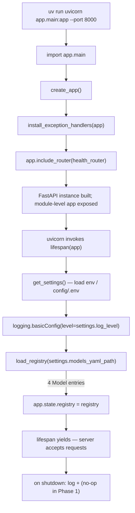
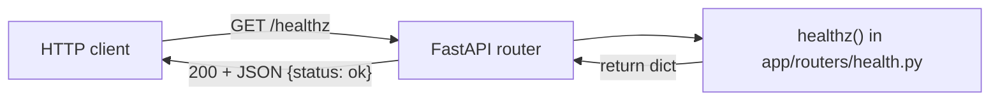
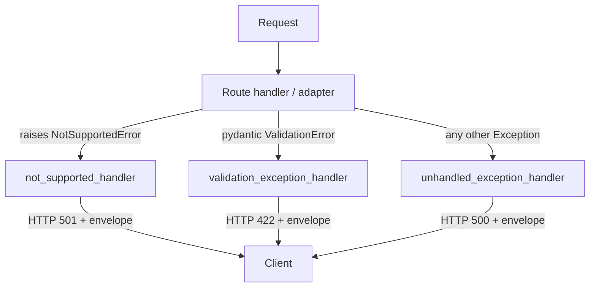

# Phase 1 — Skeleton — Architecture Specification

**Project**: local-ai-server
**Version**: v0.1.0
**Phase**: 1 — Skeleton
**Branch**: `phase/local-ai-server/1-skeleton`
**Date**: 2026-06-07

---

## 1. Phase Overview

### Goal
Project structure compiles, imports clean, `uvicorn` boots, `GET /healthz` returns 200; the `BackendAdapter` ABC and three concrete adapters (one skeleton, two stubs) are in place; the registry loads `config/models.yaml` and yields four typed model entries.

### Dependencies
None. This is the first phase. Existing repo assets that stay untouched: `.devcontainer/`, `.vscode/`, `docker/` (dev container only), `ruff.toml`, `docs/spec.md`, `pm/`, `posts/`, `assets/`, `README.md`, `.gitignore`.

### What this phase delivers
- `pyproject.toml` (uv-managed) with the v0.1.0 runtime + dev dep set (no `structlog`, no `watchfiles`).
- `app/` package with: `config.py`, `schemas.py`, `errors.py`, `registry.py`, `main.py`, `adapters/` (ABC + 3 adapter classes), `routers/health.py`.
- `config/models.yaml` (4 sample entries) and `config/.env.example`.
- A bootable FastAPI app whose only mounted route is `GET /healthz`.

### What this phase intentionally does NOT deliver
- No `/v1/models`, `/v1/chat/completions`, `/v1/embeddings` routers (Phase 2).
- No real Ollama implementation — `OllamaAdapter` methods raise `NotImplementedError("filled in Phase 2")`.
- No `auth.py`, no API key store, no `/readyz`.
- No Caddy, no `Dockerfile.gateway`, no `compose.yaml`, no `Makefile`.
- No `structlog` (stdlib `logging` only) and no `watchfiles` hot-reload.
- No tests (tests land in Phase 3).
- No `posts/v0_1_0_demo.ipynb` (Phase 2).

---

## 2. Module Specifications

### 2.1 `pyproject.toml`

**Purpose**: Declare the v0.1.0 Python project, runtime + dev deps, and uv-managed venv configuration.

**Exact content** (Builder must use these versions verbatim — match spec §11 minus deferred deps):

```toml
[project]
name = "local-ai-server"
version = "0.1.0"
description = "OpenAI-compatible local AI gateway (v0.1.0: Ollama only)."
requires-python = ">=3.12"
readme = "README.md"
license = { text = "CC-BY-NC-SA-4.0" }
dependencies = [
    "fastapi>=0.115",
    "uvicorn[standard]>=0.32",
    "httpx>=0.27",
    "pydantic>=2.9",
    "pydantic-settings>=2.5",
    "pyyaml>=6.0",
]

[dependency-groups]
dev = [
    "pytest>=8",
    "pytest-asyncio>=0.24",
    "pytest-httpx>=0.30",
    "ruff>=0.6",
    "mypy>=1.11",
]

[tool.uv]
package = false
```

Notes:
- **`structlog` and `watchfiles` are intentionally absent** (deferred to v0.2.0).
- `argon2-cffi` is intentionally absent (auth deferred to v0.2.0).
- `[tool.uv] package = false` keeps the project as a workspace-style app rather than a publishable wheel — matches "first vertical slice" framing.
- `requires-python = ">=3.12"` matches spec §11 even though the dev-container image bundles 3.11; the runtime invariant (`uv run`) creates its own 3.12 venv.

---

### 2.2 `app/__init__.py`

**Purpose**: Mark `app/` as a Python package; expose the package version.

**Dependencies**: none.

**Public API**:
```python
__version__: str = "0.1.0"
```

**Notes**: Keep this file tiny. No re-exports — they create import cycles once Phase 2 adds the routers.

---

### 2.3 `app/config.py`

**Purpose**: Centralize runtime configuration via `pydantic-settings`, loading from environment variables (and optionally `config/.env`).

**Dependencies**:
```python
from functools import lru_cache
from pathlib import Path
from pydantic import Field
from pydantic_settings import BaseSettings, SettingsConfigDict
```

**Public API**:
```python
class Settings(BaseSettings):
    """Gateway runtime configuration loaded from environment variables."""

    model_config = SettingsConfigDict(
        env_file="config/.env",
        env_file_encoding="utf-8",
        case_sensitive=False,
        extra="ignore",
    )

    gateway_host: str = Field(default="127.0.0.1", alias="GATEWAY_HOST")
    gateway_port: int = Field(default=8000, alias="GATEWAY_PORT")
    models_yaml_path: Path = Field(
        default=Path("config/models.yaml"),
        alias="MODELS_YAML_PATH",
    )
    log_level: str = Field(default="INFO", alias="LOG_LEVEL")
    ollama_base_url: str = Field(
        default="http://localhost:11434",
        alias="OLLAMA_BASE_URL",
    )


@lru_cache(maxsize=1)
def get_settings() -> Settings:
    """Return a cached Settings instance for dependency injection."""
    ...
```

**Interface contracts**:
- `Settings()` raises `pydantic.ValidationError` on bad types (e.g., non-int port).
- `get_settings()` returns the same instance per process; tests can call `get_settings.cache_clear()`.

**Notes**:
- Field names are snake_case in Python; aliases are SHOUT_CASE per the env-var convention in plan §10.
- `pydantic-settings` v2 uses `model_config = SettingsConfigDict(...)` (not the v1 `Config` inner class).
- Path is resolved relative to the process CWD; the boot checkpoint runs from the repo root, which makes `config/models.yaml` resolvable.

---

### 2.4 `app/schemas.py`

**Purpose**: Pydantic v2 mirrors of the OpenAI v1 wire shapes the gateway accepts and emits. Phase 1 declares them; Phase 2 routers consume them.

**Dependencies**:
```python
from typing import Any, Literal
from pydantic import BaseModel, ConfigDict, Field
```

**Module-level convention**:
```python
class _OpenAIModel(BaseModel):
    """Base for OpenAI v1 mirrors. Allows extra fields so we passthrough
    OpenAI-vendor extensions without 422 errors, but emits them verbatim."""
    model_config = ConfigDict(extra="allow", populate_by_name=True)
```

**Public API** (signatures only — Builder writes the field bodies):

#### Tool blocks (used by chat completions)
```python
class FunctionDefinition(_OpenAIModel):
    name: str
    description: str | None = None
    parameters: dict[str, Any] | None = None
    strict: bool | None = None


class ToolDefinition(_OpenAIModel):
    type: Literal["function"]
    function: FunctionDefinition


ToolChoice = Literal["none", "auto", "required"] | dict[str, Any]


class ToolCallFunction(_OpenAIModel):
    name: str
    arguments: str  # JSON-encoded string per OpenAI spec


class ToolCall(_OpenAIModel):
    id: str
    type: Literal["function"]
    function: ToolCallFunction
```

#### Chat messages
```python
class ChatMessage(_OpenAIModel):
    role: Literal["system", "user", "assistant", "tool", "developer"]
    content: str | list[dict[str, Any]] | None = None
    name: str | None = None
    tool_calls: list[ToolCall] | None = None
    tool_call_id: str | None = None
```

#### Chat completions request
```python
class ChatCompletionRequest(_OpenAIModel):
    model: str
    messages: list[ChatMessage]
    stream: bool = False
    temperature: float | None = None
    top_p: float | None = None
    max_tokens: int | None = None
    max_completion_tokens: int | None = None
    n: int | None = None
    stop: str | list[str] | None = None
    seed: int | None = None
    presence_penalty: float | None = None
    frequency_penalty: float | None = None
    logit_bias: dict[str, float] | None = None
    user: str | None = None
    response_format: dict[str, Any] | None = None
    tools: list[ToolDefinition] | None = None
    tool_choice: ToolChoice | None = None
    parallel_tool_calls: bool | None = None
    stream_options: dict[str, Any] | None = None
```

#### Chat completion (non-streaming) response
```python
class ChatCompletionUsage(_OpenAIModel):
    prompt_tokens: int
    completion_tokens: int
    total_tokens: int


class ChatCompletionChoice(_OpenAIModel):
    index: int
    message: ChatMessage
    finish_reason: Literal[
        "stop", "length", "tool_calls", "content_filter", "function_call"
    ] | None = None
    logprobs: dict[str, Any] | None = None


class ChatCompletionResponse(_OpenAIModel):
    id: str
    object: Literal["chat.completion"]
    created: int
    model: str
    choices: list[ChatCompletionChoice]
    usage: ChatCompletionUsage | None = None
    system_fingerprint: str | None = None
```

#### Chat completion chunk (streaming)
```python
class ChatCompletionDelta(_OpenAIModel):
    role: Literal["system", "user", "assistant", "tool"] | None = None
    content: str | None = None
    tool_calls: list[ToolCall] | None = None


class ChatCompletionChunkChoice(_OpenAIModel):
    index: int
    delta: ChatCompletionDelta
    finish_reason: Literal[
        "stop", "length", "tool_calls", "content_filter"
    ] | None = None
    logprobs: dict[str, Any] | None = None


class ChatCompletionChunk(_OpenAIModel):
    id: str
    object: Literal["chat.completion.chunk"]
    created: int
    model: str
    choices: list[ChatCompletionChunkChoice]
    usage: ChatCompletionUsage | None = None
    system_fingerprint: str | None = None
```

#### Embeddings
```python
class EmbeddingsRequest(_OpenAIModel):
    model: str
    input: str | list[str] | list[int] | list[list[int]]
    encoding_format: Literal["float", "base64"] | None = None
    dimensions: int | None = None
    user: str | None = None


class EmbeddingItem(_OpenAIModel):
    object: Literal["embedding"]
    index: int
    embedding: list[float] | str  # str when encoding_format == "base64"


class EmbeddingsUsage(_OpenAIModel):
    prompt_tokens: int
    total_tokens: int


class EmbeddingsResponse(_OpenAIModel):
    object: Literal["list"]
    data: list[EmbeddingItem]
    model: str
    usage: EmbeddingsUsage
```

#### Models list
```python
class ModelEntry(_OpenAIModel):
    id: str
    object: Literal["model"] = "model"
    created: int
    owned_by: str = "local"


class ModelsListResponse(_OpenAIModel):
    object: Literal["list"] = "list"
    data: list[ModelEntry]
```

**Interface contracts**:
- All request models accept extra fields (`extra="allow"`); unknown keys are preserved on the model and re-serialized — this is critical for OpenAI vendor-extension passthrough.
- `ChatCompletionRequest.model` is a non-empty string; pydantic raises `ValidationError` on missing fields, surfaced as HTTP 422 by FastAPI.

**Notes**:
- Phase 1 only defines these classes; nothing imports them yet (routers in Phase 2 will).
- The `_OpenAIModel` private base prevents drift in `model_config` across the dozen mirror classes.
- `populate_by_name=True` lets future code feed payloads using either Python names or wire names if aliases are introduced.

---

### 2.5 `app/errors.py`

**Purpose**: Provide the OpenAI-compatible error envelope, the typed `ErrorResponse` schema, and FastAPI exception handlers that translate `NotSupportedError`, `pydantic.ValidationError`, and unhandled exceptions into the envelope.

**Dependencies**:
```python
from typing import Any, Literal
from fastapi import FastAPI, Request, status
from fastapi.exceptions import RequestValidationError
from fastapi.responses import JSONResponse
from pydantic import BaseModel
from app.adapters.base import NotSupportedError
```

**Public API**:

#### Envelope schema (matches spec §4.3)
```python
class ErrorBody(BaseModel):
    type: str
    message: str
    param: str | None = None
    code: str | None = None


class ErrorResponse(BaseModel):
    error: ErrorBody
```

#### Helpers
```python
def make_error(
    *,
    type_: str,
    message: str,
    param: str | None = None,
    code: str | None = None,
) -> dict[str, Any]:
    """Return a dict matching the OpenAI error envelope shape."""
    ...


def error_response(
    *,
    status_code: int,
    type_: str,
    message: str,
    param: str | None = None,
    code: str | None = None,
) -> JSONResponse:
    """Return a JSONResponse with the OpenAI error envelope."""
    ...
```

#### Handlers
```python
async def not_supported_handler(
    request: Request, exc: NotSupportedError
) -> JSONResponse:
    """Translate NotSupportedError -> HTTP 501 with the envelope."""
    ...


async def validation_exception_handler(
    request: Request, exc: RequestValidationError
) -> JSONResponse:
    """Translate pydantic ValidationError -> HTTP 422 with the envelope.
    The param field carries the dotted location of the first invalid field."""
    ...


async def unhandled_exception_handler(
    request: Request, exc: Exception
) -> JSONResponse:
    """Catch-all -> HTTP 500 with type='internal_error', code='internal_error'.
    Logs traceback via stdlib logging; never leaks internals into message."""
    ...


def install_exception_handlers(app: FastAPI) -> None:
    """Register all handlers on the FastAPI app."""
    ...
```

#### Envelope JSON shape (illustrative — matches spec §4.3)
```json
{
  "error": {
    "type": "not_supported",
    "message": "Backend 'mlx' does not support embeddings",
    "param": "model",
    "code": "backend_capability_missing"
  }
}
```

**Interface contracts**:
- `not_supported_handler` always emits HTTP 501 and `error.type == "not_supported"`.
- `validation_exception_handler` always emits HTTP 422 and `error.type == "invalid_request_error"`; `param` is the dotted path of the first error (e.g., `"messages.0.role"`).
- `unhandled_exception_handler` emits HTTP 500, type `"internal_error"`, message `"Internal server error"`. The original traceback is logged at ERROR; never serialized into the body.

**Notes**:
- `type_` parameter has a trailing underscore to avoid shadowing the builtin.
- The catch-all handler must be installed via `app.add_exception_handler(Exception, unhandled_exception_handler)` last — order matters in Starlette.
- `RequestValidationError` (FastAPI's wrapper around pydantic `ValidationError`) is what propagates from request body parsing; that is the type to register, not raw pydantic `ValidationError`.

---

### 2.6 `app/registry.py`

**Purpose**: Parse `config/models.yaml` into typed `Model` entries and provide a `Registry` container with O(1) id lookup and capability inspection. One-shot load only — no hot-reload in v0.1.0.

**Dependencies**:
```python
from dataclasses import dataclass, field
from enum import Enum
from pathlib import Path
import yaml
```

**Public API**:

#### Capability enum
```python
class Capability(str, Enum):
    CHAT = "chat"
    EMBEDDINGS = "embeddings"
    TOOLS = "tools"
```
Inheriting `str` makes JSON-serialization free and enables `"chat" in caps` style checks against the wire form.

#### Backend identifier
The plan keeps `backend` as a free string (`ollama`, `mlx`, `docker_model_runner`) at the registry level rather than an enum, so unknown backends raise during adapter dispatch (Phase 2) rather than during YAML parse. Phase 1 still validates the value is a non-empty string.

#### Model and Registry dataclasses
```python
@dataclass(frozen=True, slots=True)
class Model:
    id: str
    backend: str               # 'ollama' | 'mlx' | 'docker_model_runner'
    upstream_model: str
    capabilities: frozenset[Capability]
    base_url: str | None = None  # per-model override; None = adapter default

    def supports(self, cap: Capability) -> bool:
        """Return True iff cap is in this model's capabilities set."""
        ...


@dataclass(frozen=True, slots=True)
class Registry:
    models: tuple[Model, ...]
    _by_id: dict[str, Model] = field(default_factory=dict, compare=False)

    def get(self, model_id: str) -> Model | None:
        """O(1) lookup; returns None if not found."""
        ...

    def __iter__(self):
        """Iterate models in source order."""
        ...

    def ids(self) -> list[str]:
        """List model ids in source order."""
        ...
```

#### Loader
```python
def load_registry(path: str | Path) -> Registry:
    """Load and validate models.yaml. One-shot; called once at lifespan start.

    Raises:
        FileNotFoundError: path does not exist.
        RegistryError: YAML is malformed, missing required fields, has
            duplicate ids, or declares an unknown capability.
    """
    ...


class RegistryError(ValueError):
    """Raised when models.yaml is structurally invalid."""
    ...
```

**Interface contracts**:
- `load_registry` is **synchronous** and called exactly once during FastAPI lifespan startup.
- Each YAML entry must have non-empty `id`, `backend`, `upstream_model`, and a list of `capabilities`. Missing or empty fields raise `RegistryError` with a path-prefixed message (e.g., `"models[2]: missing 'upstream_model'"`).
- Duplicate `id` values across the file raise `RegistryError`.
- Unknown capability strings (not in `chat | embeddings | tools`) raise `RegistryError`.
- `base_url` is optional; absent → `None` (adapter default applies).
- Returns an immutable `Registry`. Builder must populate `_by_id` inside `load_registry` (or in a `__post_init__` if using a non-frozen variant — the spec keeps it frozen so the loader builds the dict explicitly and passes it to the constructor via `object.__setattr__` or by adjusting the dataclass to allow init for that field).

**Notes**:
- Use `yaml.safe_load`, never `yaml.load`.
- `frozen=True, slots=True` is the project convention for value objects; tuples and frozensets keep the registry hashable and immutable.
- **No hot-reload, no `watchfiles`** in v0.1.0 — this is locked.
- `Capability(str, Enum)` is the convention; tests in Phase 3 will compare `Capability.CHAT == "chat"` directly.

---

### 2.7 `app/adapters/__init__.py`

**Purpose**: Make `app.adapters` a package; export the public adapter surface.

**Public API**:
```python
from app.adapters.base import BackendAdapter, NotSupportedError
from app.adapters.ollama import OllamaAdapter
from app.adapters.mlx import MLXAdapter
from app.adapters.docker_model_runner import DockerModelRunnerAdapter

__all__ = [
    "BackendAdapter",
    "NotSupportedError",
    "OllamaAdapter",
    "MLXAdapter",
    "DockerModelRunnerAdapter",
]
```

**Notes**: This file makes the import-sanity check in the Phase 1 test checkpoint succeed in one line.

---

### 2.8 `app/adapters/base.py`

**Purpose**: Define the `BackendAdapter` ABC (the routing seam) and the `NotSupportedError` exception type.

**Dependencies**:
```python
from abc import ABC, abstractmethod
from typing import AsyncIterator
```

**Public API**:

#### Exception
```python
class NotSupportedError(Exception):
    """Raised by adapters when an operation isn't supported.

    Translated to HTTP 501 with type='not_supported' by the FastAPI
    exception handler in app/errors.py.
    """

    def __init__(
        self,
        message: str,
        *,
        backend: str | None = None,
        param: str | None = None,
        code: str = "backend_capability_missing",
    ) -> None:
        super().__init__(message)
        self.message = message
        self.backend = backend
        self.param = param
        self.code = code
```

#### ABC
```python
class BackendAdapter(ABC):
    """Common contract for every backend behind the gateway.

    Concrete subclasses are constructed once during FastAPI lifespan
    startup, share a single httpx.AsyncClient (Phase 2), and are closed
    on lifespan shutdown.
    """

    name: str
    base_url: str

    @abstractmethod
    async def chat_completions(
        self,
        body: dict,
        stream: bool,
    ) -> dict | AsyncIterator[bytes]:
        """Forward a chat completion request to the upstream backend.

        When stream=False, return the parsed JSON response body.
        When stream=True, return an async iterator yielding raw bytes
        (SSE 'data: {json}\\n\\n' chunks plus the terminal
        'data: [DONE]\\n\\n'), to be wrapped in a StreamingResponse
        by the router.
        """
        ...

    @abstractmethod
    async def embeddings(self, body: dict) -> dict:
        """Forward an embeddings request; return parsed JSON response."""
        ...

    @abstractmethod
    async def health(self) -> dict:
        """Return {"status": "ok"|"unreachable", ...} for /readyz (Phase 3)."""
        ...

    async def close(self) -> None:
        """Release any held resources (httpx clients, etc.). Default no-op.

        Concrete adapters that own clients override this. Called from the
        FastAPI lifespan shutdown handler.
        """
        return None
```

**Interface contracts**:
- All four methods are async. `close()` has a default implementation; `chat_completions`, `embeddings`, and `health` are abstract and must be overridden.
- Concrete classes must set instance attributes `name: str` and `base_url: str` in `__init__`.
- Raising `NotSupportedError` from any method results in HTTP 501. Any other unhandled exception bubbles up to the catch-all handler (HTTP 500).

**Notes**:
- The signature uses `dict | AsyncIterator[bytes]` (PEP 604 union, Python 3.10+) to match the modernized type hints used elsewhere in the codebase.
- The ABC matches spec §5.1 verbatim with the type-hint syntax modernized.

---

### 2.9 `app/adapters/ollama.py`

**Purpose**: Class skeleton for the Ollama adapter. Phase 1 declares the shape; **Phase 2 fills in the bodies**. Methods raise `NotImplementedError("filled in Phase 2")` so the module imports cleanly but instantiating + calling fails loudly.

**Dependencies**:
```python
from typing import AsyncIterator
from app.adapters.base import BackendAdapter
```
Note: **no `httpx` import yet** — adding it here would create a phantom runtime dep. Phase 2 introduces httpx usage.

**Public API**:
```python
class OllamaAdapter(BackendAdapter):
    """Adapter for a host-native Ollama process serving the OpenAI-compatible
    surface at {base_url}/v1/...

    Phase 1: skeleton only. All methods raise NotImplementedError.
    Phase 2 wires real httpx calls per spec §5.2 / §5.3.
    """

    name: str = "ollama"

    def __init__(self, base_url: str = "http://localhost:11434") -> None:
        self.base_url = base_url.rstrip("/")
        # Phase 2 will create an httpx.AsyncClient here.

    async def chat_completions(
        self, body: dict, stream: bool
    ) -> dict | AsyncIterator[bytes]:
        raise NotImplementedError("filled in Phase 2")

    async def embeddings(self, body: dict) -> dict:
        raise NotImplementedError("filled in Phase 2")

    async def health(self) -> dict:
        raise NotImplementedError("filled in Phase 2")

    async def close(self) -> None:
        return None
```

**Interface contracts**:
- The class is constructible without errors (the import-sanity test instantiates it indirectly via `app.adapters` import).
- Calling any of the three abstract methods raises `NotImplementedError` — distinct from `NotSupportedError` so tests can tell the two states apart.

**Notes**:
- `NotImplementedError` (placeholder for Phase 2) is **not** the same as `NotSupportedError` (HTTP 501 contract). This is intentional and emphasized in the spec.
- Do not import `httpx` in this file in Phase 1.

---

### 2.10 `app/adapters/mlx.py`

**Purpose**: Permanent 501 stub for the MLX backend in v0.1.0 (real implementation lands in v0.4.0).

**Dependencies**:
```python
from typing import AsyncIterator
from app.adapters.base import BackendAdapter, NotSupportedError
```

**Public API**:
```python
class MLXAdapter(BackendAdapter):
    """Stub adapter for mlx_lm.server. Every method raises NotSupportedError
    so v0.1.0 returns HTTP 501 for any MLX-routed request, locking the seam.
    """

    name: str = "mlx"

    def __init__(self, base_url: str = "http://localhost:8080") -> None:
        self.base_url = base_url.rstrip("/")

    async def chat_completions(
        self, body: dict, stream: bool
    ) -> dict | AsyncIterator[bytes]:
        raise NotSupportedError(
            "MLX adapter is not implemented in v0.1.0",
            backend="mlx",
            code="not_implemented",
        )

    async def embeddings(self, body: dict) -> dict:
        raise NotSupportedError(
            "MLX backend does not support embeddings",
            backend="mlx",
            param="model",
            code="backend_capability_missing",
        )

    async def health(self) -> dict:
        raise NotSupportedError(
            "MLX adapter is not implemented in v0.1.0",
            backend="mlx",
            code="not_implemented",
        )

    async def close(self) -> None:
        return None
```

**Interface contracts**: every public method raises `NotSupportedError` → HTTP 501 with the OpenAI envelope.

**Notes**: The two distinct error reasons (`not_implemented` vs. `backend_capability_missing`) are deliberate: `embeddings` is a permanent capability gap per spec §5.2, while `chat_completions` and `health` are deferred-implementation in v0.1.0.

---

### 2.11 `app/adapters/docker_model_runner.py`

**Purpose**: Permanent 501 stub for the Docker Model Runner backend in v0.1.0.

**Dependencies**:
```python
from typing import AsyncIterator
from app.adapters.base import BackendAdapter, NotSupportedError
```

**Public API**:
```python
class DockerModelRunnerAdapter(BackendAdapter):
    """Stub adapter for Docker Desktop Model Runner. Every method raises
    NotSupportedError. Real implementation lands in a later version.
    """

    name: str = "docker_model_runner"

    def __init__(
        self,
        base_url: str = "http://model-runner.docker.internal/engines/v1",
    ) -> None:
        self.base_url = base_url.rstrip("/")

    async def chat_completions(
        self, body: dict, stream: bool
    ) -> dict | AsyncIterator[bytes]:
        raise NotSupportedError(
            "Docker Model Runner adapter is not implemented in v0.1.0",
            backend="docker_model_runner",
            code="not_implemented",
        )

    async def embeddings(self, body: dict) -> dict:
        raise NotSupportedError(
            "Docker Model Runner adapter is not implemented in v0.1.0",
            backend="docker_model_runner",
            code="not_implemented",
        )

    async def health(self) -> dict:
        raise NotSupportedError(
            "Docker Model Runner adapter is not implemented in v0.1.0",
            backend="docker_model_runner",
            code="not_implemented",
        )

    async def close(self) -> None:
        return None
```

**Notes**: Default `base_url` matches spec §5.2 even though v0.1.0 won't reach a Docker-internal hostname from a host process — Phase 2's adapter factory will let the YAML's per-model `base_url` override this.

---

### 2.12 `app/routers/__init__.py`

**Purpose**: Mark `app.routers` as a package. Empty body for Phase 1 (no re-exports).

**Public API**: none.

**Notes**: Keep empty so Phase 2 can add `from app.routers.chat import router as chat_router` etc. without churn.

---

### 2.13 `app/routers/health.py`

**Purpose**: Public, unauthenticated `GET /healthz` endpoint that returns 200 if the process is up.

**Dependencies**:
```python
from fastapi import APIRouter
```

**Public API**:
```python
router = APIRouter(tags=["health"])


@router.get("/healthz", summary="Liveness probe")
async def healthz() -> dict[str, str]:
    """Return {'status': 'ok'} with HTTP 200. No auth, no upstream pings."""
    return {"status": "ok"}
```

**Interface contracts**:
- Always 200; no failure path.
- Response body: `{"status": "ok"}` exactly.
- `/readyz` is **not** in this phase (Phase 3 — and only when auth + per-backend health are in scope).

**Notes**: Mounted **without** the `/v1` prefix (spec §4.4). Mounted in `main.py` directly.

---

### 2.14 `app/main.py`

**Purpose**: Construct the FastAPI app, install exception handlers, run lifespan startup (load registry into `app.state`), mount the health router, and expose `app` for `uvicorn app.main:app`.

**Dependencies**:
```python
import logging
from contextlib import asynccontextmanager
from fastapi import FastAPI
from app.config import get_settings
from app.errors import install_exception_handlers
from app.registry import load_registry
from app.routers.health import router as health_router
```

**Public API**:
```python
@asynccontextmanager
async def lifespan(app: FastAPI):
    """Load the registry once at startup. Phase 2 will also build the
    adapter dict here and close httpx clients on shutdown."""
    settings = get_settings()
    logging.basicConfig(
        level=settings.log_level,
        format="%(asctime)s %(levelname)s %(name)s %(message)s",
    )
    log = logging.getLogger("app.main")

    registry = load_registry(settings.models_yaml_path)
    app.state.registry = registry
    app.state.settings = settings
    # Phase 2: app.state.adapters = {"ollama": OllamaAdapter(...), ...}
    log.info(
        "registry loaded: %d models (%s)",
        len(registry.models),
        ", ".join(registry.ids()),
    )

    try:
        yield
    finally:
        # Phase 2: await asyncio.gather(*(a.close() for a in app.state.adapters.values()))
        log.info("gateway shutdown complete")


def create_app() -> FastAPI:
    """Application factory."""
    app = FastAPI(
        title="local-ai-server",
        version="0.1.0",
        description=(
            "OpenAI-compatible local AI gateway. v0.1.0 ships the "
            "skeleton + healthz; Phase 2 wires Ollama."
        ),
        lifespan=lifespan,
    )
    install_exception_handlers(app)
    app.include_router(health_router)
    return app


app = create_app()
```

**Interface contracts**:
- `app` is a module-level `FastAPI` instance, importable as `app.main:app`.
- Lifespan startup raises (and prevents boot) if `models.yaml` is missing or malformed — this is the desired fail-fast behavior; the import-sanity test runs before the app is started, so module import does not trigger lifespan.
- `app.state.registry` and `app.state.settings` are the contract Phase 2 routers will read.

**Notes**:
- **Only `health_router` is mounted** in Phase 1. The chat / embeddings / models routers don't exist yet.
- `logging.basicConfig` is the v0.1.0 logging surface — `structlog` is deferred.
- The `create_app()` factory pattern simplifies Phase 3 testing (`TestClient(create_app())`).

---

### 2.15 `config/models.yaml`

**Purpose**: Sample registry with the four entries listed in the plan §6 / spec §6.1.

**Exact content**:
```yaml
models:
  - id: ollama-llama3
    backend: ollama
    upstream_model: llama3.1:8b
    capabilities: [chat, tools]

  - id: ollama-nomic-embed
    backend: ollama
    upstream_model: nomic-embed-text
    capabilities: [embeddings]

  - id: mlx-mistral
    backend: mlx
    upstream_model: mlx-community/Mistral-7B-Instruct-v0.3
    base_url: http://localhost:8080
    capabilities: [chat]

  - id: model-runner-llama32
    backend: docker_model_runner
    upstream_model: ai/llama3.2
    capabilities: [chat, embeddings, tools]
```

**Notes**:
- `base_url` is omitted on Ollama entries — adapter default (`http://localhost:11434`) applies via `OLLAMA_BASE_URL`.
- The `mlx-mistral` `base_url` uses `http://localhost:8080` (host-process variant from plan §6) rather than `host.docker.internal` (spec §6.1). v0.1.0 runs as a host process; the containerized form returns in v0.3.0.

---

### 2.16 `config/.env.example`

**Purpose**: Template env file for local development. Subset of spec §6.2 with auth / Caddy variables omitted.

**Exact content**:
```env
# local-ai-server v0.1.0 — gateway runtime configuration.
# Copy to config/.env and adjust as needed; .env is gitignored (added in Phase 3).

GATEWAY_HOST=127.0.0.1
GATEWAY_PORT=8000
MODELS_YAML_PATH=./config/models.yaml
LOG_LEVEL=INFO
OLLAMA_BASE_URL=http://localhost:11434
```

**Notes**:
- `KEYS_DB_PATH` (auth — v0.2.0), `CORS_ORIGINS` (v0.3.0 with Caddy), and `LAN_IP` (v0.3.0 with Caddy) are intentionally absent.
- `.env` itself is **not** added to `.gitignore` in this phase — that lands in Phase 3 per development plan §8 step 3.12. Builder must not edit `.gitignore` in Phase 1.

---

## 3. Data Flow

### 3.1 Boot sequence



### 3.2 `/healthz` request flow



### 3.3 Error translation flow (forward-looking, but installed in Phase 1)



In Phase 1 only `unhandled_exception_handler` is reachable through normal request flow (`/healthz` cannot fail), but all three are wired so Phase 2 routers inherit the contract automatically.

---

## 4. Interface Contracts

### 4.1 `app.config.Settings`
- **Input**: process environment + optional `config/.env`.
- **Output**: typed `Settings` instance with five attributes.
- **Errors**: `pydantic.ValidationError` on malformed env vars (e.g., non-int `GATEWAY_PORT`).
- **Side effects**: none on instantiation; `get_settings()` caches the result via `lru_cache`.

### 4.2 `app.registry.load_registry`
- **Input**: `path: str | Path` pointing to a YAML file.
- **Output**: `Registry` (immutable, `tuple[Model, ...]` + dict index).
- **Errors**:
  - `FileNotFoundError` (path missing).
  - `RegistryError` (malformed YAML, missing required field, duplicate id, unknown capability).
- **Side effects**: reads the file once; never writes.

### 4.3 `app.adapters.base.BackendAdapter`
- **chat_completions(body, stream)**:
  - `stream=False` → returns `dict` with the full upstream JSON.
  - `stream=True` → returns `AsyncIterator[bytes]` yielding raw SSE bytes including the terminal `data: [DONE]\n\n`.
  - May raise `NotSupportedError` (501) or any other exception (500).
- **embeddings(body)**: returns `dict`; may raise `NotSupportedError`.
- **health()**: returns `dict` with at least `{"status": "ok" | "unreachable"}`; may raise `NotSupportedError` for stub adapters.
- **close()**: idempotent; default no-op.

### 4.4 `app.errors` handlers
- **Input**: a request and an exception instance.
- **Output**: `JSONResponse` with the OpenAI envelope shape.
- **Errors**: must not raise; the catch-all is the last line of defense.
- **Side effects**: `unhandled_exception_handler` logs the traceback at `ERROR` level via `logging.getLogger("app.errors")`.

### 4.5 `app.routers.health.healthz`
- **Input**: none.
- **Output**: `{"status": "ok"}` with HTTP 200.
- **Errors**: none.
- **Side effects**: none (no auth, no upstream call).

---

## 5. Configuration

### 5.1 New environment variables (all already in `config/.env.example`)

| Variable | Type | Default | Required | Phase introduced |
|---|---|---|---|---|
| `GATEWAY_HOST` | str | `127.0.0.1` | no | 1 |
| `GATEWAY_PORT` | int | `8000` | no | 1 |
| `MODELS_YAML_PATH` | path | `./config/models.yaml` | no | 1 |
| `LOG_LEVEL` | str (`DEBUG`/`INFO`/...) | `INFO` | no | 1 |
| `OLLAMA_BASE_URL` | str (URL) | `http://localhost:11434` | no | 1 |

### 5.2 Files

| File | Status | Notes |
|---|---|---|
| `config/models.yaml` | new | 4 entries; sample registry. |
| `config/.env.example` | new | Template only; `config/.env` is created by the user. |
| `config/.env` | not created | User-managed; will be gitignored in Phase 3. |

---

## 6. `BackendAdapter` ABC Contract

Restated for clarity (matches §2.8 above):

```python
class BackendAdapter(ABC):
    name: str
    base_url: str

    @abstractmethod
    async def chat_completions(
        self,
        body: dict,
        stream: bool,
    ) -> dict | AsyncIterator[bytes]: ...

    @abstractmethod
    async def embeddings(self, body: dict) -> dict: ...

    @abstractmethod
    async def health(self) -> dict: ...

    async def close(self) -> None: ...


class NotSupportedError(Exception):
    """Raised by adapters; translated to HTTP 501 with the OpenAI envelope.

    Carries optional `backend`, `param`, and `code` fields used by
    not_supported_handler to populate the response envelope.
    """
    def __init__(
        self,
        message: str,
        *,
        backend: str | None = None,
        param: str | None = None,
        code: str = "backend_capability_missing",
    ) -> None: ...
```

---

## 7. Registry Contract

```python
class Capability(str, Enum):
    CHAT = "chat"
    EMBEDDINGS = "embeddings"
    TOOLS = "tools"


@dataclass(frozen=True, slots=True)
class Model:
    id: str
    backend: str
    upstream_model: str
    capabilities: frozenset[Capability]
    base_url: str | None = None

    def supports(self, cap: Capability) -> bool: ...


@dataclass(frozen=True, slots=True)
class Registry:
    models: tuple[Model, ...]

    def get(self, model_id: str) -> Model | None: ...
    def ids(self) -> list[str]: ...
    def __iter__(self): ...


def load_registry(path: str | Path) -> Registry:
    """One-shot load. NOT hot-reloaded in v0.1.0 (no watchfiles)."""
    ...


class RegistryError(ValueError): ...
```

**Hot-reload is explicitly out of scope.** `load_registry` is called exactly once during FastAPI lifespan startup, the resulting `Registry` is stashed on `app.state.registry`, and any change to `models.yaml` requires a process restart in v0.1.0. Hot-reload (and `watchfiles`) lands in v0.2.0.

---

## 8. `/healthz` Response Shape

| Aspect | Value |
|---|---|
| Method | `GET` |
| Path | `/healthz` (no `/v1` prefix) |
| Auth | **None** (public, unauthenticated) |
| Status code | `200 OK` always |
| Content-Type | `application/json` |
| Body | `{"status": "ok"}` |
| Side effects | none (no upstream pings, no DB hits) |

`/readyz` is not in this phase.

---

## 9. What is Intentionally NOT in This Phase

- **No** `app/routers/chat.py`, `app/routers/embeddings.py`, `app/routers/models.py` — Phase 2.
- **No** real Ollama implementation — `OllamaAdapter` is a skeleton with `NotImplementedError` placeholders.
- **No** `app/auth.py`, no API-key store, no key-mint scripts — v0.2.0.
- **No** `/readyz` — Phase 3 with auth observability.
- **No** `caddy/`, no `Dockerfile.gateway`, no `compose.yaml`, no `Makefile` — v0.3.0+.
- **No** `structlog` — stdlib `logging` only.
- **No** `watchfiles` — registry is one-shot at startup.
- **No** tests — Phase 3.
- **No** notebook — Phase 2.
- **No** `.gitignore` edits — Phase 3.
- **No** `docker/requirements.txt` edits — Phase 3.
- **No** `README.md` edits — Phase 3.

---

## 10. File Creation Order (for the Builder)

The order minimizes import errors during incremental development. Each step assumes the previous steps compile.

1. **`pyproject.toml`** — establishes the Python 3.12 + uv environment; run `uv sync` to verify.
2. **`app/__init__.py`** — empty-ish package marker.
3. **`app/config.py`** — no internal app deps; depends only on `pydantic-settings`.
4. **`app/schemas.py`** — no internal app deps.
5. **`app/adapters/base.py`** — defines `BackendAdapter` + `NotSupportedError`. Required by `app/errors.py` and the three concrete adapters.
6. **`app/adapters/ollama.py`** — depends on `base.py` only.
7. **`app/adapters/mlx.py`** — depends on `base.py` only.
8. **`app/adapters/docker_model_runner.py`** — depends on `base.py` only.
9. **`app/adapters/__init__.py`** — re-exports adapters; depends on items 5–8.
10. **`app/errors.py`** — imports `NotSupportedError` from `app.adapters.base`.
11. **`app/registry.py`** — no app deps (pyyaml + stdlib).
12. **`config/models.yaml`** — needed before lifespan startup is exercised.
13. **`config/.env.example`** — needed for the env-loading sanity test.
14. **`app/routers/__init__.py`** — empty.
15. **`app/routers/health.py`** — depends only on FastAPI.
16. **`app/main.py`** — pulls everything together (config, errors, registry, health router).

After step 16, run the four checkpoint commands in §11 below.

---

## 11. Done-When Checklist (Phase 1 Test Checkpoint)

Mirrors the development plan §8 Part C Phase 1 test checkpoint verbatim:

```bash
cd /Users/ramikrispin/Personal/tutorials/local-ai-server

# 1. install deps
uv sync
# expected: success, lockfile generated, no resolution errors

# 2. import sanity
uv run python -c "import app.main, app.registry, app.schemas, app.errors; \
  from app.adapters.base import BackendAdapter, NotSupportedError; \
  from app.adapters.ollama import OllamaAdapter; \
  from app.adapters.mlx import MLXAdapter; \
  from app.adapters.docker_model_runner import DockerModelRunnerAdapter; \
  print('imports ok')"
# expected: imports ok

# 3. registry loads
uv run python -c "from app.registry import load_registry; \
  reg = load_registry('config/models.yaml'); \
  print(sorted(m.id for m in reg.models))"
# expected: ['mlx-mistral', 'model-runner-llama32', 'ollama-llama3', 'ollama-nomic-embed']

# 4. boot uvicorn and probe healthz
uv run uvicorn app.main:app --port 8000 &
sleep 2
curl -sS -o /dev/null -w "%{http_code}\n" http://127.0.0.1:8000/healthz
# expected: 200
kill %1
```

### Done when all of the following hold:

- [ ] `uv sync` succeeds with no resolution errors and produces `uv.lock`.
- [ ] All imports listed in step 2 succeed; `print('imports ok')` runs.
- [ ] `load_registry('config/models.yaml')` returns a `Registry` with exactly the 4 expected ids.
- [ ] `uvicorn app.main:app` boots without warnings or tracebacks.
- [ ] `GET /healthz` returns HTTP 200 with body `{"status":"ok"}`.
- [ ] `MLXAdapter` and `DockerModelRunnerAdapter` raise `NotSupportedError` from every public abstract method (verified by direct call in a Python REPL — formal test in Phase 3).
- [ ] `OllamaAdapter` raises `NotImplementedError` from `chat_completions`, `embeddings`, and `health` (skeleton placeholder).
- [ ] `ruff check .` is clean against the new files (line-length 79 per the existing `ruff.toml`).
- [ ] No edits to `.gitignore`, `README.md`, `docker/requirements.txt`, `.devcontainer/`, `.vscode/`, or any other pre-existing repo asset.

---

## 12. Risks & Open Questions for the Orchestrator

| Item | Severity | Mitigation / Question |
|---|---|---|
| `ruff.toml` has `line-length = 79`, which is unusually tight for FastAPI signatures | Low | Builder must use multi-line signatures liberally; the spec's existing `ruff.toml` is authoritative — do not change it in Phase 1. |
| `ruff.toml` has a typo: `quite-style` instead of `quote-style` in `[format]` | Low | **Do not fix in Phase 1** (out of scope for skeleton). Flag for Phase 3 ruff-cleanup pass. |
| Dev container uses Python 3.11; `pyproject.toml` requires `>=3.12` | Med | `uv` will provision a 3.12 toolchain inside the dev container automatically; this is the documented v0.1.0 pattern in plan §6. No action needed unless `uv sync` fails. |
| Spec §5.1 declares `base_url` and `name` as class-level attributes, but our concrete classes set them in `__init__` for per-instance configurability (e.g., MLX with multiple ports) | Low | Resolved in this spec: ABC declares them as type annotations (no defaults); concrete classes assign in `__init__`. |
| `frozen=True` dataclasses + a non-init `_by_id` dict | Low | Builder must populate `_by_id` inside `load_registry` and pass it via the dataclass constructor (or use `object.__setattr__` if keeping the field hidden). Either approach is acceptable; recommend the explicit constructor argument. |
| `extra="allow"` on every schema mirror — risk of silently accepting malformed extensions | Low | This is the deliberate OpenAI-passthrough contract per spec §4.2; tests in Phase 3 will lock the round-trip. |
