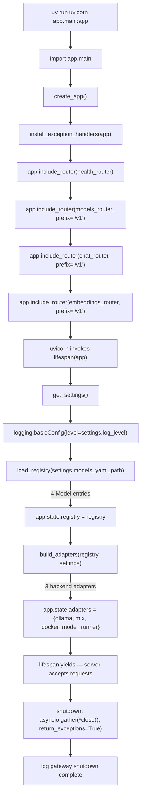
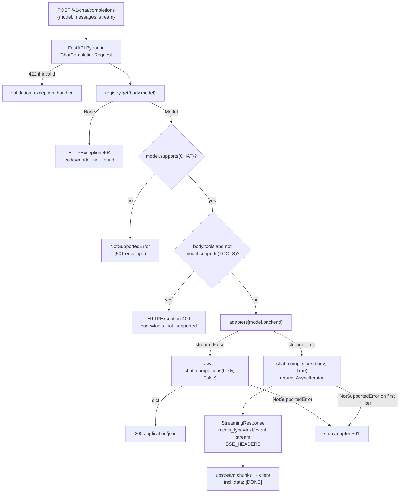
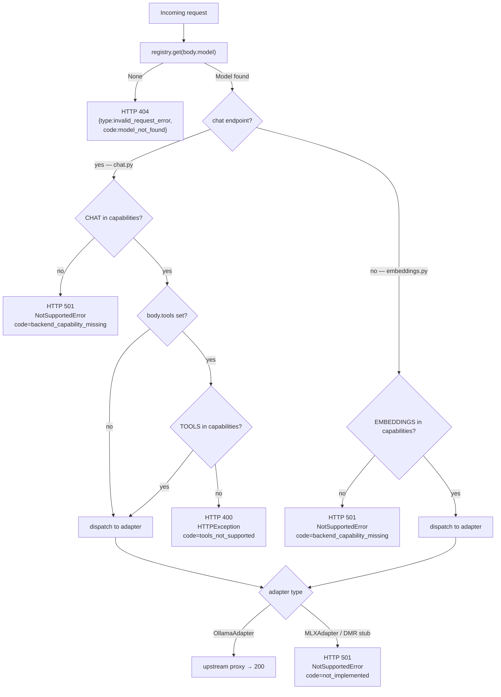

# Phase 2 — Endpoints (Ollama wired) — Architecture Specification

**Project**: local-ai-server
**Version**: v0.1.0
**Phase**: 2 — Endpoints (Ollama wired)
**Branch**: `phase/local-ai-server/2-endpoints` (branched off `dev/local-ai-server` at `6287e9b`)
**Date**: 2026-06-14
**Precondition**: Phase 1 (Skeleton) is merged into `dev/local-ai-server`. The `BackendAdapter` ABC, `NotSupportedError`, the registry, the OpenAI v1 schema mirrors, the error envelope, the lifespan that loads `app.state.registry`, and `GET /healthz` all exist and work. `OllamaAdapter` is a skeleton whose three abstract methods raise `NotImplementedError("filled in Phase 2")`.

Target output path for this document: `/Users/ramikrispin/Personal/tutorials/local-ai-server/pm/v0_1_0/phase-2-architecture.md`.

---

## 1. Phase Overview

### Goal
Against a real local Ollama (`ollama serve` on the host), an OpenAI SDK client at `http://127.0.0.1:8000/v1` can call:

- `client.models.list()` — returns the registry's 4 entries shaped as OpenAI `model` objects.
- `client.chat.completions.create(model=..., messages=..., stream=False)` — non-streaming chat.
- `client.chat.completions.create(..., stream=True)` — SSE streaming chat (terminated by `data: [DONE]\n\n` from upstream).
- `client.embeddings.create(model=..., input=...)` — embeddings (Ollama-backed only).

…end-to-end. MLX and Docker Model Runner adapter stubs continue to raise `NotSupportedError` from every method, which gets translated to HTTP 501 by the existing `not_supported_handler`.

### Dependencies on previous phases
- Phase 1 is merged. The current `app/` skeleton is unchanged from the merged Phase 1 state on `dev/local-ai-server`.
- Phase 1 modules consumed unchanged by Phase 2: `app/__init__.py`, `app/config.py`, `app/schemas.py`, `app/errors.py`, `app/registry.py`, `app/adapters/base.py`, `app/adapters/mlx.py`, `app/adapters/docker_model_runner.py`, `app/routers/__init__.py`, `app/routers/health.py`, `config/models.yaml`, `config/.env.example`, `pyproject.toml`, `ruff.toml`.

### What this phase delivers
- A real `OllamaAdapter` that proxies non-stream chat, streaming chat (SSE), and embeddings to a host-native Ollama via a long-lived `httpx.AsyncClient`, plus a real `health()` probe.
- An adapter factory in `app/adapters/__init__.py` that produces a `dict[str, BackendAdapter]` keyed by registry `backend` strings.
- Three new routers under `/v1`: `models.py`, `chat.py`, `embeddings.py`, with capability gating, tools gating, model-not-found 404, and a streaming branch using `StreamingResponse`.
- An updated `app/main.py` lifespan that builds adapters into `app.state.adapters` after registry load, mounts the three new routers, and closes adapters on shutdown.
- A demo Jupyter notebook at `examples/v0_1_0_demo.ipynb` that exercises every user-facing endpoint against a live Ollama using the OpenAI SDK.

### What this phase intentionally does NOT deliver
Restated in §10 — auth, `/readyz`, Caddy, Compose, `Makefile`, `structlog`, `watchfiles`, real MLX/DMR implementations, tests, README, dev-container deps, `.gitignore` edits, `ruff.toml` edits.

---

## 2. Module Specifications

This section breaks down each modified or new file. Conventions inherited from Phase 1: PEP 604 unions (`X | None`, never `Optional[X]`), `_OpenAIModel` schema base for all wire shapes, `frozen=True, slots=True` for value objects, `yaml.safe_load`, line-length 79, stdlib `logging` (no `structlog`), no `watchfiles`.

---

### 2.1 `app/adapters/ollama.py` — MODIFIED

**Purpose**: Proxy chat completions (stream + non-stream) and embeddings to a host-native Ollama OpenAI-compatible surface, plus expose a non-raising `health()` probe.

**Dependencies** (added in this phase):
```python
import logging
from contextlib import asynccontextmanager
from typing import AsyncIterator

import httpx

from app.adapters.base import BackendAdapter
```

**Public API** (signatures only — Builder writes the bodies):

```python
class OllamaAdapter(BackendAdapter):
    """Adapter for a host-native Ollama process serving the OpenAI-
    compatible surface at {base_url}/v1/... and the native API at
    {base_url}/api/...

    A single httpx.AsyncClient is constructed in __init__ and reused for
    every request; close() releases it during lifespan shutdown.
    """

    name: str = "ollama"

    def __init__(
        self,
        base_url: str = "http://localhost:11434",
    ) -> None:
        self.base_url = base_url.rstrip("/")
        self._client: httpx.AsyncClient = httpx.AsyncClient(
            base_url=self.base_url,
            timeout=httpx.Timeout(
                connect=5.0,
                read=None,
                write=10.0,
                pool=5.0,
            ),
        )

    async def chat_completions(
        self,
        body: dict,
        stream: bool,
    ) -> dict | AsyncIterator[bytes]: ...

    async def embeddings(self, body: dict) -> dict: ...

    async def health(self) -> dict: ...

    async def close(self) -> None: ...
```

**Internal helpers / data shapes**:
- A private `_stream(body: dict) -> AsyncIterator[bytes]` async generator wraps the upstream stream context manager so the public `chat_completions` returns this iterator without first awaiting the response. This is essential — entering the `client.stream(...)` context inside the generator means the upstream `Response.aclose()` is run when the generator finishes (normal completion **or** client cancellation).
- `_log = logging.getLogger("app.adapters.ollama")` for diagnostic info-level logs (per Phase 1 convention; no `structlog`).

**Interface contracts**:

| Method | Inputs | Output | Errors raised | Side effects |
|---|---|---|---|---|
| `__init__(base_url)` | URL string | `None` | none | Creates `self._client: httpx.AsyncClient`. |
| `chat_completions(body, stream=False)` | OpenAI body dict | `dict` parsed from upstream JSON | `httpx.HTTPStatusError` on 4xx/5xx upstream (caught by unhandled-exception handler → 500); `httpx.ConnectError` if Ollama not running (→ 500) | One POST to `/v1/chat/completions`. |
| `chat_completions(body, stream=True)` | OpenAI body dict | `AsyncIterator[bytes]` yielding raw upstream chunks including the terminal `data: [DONE]\n\n` | Same as above, but raised lazily as the iterator is consumed | Streams from `/v1/chat/completions`; closes upstream stream via try/finally on cancellation or completion. |
| `embeddings(body)` | OpenAI body dict | `dict` parsed from upstream JSON | `httpx.HTTPStatusError`, `httpx.ConnectError` | One POST to `/v1/embeddings`. |
| `health()` | none | `{"status": "ok", "models": [...]}` on 200; `{"status": "unreachable", "error": "..."}` on connection failure | **Does NOT raise** for connect/read errors — must catch `httpx.RequestError` and return the unreachable shape. Lets Phase 3's `/readyz` aggregate without try/except at every call site. | One GET to `/api/tags`. |
| `close()` | none | `None` | none | `await self._client.aclose()`; idempotent — safe to call twice. |

**Notes on each method**:

- **`chat_completions(body, stream=False)`**:
  - `r = await self._client.post("/v1/chat/completions", json=body)`
  - `r.raise_for_status()`
  - `return r.json()`
  - Body is forwarded verbatim. Ollama's OpenAI-compat endpoint accepts the same field set; unknown OpenAI vendor extensions are tolerated by Ollama and round-trip to the response.

- **`chat_completions(body, stream=True)`** — return the inner generator without awaiting it first:
  ```python
  async def chat_completions(self, body, stream):
      if not stream:
          # ... non-stream branch above ...
          return ...
      return self._stream(body)

  async def _stream(self, body: dict) -> AsyncIterator[bytes]:
      try:
          async with self._client.stream(
              "POST", "/v1/chat/completions", json=body
          ) as r:
              r.raise_for_status()
              async for chunk in r.aiter_raw():
                  yield chunk
      finally:
          # async-with already calls aclose; this finally is the
          # cancellation seam — if the consumer (StreamingResponse)
          # is cancelled, the async-with exits and closes upstream.
          pass
  ```
  - **Hard rule (spec §5.3)**: use `aiter_raw()`, not `aiter_lines()`. Line buffering breaks UTF-8 mid-token.
  - The terminal `data: [DONE]\n\n` is **passed through verbatim** from Ollama — never synthesized.
  - The `async with` block plus the implicit cancellation guarantee in `aiter_raw()` is sufficient for cancel-safety; the explicit `finally` is documentation of intent. (If the Builder finds that Starlette closes the iterator with `GeneratorExit` and that raises before `async with` cleanup, switch to `try/finally` around an `await r.aclose()` that isn't covered by the context manager.)

- **`embeddings(body)`**: POST `/v1/embeddings`, `raise_for_status`, return `r.json()`. Ollama supports embeddings only for embedding-class models (e.g., `nomic-embed-text`). Capability gating in the router prevents non-embedding Ollama models from reaching this method.

- **`health()`** — GET `/api/tags` (Ollama native, not OpenAI-compat). Catch `httpx.RequestError` (covers `ConnectError`, `TimeoutException`, etc.) and return the unreachable shape; do not propagate the exception. The tags endpoint returns `{"models": [{"name": "...", ...}, ...]}`; surface a compact `models` list of name strings. Phase 3 will iterate `health()` across all backends for `/readyz`.

- **`close()`**: `await self._client.aclose()`. Wrap in `try/except httpx.HTTPError` if needed; the lifespan handler also uses `return_exceptions=True` so a failure here doesn't block the others.

**Decision: `_stream` as separate async generator** — alternative was to inline the `client.stream(...)` async-with directly inside `chat_completions` and return the result. That would require entering the context manager **before** returning, which forces the consumer to enter it for us — incompatible with `StreamingResponse`'s consumer model. The two-method pattern (sync return of an async generator) is the standard idiom and is what spec §5.3 implies.

---

### 2.2 `app/adapters/__init__.py` — MODIFIED

**Purpose**: In addition to re-exporting the adapter classes (Phase 1 contract), expose a `build_adapters` factory that turns a loaded `Registry` plus `Settings` into a `dict[str, BackendAdapter]` keyed by backend string.

**Dependencies** (added):
```python
from app.adapters.base import BackendAdapter, NotSupportedError
from app.adapters.ollama import OllamaAdapter
from app.adapters.mlx import MLXAdapter
from app.adapters.docker_model_runner import DockerModelRunnerAdapter
from app.config import Settings
from app.registry import Registry
```

**Public API**:

```python
def build_adapters(
    registry: Registry,
    settings: Settings,
) -> dict[str, BackendAdapter]:
    """Construct one adapter per distinct backend referenced by the
    registry, honoring per-model base_url overrides where present.

    Returns a dict whose keys are backend strings ('ollama', 'mlx',
    'docker_model_runner') and whose values are the singleton adapters
    used by the routers via app.state.adapters[model.backend].
    """
    ...


__all__ = [
    "BackendAdapter",
    "NotSupportedError",
    "OllamaAdapter",
    "MLXAdapter",
    "DockerModelRunnerAdapter",
    "build_adapters",
]
```

**Internal logic** (signature-level outline — Builder fills the body):

```python
_ADAPTER_CLASSES: dict[str, type[BackendAdapter]] = {
    "ollama": OllamaAdapter,
    "mlx": MLXAdapter,
    "docker_model_runner": DockerModelRunnerAdapter,
}


def build_adapters(registry, settings):
    # Per-backend base_url resolution rules (in priority order):
    #   1. First registry model.base_url that is non-None for that backend.
    #   2. settings.ollama_base_url if backend == 'ollama'.
    #   3. The adapter class's hard-coded default (set in its __init__
    #      signature: 'http://localhost:11434' / ':8080' / DMR default).
    base_urls: dict[str, str | None] = {}
    for m in registry:
        if m.backend not in _ADAPTER_CLASSES:
            raise ValueError(
                f"registry: unknown backend '{m.backend}' for "
                f"model '{m.id}'"
            )
        if m.base_url and m.backend not in base_urls:
            base_urls[m.backend] = m.base_url

    adapters: dict[str, BackendAdapter] = {}
    for backend in {m.backend for m in registry}:
        cls = _ADAPTER_CLASSES[backend]
        if backend == "ollama" and backend not in base_urls:
            base_urls[backend] = settings.ollama_base_url
        url = base_urls.get(backend)
        adapters[backend] = cls(url) if url is not None else cls()
    return adapters
```

**Multi-instance decision (DOCUMENTED)**: when the registry has multiple models sharing a backend string with different `base_url`s (e.g., two MLX models on different ports), this factory **picks the first non-None `base_url` it sees in registry source order and ignores subsequent overrides**. Rationale:

- Spec §5.2 explicitly notes MLX is one model per process per port — so multi-MLX is a v0.4.0+ concern.
- v0.1.0's sample `config/models.yaml` has at most one entry per backend with a `base_url` set (`mlx-mistral` is the only one).
- For Ollama, all Ollama models share `OLLAMA_BASE_URL` from settings and should never carry a per-model `base_url` in practice.

**Open follow-up** (Phase 3+ / v0.4.0+): when MLX gets a real implementation and the registry can carry multiple MLX entries on different ports, `build_adapters` will need to key by `(backend, base_url)` — likely a dict keyed by model id, with the router doing `adapters[model.id]` rather than `adapters[model.backend]`. Flagged in §13.

**Interface contracts**:
- **Input**: `Registry` (must have at least one model — empty registries already fail at `load_registry` parse).
- **Output**: `dict[str, BackendAdapter]` with keys ⊆ `{"ollama", "mlx", "docker_model_runner"}` and exactly one entry per distinct `backend` string in the registry.
- **Errors raised**: `ValueError` if the registry contains a backend string not in `_ADAPTER_CLASSES`. (The plan §4.3 capability decision graph already shows the unknown-backend path; the factory raises during lifespan startup, so the gateway fails fast at boot rather than 500-ing per-request.)
- **Side effects**: each adapter's `__init__` constructs an `httpx.AsyncClient` (Ollama only — MLX/DMR `__init__`s are pure). The factory does **not** call `close()`; the lifespan owns lifecycle.

---

### 2.3 `app/main.py` — MODIFIED

**Purpose**: Extend the lifespan to construct adapters via `build_adapters`, mount the three new routers, and close adapters on shutdown.

**Dependencies** (added):
```python
import asyncio

from app.adapters import build_adapters
from app.routers.chat import router as chat_router
from app.routers.embeddings import router as embeddings_router
from app.routers.models import router as models_router
```

**Modified lifespan** (signature-level outline — Builder integrates with the existing Phase 1 body):

```python
@asynccontextmanager
async def lifespan(app: FastAPI):
    settings = get_settings()
    logging.basicConfig(
        level=settings.log_level,
        format="%(asctime)s %(levelname)s %(name)s %(message)s",
    )
    log = logging.getLogger("app.main")

    registry = load_registry(settings.models_yaml_path)
    app.state.registry = registry
    app.state.settings = settings

    adapters = build_adapters(registry, settings)
    app.state.adapters = adapters
    log.info(
        "registry loaded: %d models (%s); adapters: %s",
        len(registry.models),
        ", ".join(registry.ids()),
        ", ".join(sorted(adapters.keys())),
    )

    try:
        yield
    finally:
        results = await asyncio.gather(
            *(a.close() for a in app.state.adapters.values()),
            return_exceptions=True,
        )
        for backend, result in zip(
            sorted(app.state.adapters.keys()), results
        ):
            if isinstance(result, BaseException):
                log.warning(
                    "adapter close failed for %s: %s",
                    backend, result,
                )
        log.info("gateway shutdown complete")
```

**Modified `create_app`**:

```python
def create_app() -> FastAPI:
    app = FastAPI(
        title="local-ai-server",
        version="0.1.0",
        description=(
            "OpenAI-compatible local AI gateway. v0.1.0: Ollama "
            "wired; MLX and Docker Model Runner stubbed at 501."
        ),
        lifespan=lifespan,
    )
    install_exception_handlers(app)
    app.include_router(health_router)        # Phase 1 — no /v1
    app.include_router(models_router, prefix="/v1")
    app.include_router(chat_router, prefix="/v1")
    app.include_router(embeddings_router, prefix="/v1")
    return app
```

**Interface contracts**:
- `app.state.adapters` is set after `app.state.registry` and before lifespan yields. Routers must read it as `request.app.state.adapters[model.backend]`.
- The three new routers are mounted with prefix `/v1`. Their internal route paths are therefore `/models`, `/chat/completions`, `/embeddings` — they must NOT include `/v1` themselves.
- `health_router` continues to be mounted **without** the `/v1` prefix (spec §4.4).
- On shutdown, every adapter's `close()` is awaited; `return_exceptions=True` ensures one failure doesn't block the others.

**Notes**:
- Logging the sorted adapter key list at INFO level is a low-cost startup signal that the factory ran. Useful for the manual test plan in Phase 3.
- The lifespan's pre-Phase-2 comment placeholder (`# Phase 2: app.state.adapters = {...}`) is replaced with the real call.

---

### 2.4 `app/routers/models.py` — NEW

**Purpose**: `GET /v1/models` — emit the registry as an OpenAI list response.

**Dependencies**:
```python
import time
from fastapi import APIRouter, Request

from app.schemas import ModelEntry, ModelsListResponse
```

**Public API**:

```python
router = APIRouter(tags=["models"])


@router.get(
    "/models",
    response_model=ModelsListResponse,
    summary="List available models (OpenAI-compatible).",
)
async def list_models(request: Request) -> ModelsListResponse:
    """Return the registry as {object: 'list', data: [...]}."""
    ...
```

**Implementation outline** (Builder writes body):

```python
async def list_models(request):
    registry = request.app.state.registry
    now = int(time.time())
    return ModelsListResponse(
        data=[
            ModelEntry(id=m.id, created=now, owned_by="local")
            for m in registry
        ]
    )
```

**Interface contracts**:
- **Method/path**: `GET /v1/models`.
- **Response shape** (matches spec §4.1):
  ```json
  {
    "object": "list",
    "data": [
      {"id":"ollama-llama3","object":"model","created":1717000000,"owned_by":"local"},
      ...
    ]
  }
  ```
- All four registry entries are listed, including the stub-backed ones (`mlx-mistral`, `model-runner-llama32`). The capability gates fire only on the request endpoints, not on the listing.
- `created` uses the **current Unix timestamp** at request time. (Spec uses an example `1717000000`; the OpenAI client doesn't validate the field beyond type-int.)
- **Errors**: none expected; an empty registry is impossible (loader rejects it).

**Notes**:
- `response_model=ModelsListResponse` triggers FastAPI's serialization; `ModelEntry` defaults `object="model"` and `owned_by="local"`.
- No auth (auth is v0.2.0).

---

### 2.5 `app/routers/chat.py` — NEW

**Purpose**: `POST /v1/chat/completions` with capability gate, tools gate, and stream / non-stream branching.

**Dependencies**:
```python
from fastapi import APIRouter, HTTPException, Request, status
from fastapi.responses import StreamingResponse

from app.adapters.base import BackendAdapter
from app.errors import make_error
from app.registry import Capability, Model
from app.schemas import ChatCompletionRequest
```

**Module-level constants**:

```python
SSE_HEADERS: dict[str, str] = {
    "Cache-Control": "no-cache",
    "X-Accel-Buffering": "no",
    "Connection": "keep-alive",
}
```

**Public API**:

```python
router = APIRouter(tags=["chat"])


@router.post(
    "/chat/completions",
    summary="OpenAI-compatible chat completions (stream + non-stream).",
)
async def chat_completions(
    body: ChatCompletionRequest,
    request: Request,
) -> dict | StreamingResponse: ...
```

**Implementation outline** (Builder writes body):

```python
async def chat_completions(body, request):
    registry = request.app.state.registry
    adapters: dict[str, BackendAdapter] = request.app.state.adapters

    model: Model | None = registry.get(body.model)
    if model is None:
        raise HTTPException(
            status_code=status.HTTP_404_NOT_FOUND,
            detail=make_error(
                type_="invalid_request_error",
                message=f"Unknown model '{body.model}'",
                param="model",
                code="model_not_found",
            ),
        )

    if not model.supports(Capability.CHAT):
        raise NotSupportedError(
            (
                f"Backend '{model.backend}' / model '{model.id}' "
                f"does not support chat"
            ),
            backend=model.backend,
            param="model",
            code="backend_capability_missing",
        )

    if body.tools and not model.supports(Capability.TOOLS):
        raise HTTPException(
            status_code=status.HTTP_400_BAD_REQUEST,
            detail=make_error(
                type_="invalid_request_error",
                message=(
                    f"Model '{model.id}' does not support "
                    "tool calls"
                ),
                param="tools",
                code="tools_not_supported",
            ),
        )

    adapter = adapters[model.backend]
    forwarded = body.model_dump(
        exclude_none=True, by_alias=True
    )
    # Replace the registry-facing model id with the upstream
    # one so Ollama receives 'llama3.1:8b' not 'ollama-llama3'.
    forwarded["model"] = model.upstream_model

    result = await adapter.chat_completions(
        forwarded, stream=body.stream
    )

    if body.stream:
        return StreamingResponse(
            result,
            media_type="text/event-stream",
            headers=SSE_HEADERS,
        )
    return result
```

**Interface contracts**:

| Condition | HTTP status | Body shape |
|---|---|---|
| Unknown `body.model` | 404 | OpenAI envelope, `type=invalid_request_error`, `code=model_not_found`, `param=model` |
| Model has no `chat` capability (e.g., `ollama-nomic-embed`) | 501 | OpenAI envelope from `not_supported_handler`, `code=backend_capability_missing` |
| Request has `tools=[...]` and model has no `tools` capability (e.g., `ollama-nomic-embed`, `mlx-mistral`) | **400** | OpenAI envelope, `type=invalid_request_error`, `code=tools_not_supported`, `param=tools`. Raised **before** adapter dispatch. |
| Backend is a stub (`mlx-mistral`, `model-runner-llama32`) | 501 | Adapter raises `NotSupportedError` → `not_supported_handler` |
| Pydantic body validation fails (missing `messages`, etc.) | 422 | `validation_exception_handler` (Phase 1) |
| Backend is reachable, request succeeds, `stream=False` | 200 | Upstream JSON dict (FastAPI serializes to JSON) |
| Backend is reachable, request succeeds, `stream=True` | 200 | `StreamingResponse` with `media_type="text/event-stream"` and `SSE_HEADERS`, body is the byte iterator from the adapter (terminated by Ollama's `data: [DONE]\n\n`) |
| Upstream Ollama unreachable / 5xx | 500 (catch-all) | Generic `internal_error` envelope (Phase 1 unhandled handler logs the traceback) |

**Side effects**:
- One outbound HTTP call to Ollama per request (stream or non-stream).
- For streaming, the upstream connection is held open for the duration of the response and closed via the adapter's try/finally on cancellation or completion.

**Tools gate decision (HTTPException vs. custom exception)**:
- Recommend raising `HTTPException(400, detail=make_error(...))` directly. Rationale: FastAPI serializes `HTTPException.detail` as the entire JSON body when it's a dict; `make_error()` already returns the OpenAI envelope dict; no new handler is needed in `app/errors.py` for the 400 path. This is the simplest possible match to Phase 1 conventions.
- Alternative considered and rejected: a new `ToolsNotSupportedError(Exception)` with its own handler. Adds two layers of code for a single call site; rejected.
- **Implication**: `app/errors.py` is **not** modified in Phase 2. It already covers `NotSupportedError` (501), `RequestValidationError` (422), and the catch-all (500).

**Notes**:
- `body.model_dump(exclude_none=True, by_alias=True)` produces the dict forwarded to the adapter. `exclude_none=True` strips Pydantic-default `None`s so we don't send unsolicited fields to Ollama. `by_alias=True` is harmless here (no aliases on `ChatCompletionRequest` fields) but keeps future-compat if aliases land.
- The `forwarded["model"] = model.upstream_model` rewrite is **mandatory** — Ollama's `/v1/chat/completions` expects its own model name (`llama3.1:8b`), not the gateway's logical id (`ollama-llama3`). Same rewrite applies in the embeddings router.
- `Capability.CHAT` is checked even though the only chat-only paths in v0.1.0 are `ollama-llama3` (chat+tools), `mlx-mistral` (chat), and `model-runner-llama32` (chat+embeddings+tools). The gate prevents `ollama-nomic-embed` (embeddings-only) from being chat-routed and getting a confusing upstream 4xx.
- `Capability` is `str, Enum`; `model.supports(Capability.CHAT)` works because `Capability(str, Enum)` is comparable to its values.

---

### 2.6 `app/routers/embeddings.py` — NEW

**Purpose**: `POST /v1/embeddings` with `embeddings` capability gate.

**Dependencies**:
```python
from fastapi import APIRouter, HTTPException, Request, status

from app.adapters.base import BackendAdapter, NotSupportedError
from app.errors import make_error
from app.registry import Capability, Model
from app.schemas import EmbeddingsRequest
```

**Public API**:

```python
router = APIRouter(tags=["embeddings"])


@router.post(
    "/embeddings",
    summary="OpenAI-compatible embeddings.",
)
async def embeddings(
    body: EmbeddingsRequest,
    request: Request,
) -> dict: ...
```

**Implementation outline**:

```python
async def embeddings(body, request):
    registry = request.app.state.registry
    adapters: dict[str, BackendAdapter] = request.app.state.adapters

    model: Model | None = registry.get(body.model)
    if model is None:
        raise HTTPException(
            status_code=status.HTTP_404_NOT_FOUND,
            detail=make_error(
                type_="invalid_request_error",
                message=f"Unknown model '{body.model}'",
                param="model",
                code="model_not_found",
            ),
        )

    if not model.supports(Capability.EMBEDDINGS):
        raise NotSupportedError(
            (
                f"Backend '{model.backend}' does not support "
                "embeddings"
            ),
            backend=model.backend,
            param="model",
            code="backend_capability_missing",
        )

    adapter = adapters[model.backend]
    forwarded = body.model_dump(
        exclude_none=True, by_alias=True
    )
    forwarded["model"] = model.upstream_model
    return await adapter.embeddings(forwarded)
```

**Interface contracts**:

| Condition | HTTP status | Body |
|---|---|---|
| Unknown `body.model` | 404 | OpenAI envelope, `code=model_not_found` |
| Model has no `embeddings` capability (e.g., `ollama-llama3`, `mlx-mistral`) | **501** | OpenAI envelope from `not_supported_handler`, `code=backend_capability_missing`, exact message format from spec §4.3 |
| Stub backend (`model-runner-llama32` declares embeddings but adapter is a stub) | 501 | Adapter's `NotSupportedError` (`code=not_implemented`) |
| Successful Ollama call | 200 | Upstream JSON (OpenAI embeddings shape) |

**Notes**:
- The `mlx-mistral` 501 case (test-checkpoint command 5) takes the **capability gate** path — `mlx-mistral` declares only `[chat]`, so `Capability.EMBEDDINGS not in model.capabilities` fires the router's `NotSupportedError` before adapter dispatch. The adapter's own `NotSupportedError` in `MLXAdapter.embeddings` is therefore not reached for `mlx-mistral`; it's a defense-in-depth fallback for any future MLX model that mistakenly declares `embeddings`.
- `model-runner-llama32` declares `embeddings` (per the v0.1.0 sample registry), so its capability gate **passes**, and the stub adapter then raises `NotSupportedError` with `code=not_implemented`. This is the intended seam test: the 501 surface is identical to clients regardless of which layer raises.

---

### 2.7 `examples/v0_1_0_demo.ipynb` — NEW

**Purpose**: A Jupyter notebook that demonstrates each user-facing endpoint runs against a live local Ollama via the OpenAI SDK.

**Notebook cell structure** (signatures of the cells — Builder authors the markdown narrative + code):

| Cell | Type | Content |
|---|---|---|
| 1 | Markdown | Title: "local-ai-server v0.1.0 — End-to-End Demo". One-paragraph framing: prereqs are `ollama serve` running with `llama3.1:8b` and `nomic-embed-text` pulled, and `uv run uvicorn app.main:app --port 8000` started in another shell. Note that `api_key` is a placeholder until v0.2.0. |
| 2 | Code | `from openai import OpenAI` + `client = OpenAI(base_url="http://127.0.0.1:8000/v1", api_key="not-used-yet")`. |
| 3 | Markdown | "List models" |
| 4 | Code | `models = client.models.list()` then `for m in models.data: print(m.id)` — should print all four ids. |
| 5 | Markdown | "Non-streaming chat" |
| 6 | Code | `r = client.chat.completions.create(model="ollama-llama3", messages=[{"role": "user", "content": "Say hi in three words."}])` then `print(r.choices[0].message.content)`. |
| 7 | Markdown | "Streaming chat (SSE)" — note that `[DONE]` is consumed by the SDK and surfaces as iteration end. |
| 8 | Code | `stream = client.chat.completions.create(model="ollama-llama3", messages=[{"role": "user", "content": "Stream a haiku about Mac Studio."}], stream=True)` then concatenate `chunk.choices[0].delta.content` (filter `None`s) and `print` the assembled string. |
| 9 | Markdown | "Embeddings" |
| 10 | Code | `e = client.embeddings.create(model="ollama-nomic-embed", input="hello world")` then `print(len(e.data[0].embedding))` — expect a positive integer (e.g., 768 for nomic-embed-text). |
| 11 | Markdown | "501 from a stub backend (MLX)" — note this is the MLX path being unimplemented in v0.1.0. |
| 12 | Code | `try: client.chat.completions.create(model="mlx-mistral", messages=[{"role": "user", "content": "hi"}])` `except Exception as exc: print(type(exc).__name__, str(exc)[:120])` — expect a 501-bearing OpenAI client error (`NotImplementedError` from the SDK or `APIStatusError`/`InternalServerError` depending on the SDK version; the notebook just demonstrates the error surfaces, doesn't pin the type). |

**Interface contracts**:
- The notebook **demonstrates** end-to-end usage; it is **not** a test (Phase 3 owns tests and any error-envelope shape assertions).
- All cells assume the gateway is running on `http://127.0.0.1:8000` and Ollama is on `http://localhost:11434` with both models pulled. README-side prereqs land in Phase 3.

**Notes**:
- The development plan §8 step 2.10 explicitly lists "demonstrate 501 from MLX" as part of the notebook scope — the cell exists as illustration, not validation.
- `posts/*.*` is in `.gitignore`, but the notebook now lives at `examples/v0_1_0_demo.ipynb` — the orchestrator moved it out of `posts/` to avoid the conflict with the social-content workspace convention (which owns `posts/`). The notebook is therefore tracked normally; no `.gitignore` carve-out is required.
- The notebook uses the official `openai` Python SDK. v0.1.0's `pyproject.toml` does **not** include `openai` as a dependency; the development plan's test checkpoint command 8 uses `uv run --with openai python - <<'PY' ... PY`. For the notebook, the user runs it with a Python kernel that has `openai` installed (either via `uv pip install openai` in the dev container or via Jupyter's `%pip install openai` magic in cell 1 — Builder picks the simpler form, recommend `%pip install openai` in cell 1 to keep the notebook self-contained).

---

## 3. `OllamaAdapter` Implementation Contract — Pseudo-code Outline

Restated for the Builder as the load-bearing seam of Phase 2. Bodies elided per the architect/builder split.

```python
class OllamaAdapter(BackendAdapter):
    name: str = "ollama"

    def __init__(
        self, base_url: str = "http://localhost:11434"
    ) -> None:
        self.base_url = base_url.rstrip("/")
        self._client = httpx.AsyncClient(
            base_url=self.base_url,
            timeout=httpx.Timeout(
                connect=5.0,
                read=None,      # streaming -> no read timeout
                write=10.0,
                pool=5.0,
            ),
        )

    async def chat_completions(
        self, body: dict, stream: bool
    ) -> dict | AsyncIterator[bytes]:
        if not stream:
            r = await self._client.post(
                "/v1/chat/completions", json=body
            )
            r.raise_for_status()
            return r.json()
        return self._stream(body)

    async def _stream(
        self, body: dict
    ) -> AsyncIterator[bytes]:
        try:
            async with self._client.stream(
                "POST", "/v1/chat/completions", json=body,
            ) as r:
                r.raise_for_status()
                async for chunk in r.aiter_raw():
                    yield chunk
        finally:
            # `async with` already closes on normal exit; the
            # try/finally is the cancel-safety seam (spec §5.3):
            # if the consumer (StreamingResponse) is cancelled
            # the GeneratorExit propagates here, the async-with
            # exit handler runs, and the upstream Response is
            # closed. No additional aclose() needed.
            pass

    async def embeddings(self, body: dict) -> dict:
        r = await self._client.post(
            "/v1/embeddings", json=body
        )
        r.raise_for_status()
        return r.json()

    async def health(self) -> dict:
        try:
            r = await self._client.get("/api/tags")
            r.raise_for_status()
            payload = r.json() or {}
            names = [
                m.get("name")
                for m in payload.get("models", [])
                if isinstance(m, dict)
            ]
            return {"status": "ok", "models": names}
        except httpx.RequestError as exc:
            return {"status": "unreachable", "error": str(exc)}
        except httpx.HTTPStatusError as exc:
            return {
                "status": "unreachable",
                "error": f"HTTP {exc.response.status_code}",
            }

    async def close(self) -> None:
        await self._client.aclose()
```

**Illustrative SSE chunk shape** (what `aiter_raw` yields when forwarded verbatim — for design context only, not implementation):

```
data: {"id":"chatcmpl-...","object":"chat.completion.chunk","choices":[{"index":0,"delta":{"content":"Hi"},"finish_reason":null}]}\n\n
data: {"id":"chatcmpl-...","object":"chat.completion.chunk","choices":[{"index":0,"delta":{"content":" there"},"finish_reason":null}]}\n\n
...
data: [DONE]\n\n
```

`aiter_raw()` does NOT honor `\n\n` boundaries — it yields whatever bytes happen to arrive in each TCP read. The OpenAI SDK on the client side handles SSE framing. We pass bytes through.

---

## 4. Adapter Factory Contract

Repeated for emphasis, with the load-bearing decisions explicit:

**Signature**: `def build_adapters(registry: Registry, settings: Settings) -> dict[str, BackendAdapter]`

**Construction rules**:
1. For each distinct `backend` string in `registry`, instantiate the corresponding adapter class **exactly once**.
2. Resolution of the `base_url` argument:
   - `ollama` → first `model.base_url` for an Ollama entry that is non-None (none in the v0.1.0 sample) **else** `settings.ollama_base_url`.
   - `mlx` → first `model.base_url` for an MLX entry that is non-None (`http://localhost:8080` from `mlx-mistral`).
   - `docker_model_runner` → first `model.base_url` for a DMR entry that is non-None (none in the v0.1.0 sample) **else** the adapter's hard-coded default `http://model-runner.docker.internal/engines/v1`.
3. Unknown backend strings raise `ValueError` immediately — caught by the lifespan, propagated, and uvicorn fails to start. This is fail-fast and intentional.

**Multi-instance choice (DOCUMENTED)**:
- v0.1.0 picks **option (a)** from the orchestrator's prompt: one adapter per backend, first non-None `base_url` wins, subsequent `base_url`s on the same backend are ignored.
- Justification: in the v0.1.0 sample registry no backend has more than one `base_url` override, so behavior is deterministic. MLX is documented in spec §5.2 as one-process-per-model — so multi-MLX is a v0.4.0+ design problem.
- **Required follow-up before v0.4.0**: re-key adapters by model id (or by `(backend, base_url)`) so each MLX port gets its own adapter instance with its own `httpx.AsyncClient`. Routers would change `adapters[model.backend]` → `adapters[model.id]`. This is a routing-layer change, not an ABC change. Captured in §13.

**Side effects**:
- Constructing `OllamaAdapter` opens an `httpx.AsyncClient` (no actual TCP yet — httpx connects lazily on first request).
- `MLXAdapter.__init__` and `DockerModelRunnerAdapter.__init__` are pure (no client construction in v0.1.0 — they raise from every method).

---

## 5. Lifespan changes to `app/main.py`

| Item | Phase 1 | Phase 2 |
|---|---|---|
| Registry load | `load_registry(settings.models_yaml_path)` → `app.state.registry` | unchanged |
| Adapter dict | placeholder comment only | `build_adapters(registry, settings)` → `app.state.adapters: dict[str, BackendAdapter]` |
| Mounted routers | `health_router` only (no prefix) | `health_router` + `models_router`, `chat_router`, `embeddings_router` (each with `prefix="/v1"`) |
| Shutdown | log-only no-op | `await asyncio.gather(*(a.close() for a in app.state.adapters.values()), return_exceptions=True)`; per-adapter close failures logged at WARNING; final INFO log unchanged |
| Logging | `app.main` logger via stdlib | unchanged (no `structlog`) |

**`app.state` contract after Phase 2 startup**:
- `app.state.settings: Settings` — Phase 1 contract.
- `app.state.registry: Registry` — Phase 1 contract.
- `app.state.adapters: dict[str, BackendAdapter]` — **NEW in Phase 2**. Routers must read it via `request.app.state.adapters[model.backend]`.

---

## 6. Router Contracts (recap table)

| Router | Method/path | Capability gate | Tools gate | Adapter dispatch | Response type |
|---|---|---|---|---|---|
| `models.py` | `GET /v1/models` | none | none | none | `ModelsListResponse` (200) |
| `chat.py` | `POST /v1/chat/completions` | `Capability.CHAT` (501 via `NotSupportedError` if missing) | If `body.tools` present and not `Capability.TOOLS` → 400 via `HTTPException` with `make_error` envelope, **before adapter call** | `adapter.chat_completions(forwarded, stream=body.stream)` | `dict` (non-stream, FastAPI JSON) **or** `StreamingResponse` (text/event-stream + `SSE_HEADERS`) |
| `embeddings.py` | `POST /v1/embeddings` | `Capability.EMBEDDINGS` (501) | none (embeddings has no `tools` parameter) | `adapter.embeddings(forwarded)` | `dict` (200) |

All three routers share:
- Look up the model: `model = request.app.state.registry.get(body.model)` → 404 with envelope (`code=model_not_found`, `param=model`) if `None`.
- Use `make_error(...)` (already in `app/errors.py`) for any custom error body.
- Forward to adapter only **after** all gates pass.
- Use `body.model_dump(exclude_none=True, by_alias=True)` then `forwarded["model"] = model.upstream_model` (for chat + embeddings).

**`SSE_HEADERS` contract** (chat.py only):
```python
SSE_HEADERS: dict[str, str] = {
    "Cache-Control": "no-cache",
    "X-Accel-Buffering": "no",
    "Connection": "keep-alive",
}
```
These three headers are required by spec §5.3 to defeat upstream/middlebox buffering and preserve token streaming latency.

---

## 7. Error envelope on 400 (tools gate) and `app/errors.py` modification

**Decision**: `app/errors.py` IS modified in Phase 2. A new
`http_exception_handler` is added to preserve the OpenAI envelope shape
when `HTTPException.detail` is a dict.

**Why the handler is required**: FastAPI's default `HTTPException` handler
wraps any `detail` value — including a dict — under `{"detail": ...}`.
When the tools gate raises `HTTPException(400, detail=make_error(...))`,
the raw FastAPI behaviour would produce `{"detail": {"error": {...}}}`,
which breaks the OpenAI envelope contract. The new handler short-circuits
this: if `detail` is already a dict it emits the dict directly as the
JSON response body; if `detail` is a string it falls back to FastAPI's
default `{"detail": str}` shape. This is the minimal, targeted fix.

**Handler contract** (installed in `install_exception_handlers`):

```python
@app.exception_handler(HTTPException)
async def http_exception_handler(request, exc):
    if isinstance(exc.detail, dict):
        return JSONResponse(
            status_code=exc.status_code,
            content=exc.detail,
        )
    # string detail — fall back to FastAPI default shape
    return JSONResponse(
        status_code=exc.status_code,
        content={"detail": exc.detail},
    )
```

**Body shape on 400** (illustrative):
```json
{
  "error": {
    "type": "invalid_request_error",
    "message": "Model 'ollama-nomic-embed' does not support tool calls",
    "param": "tools",
    "code": "tools_not_supported"
  }
}
```

**Rationale**:
- Phase 1's `app/errors.py` already supplies `make_error()` and the
  catch-all unhandled-exception handler. The new handler is a small
  addition to that module, not an external change.
- `HTTPException.detail=dict` is FastAPI's documented way to emit a
  custom JSON body at a specific status code, but the default handler's
  wrapping behaviour requires the override to get the flat envelope.
- Matches Phase 1's pattern of centralising error handling in
  `app/errors.py` rather than inline per-router workarounds.

**Consequence**: `app/errors.py` is modified in Phase 2 to add
`http_exception_handler`. The handler covers both the 400 tools-gate
path (dict detail) and the 404 model-not-found path (dict detail), and
passes through any plain-string-detail `HTTPException` unchanged.

---

## 8. Data-flow diagrams

### 8.1 Boot sequence (Phase 2 extension of Phase 1)



### 8.2 Chat completions request lifecycle



### 8.3 Capability + tools gating decision graph



---

## 9. Test checkpoint

The development plan §8 Part C Phase 2 test checkpoint, repeated **verbatim** below. No formal pytest suite in this phase (Phase 3 owns tests).

> Prereqs:
> - `ollama serve` is running on the host.
> - `ollama pull llama3.1:8b` and `ollama pull nomic-embed-text` have been executed.

```bash
# 0. host prereqs (run separately if not already up)
# ollama serve &
# ollama pull llama3.1:8b
# ollama pull nomic-embed-text

cd /Users/ramikrispin/Personal/tutorials/local-ai-server
uv run uvicorn app.main:app --port 8000 &
sleep 2

# 1. models list
curl -sS http://127.0.0.1:8000/v1/models | python -m json.tool
# expected: {"object":"list","data":[{"id":"ollama-llama3",...}, ...]}

# 2. non-streaming chat
curl -sS -X POST http://127.0.0.1:8000/v1/chat/completions \
  -H 'Content-Type: application/json' \
  -d '{"model":"ollama-llama3","messages":[{"role":"user","content":"Say hi in 3 words."}]}' \
  | python -m json.tool
# expected: choices[0].message.content non-empty

# 3. streaming chat
curl -sS -N -X POST http://127.0.0.1:8000/v1/chat/completions \
  -H 'Content-Type: application/json' \
  -d '{"model":"ollama-llama3","messages":[{"role":"user","content":"Stream a haiku."}],"stream":true}' \
  | head -50
# expected: multiple "data: {...}" lines, terminating with "data: [DONE]"

# 4. embeddings
curl -sS -X POST http://127.0.0.1:8000/v1/embeddings \
  -H 'Content-Type: application/json' \
  -d '{"model":"ollama-nomic-embed","input":"hello world"}' \
  | python -c "import sys,json; r=json.load(sys.stdin); print(len(r['data'][0]['embedding']))"
# expected: a positive integer (vector dimension, e.g., 768)

# 5. capability gate: embeddings on a chat-only stub
curl -sS -o /dev/null -w "%{http_code}\n" -X POST http://127.0.0.1:8000/v1/embeddings \
  -H 'Content-Type: application/json' \
  -d '{"model":"mlx-mistral","input":"hello"}'
# expected: 501

# 6. stub adapter: chat against MLX returns 501
curl -sS -o /dev/null -w "%{http_code}\n" -X POST http://127.0.0.1:8000/v1/chat/completions \
  -H 'Content-Type: application/json' \
  -d '{"model":"mlx-mistral","messages":[{"role":"user","content":"hi"}]}'
# expected: 501

# 7. tools gate: tools field on a non-tools model
curl -sS -o /dev/null -w "%{http_code}\n" -X POST http://127.0.0.1:8000/v1/chat/completions \
  -H 'Content-Type: application/json' \
  -d '{"model":"ollama-nomic-embed","messages":[{"role":"user","content":"x"}],"tools":[{"type":"function","function":{"name":"f","parameters":{"type":"object"}}}]}'
# expected: 400

# 8. OpenAI SDK end-to-end
uv run --with openai python - <<'PY'
from openai import OpenAI
c = OpenAI(base_url="http://127.0.0.1:8000/v1", api_key="not-used-yet")
print([m.id for m in c.models.list().data])
r = c.chat.completions.create(model="ollama-llama3", messages=[{"role":"user","content":"Say hi."}])
print("non-stream:", r.choices[0].message.content[:80])
print("stream:", end=" ")
for chunk in c.chat.completions.create(model="ollama-llama3", messages=[{"role":"user","content":"Hi."}], stream=True):
    if chunk.choices and chunk.choices[0].delta.content:
        print(chunk.choices[0].delta.content, end="", flush=True)
print()
e = c.embeddings.create(model="ollama-nomic-embed", input="hello")
print("embedding dim:", len(e.data[0].embedding))
PY

kill %1
```

### Additional in-process probes the architect recommends adding to the manual test plan

These are **optional supplementary probes** the Builder may run to catch regressions earlier than the curl-based suite. They use FastAPI's `TestClient` against `create_app()` and don't require a running uvicorn process — but they **do** require Ollama to be reachable on localhost:11434, since the adapter is wired.

```bash
# A. app.state.adapters sanity (in-process, no uvicorn)
uv run python <<'PY'
from app.main import create_app
from fastapi.testclient import TestClient

app = create_app()
with TestClient(app) as c:
    # the lifespan ran on TestClient context entry
    assert sorted(app.state.adapters.keys()) == [
        "docker_model_runner", "mlx", "ollama"
    ]
    print("adapters ok:", sorted(app.state.adapters.keys()))
PY

# B. unknown model id → 404 with envelope
curl -sS -o /tmp/r.json -w "%{http_code}\n" -X POST \
  http://127.0.0.1:8000/v1/chat/completions \
  -H 'Content-Type: application/json' \
  -d '{"model":"does-not-exist","messages":[{"role":"user","content":"x"}]}'
python -m json.tool < /tmp/r.json
# expected: 404; body has error.code == "model_not_found"

# C. tools gate body shape (not just status code)
curl -sS -X POST http://127.0.0.1:8000/v1/chat/completions \
  -H 'Content-Type: application/json' \
  -d '{"model":"ollama-nomic-embed","messages":[{"role":"user","content":"x"}],"tools":[{"type":"function","function":{"name":"f","parameters":{"type":"object"}}}]}' \
  | python -c "import sys,json; b=json.load(sys.stdin); assert b['error']['code']=='tools_not_supported'; print('tools gate ok')"
# expected: tools gate ok

# D. SSE terminator is present in the byte stream (not just first 50 lines)
curl -sS -N -X POST http://127.0.0.1:8000/v1/chat/completions \
  -H 'Content-Type: application/json' \
  -d '{"model":"ollama-llama3","messages":[{"role":"user","content":"one word."}],"stream":true}' \
  | tee /tmp/sse.txt > /dev/null
grep -F 'data: [DONE]' /tmp/sse.txt && echo "DONE marker ok"
# expected: DONE marker ok
```

---

## 10. What is intentionally NOT in this phase

Restated from the orchestrator's locked scope:

- **No** auth — `app/auth.py`, key-mint scripts, Argon2id (v0.2.0).
- **No** `/readyz` per-backend health composition (v0.2.0). `OllamaAdapter.health()` is implemented but no router consumes it yet.
- **No** Caddy / `compose.yaml` / `Dockerfile.gateway` (v0.3.0).
- **No** `Makefile` for host-backend lifecycle (v0.4.0+).
- **No** real MLX or Docker Model Runner implementations (v0.4.0+).
- **No** hot-reload via `watchfiles` (v0.2.0).
- **No** `structlog` — stdlib `logging` only.
- **No** tests — Phase 3.
- **No** README rewrite — Phase 3.
- **No** `docker/requirements.txt` parity — Phase 3.
- **No** `.gitignore` edits — Phase 3.
- **No** changes to `app/schemas.py`, `app/registry.py`, `app/config.py`, `app/adapters/base.py`, `app/adapters/mlx.py`, `app/adapters/docker_model_runner.py`, `app/routers/health.py`, `app/__init__.py`, `app/routers/__init__.py`, `config/models.yaml`, or `config/.env.example` — those Phase 1 modules are consumed unchanged by Phase 2.
- **Note**: `app/errors.py` IS modified in Phase 2 (new `http_exception_handler` — see §7). All other Phase 1 files listed above are untouched.

---

## 11. File creation / modification order for the Builder

This sequence minimizes import errors during incremental development. Each step assumes the previous steps compile and the project still imports.

1. **Modify `app/adapters/ollama.py`** — replace the three `NotImplementedError` placeholders with real httpx calls per §3. The module imports cleanly with `httpx` once added; the schema already exposed `_client`-friendly construction in the Phase 1 skeleton.
   - Verify locally: `uv run python -c "from app.adapters.ollama import OllamaAdapter; print(OllamaAdapter())"`.
2. **Modify `app/adapters/__init__.py`** — add `build_adapters` and re-export it. Adapters are already imported by Phase 1; this only adds the factory.
   - Verify: `uv run python -c "from app.adapters import build_adapters; print(build_adapters)"`.
3. **Create `app/routers/models.py`** — depends only on `app.schemas` (Phase 1) and FastAPI. No behavioral dependency on adapters yet.
4. **Create `app/routers/embeddings.py`** — depends on `app.adapters.base.NotSupportedError` (Phase 1), `app.errors.make_error` (Phase 1), `app.registry.{Capability,Model}` (Phase 1), `app.schemas.EmbeddingsRequest` (Phase 1). The adapter dispatch reads `request.app.state.adapters` which doesn't exist yet — but importing the router doesn't trigger that path.
5. **Create `app/routers/chat.py`** — same dependency surface as embeddings, plus `StreamingResponse` and `SSE_HEADERS`.
6. **Modify `app/main.py`** — wire up `build_adapters` in the lifespan, mount the three new routers under `/v1`, add the `asyncio.gather` shutdown. After this step the gateway is fully end-to-end against Ollama.
   - Verify: run the full test checkpoint in §9.
7. **Create `examples/v0_1_0_demo.ipynb`** — the notebook is purely demonstration; the gateway is already functional from step 6. Build the cells per §2.7. The Builder must create the `examples/` directory if absent; it isn't gitignored.

This ordering also matches the development plan §8 Part C step list 2.1–2.10:
- 2.1–2.4 → step 1 above (`OllamaAdapter` chat / streaming / embeddings / health).
- 2.5 → step 5 (chat router with capability + tools gate + SSE branch).
- 2.6 → step 4 (embeddings router with capability gate).
- 2.7 → step 3 (models router).
- 2.8 → step 2 + step 6 (factory + main.py mount + lifespan).
- 2.9 → already covered in steps 4 + 5 (gating returns 501 / 400 / 404 with correct codes).
- 2.10 → step 7 (notebook).

---

## 12. Done-when checklist

Mirrors the development plan's "Done when" for Phase 2:

- [ ] `OllamaAdapter` constructs a long-lived `httpx.AsyncClient` in `__init__` and closes it in `close()`; the timeout is `httpx.Timeout(connect=5.0, read=None, write=10.0, pool=5.0)`.
- [ ] `OllamaAdapter.chat_completions(body, stream=False)` returns a `dict` with the upstream Ollama JSON.
- [ ] `OllamaAdapter.chat_completions(body, stream=True)` returns an `AsyncIterator[bytes]` that yields raw bytes from `aiter_raw()`, including the terminal `data: [DONE]\n\n` from Ollama, and closes the upstream stream on cancellation via the `async with`.
- [ ] `OllamaAdapter.embeddings(body)` returns a `dict`.
- [ ] `OllamaAdapter.health()` returns `{"status": "ok", "models": [...]}` when Ollama is reachable and `{"status": "unreachable", "error": "..."}` when not — never raises.
- [ ] `app.adapters.build_adapters(registry, settings)` returns `dict[str, BackendAdapter]` with one entry per distinct backend in the registry, honoring per-model `base_url` overrides per §4.
- [ ] `app/main.py` lifespan stashes `app.state.adapters` after `app.state.registry` and closes adapters on shutdown via `asyncio.gather(..., return_exceptions=True)`.
- [ ] `GET /v1/models` returns the OpenAI list shape with all four registry entries.
- [ ] `POST /v1/chat/completions` non-stream against `ollama-llama3` returns a non-empty `choices[0].message.content`.
- [ ] `POST /v1/chat/completions` with `stream=true` against `ollama-llama3` returns a `text/event-stream` response that includes a `data: [DONE]` line.
- [ ] `POST /v1/embeddings` against `ollama-nomic-embed` returns a vector of positive length.
- [ ] `POST /v1/embeddings` against `mlx-mistral` returns HTTP 501 with `code=backend_capability_missing` (capability gate fires before adapter dispatch).
- [ ] `POST /v1/chat/completions` against `mlx-mistral` returns HTTP 501 (stub adapter `NotSupportedError`).
- [ ] `POST /v1/chat/completions` with `tools` against `ollama-nomic-embed` returns HTTP 400 with `code=tools_not_supported` **before any backend call**.
- [ ] `POST /v1/chat/completions` with an unknown `model` returns HTTP 404 with `code=model_not_found`.
- [ ] OpenAI SDK end-to-end (test checkpoint command 8) prints model list, non-stream content, streaming deltas, and embedding dim.
- [ ] `examples/v0_1_0_demo.ipynb` runs top-to-bottom against a live Ollama without errors.
- [ ] `app/errors.py` is modified to add `http_exception_handler` which emits `HTTPException.detail` directly when it is a dict, preserving the OpenAI envelope shape (see §7).
- [ ] No edits to `.gitignore`, `README.md`, `docker/requirements.txt`, `ruff.toml`, `.devcontainer/`, `.vscode/`, `app/schemas.py`, `app/registry.py`, `app/config.py`, `app/adapters/base.py`, `app/adapters/mlx.py`, `app/adapters/docker_model_runner.py`, `app/routers/health.py`, `app/__init__.py`, `app/routers/__init__.py`, `config/models.yaml`, or `config/.env.example`.
- [ ] `ruff check .` is clean against the new and modified files (line-length 79).

---

## 13. Risks & open questions for the orchestrator

| Item | Severity | Notes / Action |
|---|---|---|
| Notebook path conflict with `posts/*.*` gitignore rule | Resolved | Original plan named `posts/v0_1_0_demo.ipynb`; that path is gitignored by the existing `posts/*.*` rule (the workspace's social-content convention owns `posts/`). The orchestrator moved the notebook to `examples/v0_1_0_demo.ipynb` before this spec was persisted; no `.gitignore` change required. Builder creates `examples/` if absent. |
| `ruff.toml` has the pre-existing typo `quite-style` (should be `quote-style`) | Low | Phase 1 architecture flagged this; remains pending. Phase 3 ruff cleanup (development plan step 3.11) is the right place to fix it; **do not touch in Phase 2**. |
| `OLLAMA_BASE_URL` defaults to `http://localhost:11434` in `Settings`, but spec §5.2 uses `host.docker.internal:11434`. v0.1.0 runs as a host process so `localhost` is correct | None | Already correct in `app/config.py` (Phase 1). Containerized v0.3.0 will switch via `.env`. |
| The factory's "first non-None `base_url` wins" rule for a backend is fine for v0.1.0 but blocks multi-MLX in v0.4.0+ | Low (deferred) | Documented in §4. Re-key adapters by model id when MLX gets a real implementation. The router-side change is one line (`adapters[model.backend]` → `adapters[model.id]`). |
| `httpx` connection failures (e.g., Ollama not running) currently surface as HTTP 500 via the catch-all unhandled handler | Low | Acceptable for v0.1.0. Phase 3 may add a typed `BackendUnavailableError` → 503; deferred. |
| The notebook's 501-from-MLX cell will produce different exception types depending on the OpenAI SDK version (`InternalServerError`, `APIStatusError`, `NotImplementedError` aren't all the same across versions) | Low | The architect intentionally specifies the cell as illustrative — it prints the exception type and a truncated message. No assertion. Phase 3's tests will pin the exact envelope. |
| `HTTPException(400, detail=make_error(...))` returns the envelope dict directly as the response body, with **no top-level wrapping**. This matches the OpenAI shape because `make_error()` already wraps with `{"error": {...}}` | None | Verified by inspection of Phase 1's `make_error`. Builder must NOT pass `make_error(...)["error"]` (un-wrapped) — pass the full dict. |
| `body.model_dump(exclude_none=True, by_alias=True)` may strip OpenAI vendor extensions that arrived as explicit `null` in the request | Low | The schemas use `extra="allow"`, so vendor extensions land in the model's `__pydantic_extra__` dict and are re-emitted by `model_dump()` regardless. `exclude_none=True` only affects fields that are `None`. The risk is theoretical and matches Phase 1's deliberate `extra="allow"` contract. |
| `OllamaAdapter.chat_completions` returns either a `dict` (awaited) or an `AsyncIterator[bytes]` (NOT awaited). The router's `await adapter.chat_completions(...)` always awaits — but in the streaming branch the coroutine completes by returning the iterator object | None | This is the standard idiom: `chat_completions` is `async def`, but in the stream case it returns `self._stream(body)` (an async generator object, which is created by calling but not awaiting). The `await` in the router unwraps the coroutine → yields the iterator → passes to `StreamingResponse`. Documented here because it is subtle. |
| `httpx.Timeout(read=None)` is required for SSE — but it also means a wedged Ollama with no data will hang forever | Low | Acceptable for v0.1.0; client cancellation is the safety valve. v0.2.0+ may add a per-chunk read timeout via a custom iterator wrapper. |

---

End of Phase 2 architecture specification.
