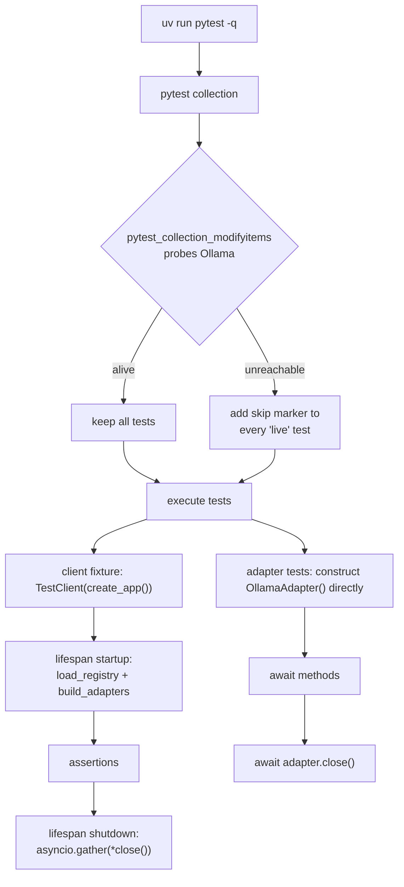
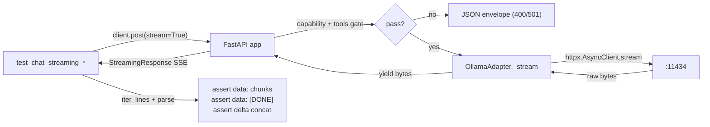
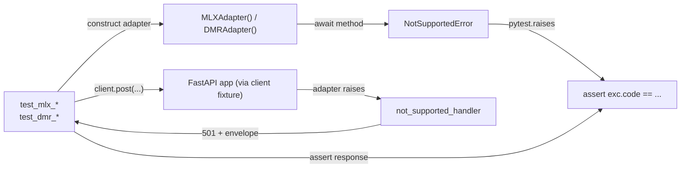

# Phase 3 — Tests + Docs — Architecture Specification

**Project**: local-ai-server
**Version**: v0.1.0
**Phase**: 3 — Tests + docs (FINAL phase of v0.1.0)
**Branch**: `phase/local-ai-server/3-tests-docs` (branched off `dev/local-ai-server` at `535983f`)
**Date**: 2026-06-15
**Precondition**: Phase 2 (Endpoints — Ollama wired) is merged into `dev/local-ai-server`. The wired `OllamaAdapter`, the `build_adapters` factory, and the three `/v1` routers (`models`, `chat`, `embeddings`) all exist on disk and pass the Phase 2 manual test checkpoint. `app/errors.py` already contains `http_exception_handler`, `not_supported_handler`, `validation_exception_handler`, and `unhandled_exception_handler`.

Target output path for this document: `/Users/ramikrispin/Personal/tutorials/local-ai-server/pm/v0_1_0/phase-3-architecture.md`.

---

## 1. Phase Overview

### Goal
Phase 3 is **tests + docs + housekeeping ONLY** — no `app/` source changes. Specifically:

- Live integration test suite (`uv run pytest -q`) is fully GREEN against a real local Ollama (`ollama serve` with `llama3.1:8b` and `nomic-embed-text` pulled). Tests that need Ollama are gated by a `live` marker that auto-skips cleanly when Ollama isn't reachable.
- Stub adapters (`MLXAdapter`, `DockerModelRunnerAdapter`) are covered by mock-based tests that lock the 501 / `NotSupportedError` contract per method (correct `code` per stub).
- `uv run ruff check .` (project mode, NOT isolated) is clean — which requires fixing the pre-existing `quite-style` → `quote-style` typo in `ruff.toml`.
- `docker/requirements.txt` parity: dev-container Python stack mirrors the gateway runtime + dev deps.
- `README.md` rewritten for v0.1.0: scope, prereqs, quick-start, `models.yaml` example, OpenAI SDK example, version roadmap. Preserves the existing WIP banner and the architecture diagram embed.
- `.gitignore` extended for `.env`, `__pycache__/`, `.pytest_cache/`, `.mypy_cache/`, `.ruff_cache/`, `htmlcov/`, `*.egg-info/`. Existing `posts/*.*` and `posts/assets/*.*` rules are preserved untouched.
- `pyproject.toml` extended with a `[tool.pytest.ini_options]` block (pythonpath, asyncio mode, custom markers).

### Dependencies on previous phases
- Phase 2 is merged. The current `app/` tree is unchanged from the merged Phase 2 state on `dev/local-ai-server`. **Phase 3 must not modify any file under `app/`.**
- The wired `OllamaAdapter` provides a long-lived `httpx.AsyncClient` and the four required methods (`chat_completions` stream + non-stream, `embeddings`, `health`, `close`).
- The capability gate, tools gate, and 501 paths from Phase 2 are unchanged and must keep working — Phase 3 tests lock them in place.
- `app/errors.py` already produces the OpenAI envelope on 422, 501, 500, and on `HTTPException` whose `detail` is a dict (the 400 / 404 paths).

### What this phase delivers
- `tests/` package with `conftest.py`, eight test modules, and a `tests/adapters/` sub-package.
- `pyproject.toml` extended with a `[tool.pytest.ini_options]` block.
- `ruff.toml` typo fix (`quite-style` → `quote-style`).
- `.gitignore` extension for env files and cache directories.
- `docker/requirements.txt` extension for runtime + dev parity.
- `README.md` rewritten for v0.1.0 with WIP banner + architecture diagram preserved.

### What this phase intentionally does NOT deliver
Restated in §10. Highlights:

- **No** edits to any file under `app/`. If a test surfaces a bug in `app/`, the Builder reports it as a Phase 2 regression and the orchestrator decides whether to spin a separate fix cycle.
- **No** auth, no `/readyz`, no Caddy, no Compose, no Makefile (v0.2.0+).
- **No** real MLX or Docker Model Runner implementations (v0.4.0+).
- **No** `structlog` migration (v0.2.0).
- **No** `watchfiles` hot-reload (v0.2.0).
- **No** mypy type cleanup beyond what naturally falls out of writing tests. The 27 `mypy --strict` findings carried forward from Phase 2 are out of scope; the Builder flags them in the merge note for v0.2.0 cleanup.
- **No** new endpoints.
- **No** edits to `.devcontainer/`, `.vscode/`, `docs/`, `assets/`, `posts/`, `examples/`, or pre-existing dev-container `docker/` files (`Dockerfile_Base`, `Dockerfile_Dev`, `build_*.sh`, `install_*.sh`, `.p10k.zsh`).

---

## 2. Module Specifications

Conventions inherited from Phase 1 and Phase 2: PEP 604 unions (`X | None`, never `Optional[X]`), `_OpenAIModel` schema base, `frozen=True, slots=True` for value objects, `yaml.safe_load`, line-length 79, stdlib `logging` (no `structlog`), no `watchfiles`. Tests use `TestClient` for the synchronous request path and `httpx.AsyncClient` (or `pytest-httpx`'s `httpx_mock`) when streaming or directly probing the adapter.

---

### 2.1 `tests/__init__.py` — NEW (optional package marker)

**Purpose**: Make `tests/` an importable package so `tests.conftest`-relative helpers (none in this phase, but keeps options open) and `tests/adapters/` discovery are explicit.

**Content**: empty file (0 bytes; or a single comment line `# pytest test package marker`).

**Notes**: pytest does not strictly require this with the `pythonpath = ["."]` setting in `pyproject.toml` (§5), but creating it eliminates the most common source of `ModuleNotFoundError: No module named 'tests'` confusion when Builder runs ad-hoc `uv run python -c` probes. If the Builder finds it conflicts with rootdir discovery, the file may be deleted; this is the only file in this spec that is permitted to be omitted at Builder discretion.

---

### 2.2 `tests/conftest.py` — NEW

**Purpose**: Centralize pytest fixtures, async-mode configuration, the `live` marker collection hook (auto-skip when Ollama isn't reachable), and a session-scoped `ollama_alive` probe.

**Dependencies**:
```python
from collections.abc import Iterator

import httpx
import pytest
from fastapi.testclient import TestClient

from app.config import get_settings
from app.main import create_app
from app.registry import Registry
```

**Module-level constants**:
```python
OLLAMA_PROBE_URL = "http://localhost:11434/api/tags"
OLLAMA_PROBE_TIMEOUT = 2.0
```

**Fixtures**:

```python
@pytest.fixture(scope="session")
def ollama_alive() -> bool:
    """Probe Ollama once per session; return True iff it answers
    /api/tags within OLLAMA_PROBE_TIMEOUT seconds."""
    ...


@pytest.fixture
def app_factory():
    """Return create_app from app.main as a thin re-export so tests
    that need a fresh FastAPI instance (e.g. for state isolation) can
    construct one without touching the module-level singleton."""
    return create_app


@pytest.fixture
def client(app_factory) -> Iterator[TestClient]:
    """Function-scoped TestClient with the lifespan running.

    Yields a TestClient over a freshly-created FastAPI app. Entering
    the TestClient context invokes the lifespan startup (which loads
    the registry and builds adapters); exiting closes adapters via
    the lifespan shutdown.
    """
    app = app_factory()
    with TestClient(app) as c:
        yield c


@pytest.fixture
def registry(client) -> Registry:
    """Return the Registry attached to the running app's state.

    Depends on `client` so the lifespan has run and `app.state.registry`
    is populated.
    """
    return client.app.state.registry
```

**Collection hook** — auto-skip `live` tests when Ollama isn't reachable:

```python
def pytest_configure(config: pytest.Config) -> None:
    """Register the 'live' marker so `--strict-markers` doesn't reject it."""
    config.addinivalue_line(
        "markers",
        "live: tests that require a running Ollama process",
    )


def pytest_collection_modifyitems(
    config: pytest.Config,
    items: list[pytest.Item],
) -> None:
    """Auto-skip every `live`-marked test when Ollama isn't reachable.

    Runs ONE probe per test session (cached as a module-level flag).
    A contributor running `uv run pytest -q` without Ollama gets clean
    skips, not failures.
    """
    ...
```

**Implementation outline for `pytest_collection_modifyitems`** (Builder writes the body):

```python
_alive: bool | None = None

def _probe_ollama() -> bool:
    try:
        r = httpx.get(OLLAMA_PROBE_URL, timeout=OLLAMA_PROBE_TIMEOUT)
        r.raise_for_status()
        return True
    except (httpx.RequestError, httpx.HTTPStatusError):
        return False

# Inside pytest_collection_modifyitems:
#   global _alive
#   if _alive is None:
#       _alive = _probe_ollama()
#   if _alive:
#       return
#   skip = pytest.mark.skip(reason="Ollama not reachable on :11434")
#   for item in items:
#       if "live" in item.keywords:
#           item.add_marker(skip)
```

**Interface contracts**:

| Fixture | Scope | Lifecycle |
|---|---|---|
| `ollama_alive` | session | Probes once via `httpx.get(OLLAMA_PROBE_URL, timeout=2.0)`; result cached for the whole session. Tests can also depend on this directly to inspect the result. |
| `app_factory` | function | Returns the `create_app` callable (not an instance). Lets tests build multiple isolated apps when needed. |
| `client` | function | Constructs a fresh `TestClient(create_app())`, enters the context (runs lifespan startup → `app.state.registry`, `app.state.adapters` populated), yields, then exits (lifespan shutdown closes adapters). |
| `registry` | function | Reads `client.app.state.registry`; transitively depends on `client`. |

**Notes**:
- `client` is the canonical fixture for HTTP-level assertions. **Use `TestClient` for non-streaming requests and TestClient + `stream=True` only for the streaming test as documented in §2.7**.
- `pytest-asyncio`'s `asyncio_mode = "auto"` (in `pyproject.toml`, §5) makes `async def test_*` functions runnable without `@pytest.mark.asyncio`.
- The collection hook is the one place Ollama reachability is checked; individual `live` tests do NOT need their own `pytest.mark.skipif(not ollama_alive, ...)` since the hook adds the skip marker automatically. Tests may still depend on `ollama_alive` if they want to read the value (e.g., for assertions about the probe behavior itself, though no such test exists in v0.1.0).
- All fixtures are pure factories; they hold no module-level state (the `_alive` cache in the collection hook is the single exception, and is private to the hook).
- The pytest-httpx-based MLX/DMR tests do NOT depend on `client` — they call adapter methods directly and assert exception types/codes. See §2.10/§2.11.

---

### 2.3 `tests/test_registry.py` — NEW

**Purpose**: Unit-test the `Registry` parser, lookup, and validation paths defined in `app/registry.py`.

**Dependencies**:
```python
from pathlib import Path

import pytest

from app.registry import (
    Capability,
    Model,
    Registry,
    RegistryError,
    load_registry,
)
```

**Test inventory** (all synchronous, no live deps):

| Test function | What it asserts |
|---|---|
| `test_load_registry_from_repo_yaml(tmp_path)` | `load_registry("config/models.yaml")` returns a `Registry` with exactly 4 entries; ids match the locked set `{"ollama-llama3","ollama-nomic-embed","mlx-mistral","model-runner-llama32"}`. |
| `test_registry_lookup_returns_model()` | `registry.get("ollama-llama3")` returns a `Model` with `backend="ollama"`, `upstream_model="llama3.1:8b"`, `capabilities` containing both `Capability.CHAT` and `Capability.TOOLS`. |
| `test_registry_lookup_missing_returns_none()` | `registry.get("does-not-exist")` returns `None` (NOT raises). |
| `test_registry_iter_yields_source_order()` | Iteration yields the four ids in the order declared in `config/models.yaml`. |
| `test_registry_ids_method_matches_iteration()` | `registry.ids()` equals `[m.id for m in registry]`. |
| `test_capability_enum_string_equality()` | `Capability.CHAT == "chat"`, `Capability.EMBEDDINGS == "embeddings"`, `Capability.TOOLS == "tools"` (locks the `str, Enum` contract). |
| `test_model_supports_method()` | `model.supports(Capability.CHAT)` returns True/False as expected; covers a positive and negative case. |
| `test_load_registry_missing_file_raises_filenotfound(tmp_path)` | `load_registry(tmp_path / "nope.yaml")` raises `FileNotFoundError`. |
| `test_load_registry_malformed_yaml_raises(tmp_path)` | A YAML file with `models: {oops` (lex error) raises `RegistryError` (or wraps `yaml.YAMLError` — Builder picks based on actual `app/registry.py` behavior; current implementation lets `yaml.YAMLError` propagate, which is acceptable — this test asserts that *some* exception derived from `(RegistryError, yaml.YAMLError)` is raised). |
| `test_load_registry_missing_top_level_models_raises(tmp_path)` | A YAML file with no `models:` key raises `RegistryError` with a message mentioning "models". |
| `test_load_registry_models_not_a_list_raises(tmp_path)` | A YAML where `models: "string"` raises `RegistryError`. |
| `test_load_registry_entry_missing_required_field_raises(tmp_path)` | An entry missing `upstream_model` raises `RegistryError` whose message contains `"models[0]"` and `"upstream_model"`. |
| `test_load_registry_duplicate_id_raises(tmp_path)` | Two entries with the same `id` raise `RegistryError` whose message contains the duplicated id and `"duplicate"`. |
| `test_load_registry_unknown_capability_raises(tmp_path)` | An entry with `capabilities: [chat, vision]` raises `RegistryError` whose message contains `"unknown capability"` and `"vision"`. |
| `test_load_registry_base_url_optional(tmp_path)` | An entry without `base_url:` produces a `Model` with `model.base_url is None`; an entry with `base_url: http://x:1` produces `model.base_url == "http://x:1"`. |
| `test_registry_is_immutable()` | Attempting `registry.models = ()` raises `dataclasses.FrozenInstanceError` (or `AttributeError` on slots-frozen). |

**Fixtures used**: `tmp_path` (built-in pytest fixture). No app fixtures needed — these are pure-function unit tests.

**Marker usage**: none. All tests run unconditionally.

**Notes**:
- The first test (`test_load_registry_from_repo_yaml`) reads the actual `config/models.yaml` from the repo root — it's a regression lock on the sample registry shape. Use `Path("config/models.yaml")` relative to the project root; pytest's rootdir + `pythonpath = ["."]` makes this resolvable.
- The malformed-yaml test should write a small invalid file via `tmp_path / "bad.yaml"` so it's hermetic.

---

### 2.4 `tests/test_models_endpoint.py` — NEW

**Purpose**: Lock the `GET /v1/models` shape and content.

**Dependencies**:
```python
from fastapi.testclient import TestClient
```

**Test inventory** (all use the `client` fixture; no live deps):

| Test function | What it asserts |
|---|---|
| `test_get_v1_models_returns_200(client)` | HTTP 200. |
| `test_get_v1_models_response_shape(client)` | Body has `object == "list"` and `data` is a list. |
| `test_get_v1_models_lists_all_four_registry_entries(client)` | `len(data) == 4`; the set of `data[i]["id"]` equals the locked set of four registry ids. |
| `test_get_v1_models_each_entry_shape(client)` | For every entry: `object == "model"`, `owned_by == "local"`, `created` is a positive int. |
| `test_get_v1_models_no_auth_required(client)` | Sending NO `Authorization` header still returns 200 (auth is v0.2.0). |
| `test_get_v1_models_with_random_authorization_header_still_200(client)` | Sending `Authorization: Bearer whatever` does not change the response (gateway ignores auth in v0.1.0). |

**Fixtures used**: `client`.

**Marker usage**: none.

**Notes**:
- `created` assertions are `> 0` (not equality) because the router uses `int(time.time())` per-request.
- The "no auth" tests are a forward-looking lock — when v0.2.0 adds auth, these tests will need to be updated. Document this with a comment in the test file.

---

### 2.5 `tests/test_chat.py` — NEW

**Purpose**: Lock the chat-completions non-streaming happy path against a live Ollama AND the synchronous error paths (capability + tools + 404) that fire **before** any backend call.

**Dependencies**:
```python
import pytest
from fastapi.testclient import TestClient
```

**Test inventory**:

| Test function | Marker | What it asserts |
|---|---|---|
| `test_chat_non_stream_live_ollama(client)` | `live` | `POST /v1/chat/completions` with `model="ollama-llama3"`, a one-message body asking for a 3-word reply, `stream=False` returns 200; body has `choices[0].message.content` non-empty (string, length > 0); `choices[0].message.role == "assistant"`; `usage.prompt_tokens > 0`, `usage.completion_tokens > 0`, `usage.total_tokens > 0`; `object == "chat.completion"`. |
| `test_chat_unknown_model_returns_404(client)` | none | `POST /v1/chat/completions` with `model="does-not-exist"` returns 404; body matches `{"error": {"type":"invalid_request_error","code":"model_not_found","param":"model", "message": ...}}`. |
| `test_chat_capability_gate_no_chat_returns_501(client)` | none | `POST /v1/chat/completions` with `model="ollama-nomic-embed"` (declares only `[embeddings]`) returns 501; body has `error.type == "not_supported"` and `error.code == "backend_capability_missing"`. **No live Ollama call required** because the gate fires before adapter dispatch — this test must pass even when Ollama is unreachable. |
| `test_chat_tools_gate_chat_only_model_returns_400(client)` | none | `POST /v1/chat/completions` with `model="mlx-mistral"` (declares `[chat]`, no `tools`) and a `tools=[{...}]` field returns 400 (NOT 501); body has `error.type == "invalid_request_error"` and `error.code == "tools_not_supported"` and `error.param == "tools"`. **Locks the rule** that the chat capability passes first, then the tools gate fires. No live Ollama call — gate fires before adapter dispatch. |
| `test_chat_capability_first_ordering_no_chat_with_tools_returns_501(client)` | none | `POST /v1/chat/completions` with `model="ollama-nomic-embed"` (no `chat`) + a `tools=[{...}]` field returns **501** (NOT 400). Locks the rule that the **chat capability gate fires before the tools gate**. This is the explicit ordering assertion the spec calls out. |
| `test_chat_stub_backend_mlx_returns_501(client)` | none | `POST /v1/chat/completions` with `model="mlx-mistral"` (chat-capable but stub-backed) and **no** `tools` returns 501; body has `error.code == "not_implemented"` (from `MLXAdapter.chat_completions`'s `NotSupportedError`). |
| `test_chat_stub_backend_dmr_returns_501(client)` | none | Same as above with `model="model-runner-llama32"`. |
| `test_chat_invalid_body_returns_422(client)` | none | A request body with `messages: []` is fine; a body with NO `messages` field returns 422 with `error.type == "invalid_request_error"`. (Pydantic's `RequestValidationError` path.) |

**Fixtures used**: `client`.

**Marker usage**: only the live happy path uses `pytest.mark.live`. All other tests run unconditionally because they hit error paths that fire before adapter dispatch.

**Notes**:
- The "capability-first ordering" test (`test_chat_capability_first_ordering_no_chat_with_tools_returns_501`) is the most architecturally important one in this file — it locks an invariant the Phase 2 architecture derives but the development plan only implies. Builder should add a comment in the test pointing to this section.
- The 422 test assumes `app/errors.py` `validation_exception_handler` returns the OpenAI envelope per Phase 1 contract; this is already the case.
- The "live" test should pin `temperature=0` if possible to reduce flakiness, but content assertions stay loose (`len(content) > 0`, role is `"assistant"`) because we cannot pin a deterministic completion across Ollama versions.

---

### 2.6 `tests/test_chat_streaming.py` — NEW

**Purpose**: Lock the chat-completions streaming happy path: SSE chunks arrive, the stream terminates with `data: [DONE]\n\n`, and concatenating delta content reproduces a non-empty string.

**Dependencies**:
```python
import json
import re

import pytest
from fastapi.testclient import TestClient
```

**Approach**: TestClient supports streamed responses via the standard requests-like API (`client.post(..., json=..., headers=...)` returns a `Response` object whose `iter_lines()` and `iter_bytes()` work for SSE). For v0.1.0 we use TestClient throughout for consistency with `tests/test_chat.py`; if the Builder finds TestClient cannot deliver the streaming chunks incrementally (it can — Starlette honors `StreamingResponse` under TestClient), they may switch to `httpx.AsyncClient` against the running app instance — but this is not expected to be necessary.

**Test inventory**:

| Test function | Marker | What it asserts |
|---|---|---|
| `test_chat_streaming_live_ollama_yields_data_chunks(client)` | `live` | `POST /v1/chat/completions` with `stream=True` returns 200 with `Content-Type` starting with `text/event-stream`; iterating `response.iter_lines()` collects at least one line that starts with `data: ` and parses as JSON with `choices[0].delta` present. |
| `test_chat_streaming_live_ollama_terminates_with_done(client)` | `live` | The full stream body (collected via `response.text` or by joining `iter_lines()`) contains the exact string `data: [DONE]` somewhere after at least one `data: {...}` line. (Spec §5.3: terminator passed through verbatim from Ollama, never synthesized.) |
| `test_chat_streaming_live_ollama_delta_concatenation_nonempty(client)` | `live` | Iterating SSE `data:` lines, parsing each as JSON (skipping the `[DONE]` sentinel), and concatenating `chunk["choices"][0]["delta"].get("content","")` produces a non-empty string. Locks the chunk ordering / delta semantics for SDK consumers. |
| `test_chat_streaming_live_ollama_sse_headers_present(client)` | `live` | Response headers include `Cache-Control: no-cache` and `X-Accel-Buffering: no` (the headers `app/routers/chat.py:SSE_HEADERS` mandates per spec §5.3). |
| `test_chat_streaming_capability_gate_returns_501_no_stream(client)` | none | `stream=True` with `model="ollama-nomic-embed"` returns 501 — capability gate fires before the streaming branch is entered. Body is JSON envelope, NOT SSE. |
| `test_chat_streaming_tools_gate_returns_400_no_stream(client)` | none | `stream=True` with `model="mlx-mistral"` + `tools=[...]` returns 400 — tools gate fires before the streaming branch is entered. Body is JSON envelope, NOT SSE. |

**Fixtures used**: `client`.

**Marker usage**: all four happy-path tests use `pytest.mark.live`. The two error-path tests run unconditionally.

**Notes**:
- TestClient under FastAPI/Starlette handles SSE. If the Builder hits any blocker (e.g. TestClient buffers entire body), the fallback is to construct `httpx.AsyncClient(transport=httpx.ASGITransport(app=app))` and use `async with client.stream("POST", ...)`. Document the choice the Builder lands on in a module-level docstring.
- The `[DONE]` assertion uses substring match on the response body, not an exact-line match, to tolerate trailing whitespace differences.
- Each streaming test must close its TestClient response explicitly (TestClient cleans up automatically when the response object goes out of scope, but explicit `with client.stream(...)` or explicit `response.close()` is preferred so subsequent tests don't see hanging connections; document this in the file's module docstring).
- Asserting an exact chunk count is brittle (depends on Ollama version and prompt); we only assert "at least one" `data:` chunk and "exactly one" `[DONE]` terminator.

---

### 2.7 `tests/test_embeddings.py` — NEW

**Purpose**: Lock the embeddings happy path against live Ollama and the embeddings-specific 501 paths.

**Dependencies**:
```python
import pytest
from fastapi.testclient import TestClient
```

**Test inventory**:

| Test function | Marker | What it asserts |
|---|---|---|
| `test_embeddings_live_ollama_returns_vector(client)` | `live` | `POST /v1/embeddings` with `model="ollama-nomic-embed"`, `input="hello world"` returns 200; body has `object == "list"`; `len(data) == 1`; `data[0]["object"] == "embedding"`; `data[0]["index"] == 0`; `data[0]["embedding"]` is a list of floats with length > 0 (typically 768 for `nomic-embed-text`, but assert `> 0` not `== 768` to tolerate model variants); `usage.prompt_tokens > 0`; `usage.total_tokens > 0`. |
| `test_embeddings_live_ollama_batch_input(client)` | `live` | Same with `input=["hello", "world"]`; body's `data` has length 2; both embeddings have non-empty vectors; `data[0]["index"] == 0`, `data[1]["index"] == 1`. |
| `test_embeddings_capability_gate_no_embeddings_returns_501(client)` | none | `POST /v1/embeddings` with `model="ollama-llama3"` (declares `[chat, tools]`, no `embeddings`) returns 501; body has `error.type == "not_supported"` and `error.code == "backend_capability_missing"`; **fires before any adapter call**, so passes regardless of Ollama status. |
| `test_embeddings_unknown_model_returns_404(client)` | none | `POST /v1/embeddings` with `model="does-not-exist"` returns 404; body has `error.code == "model_not_found"`. |
| `test_embeddings_stub_backend_dmr_returns_501(client)` | none | `POST /v1/embeddings` with `model="model-runner-llama32"` (declares `[chat, embeddings, tools]` but stub-backed) returns 501; body has `error.code == "not_implemented"` (from `DockerModelRunnerAdapter.embeddings`'s `NotSupportedError`). This test locks the seam where the capability gate passes but the adapter still fails. |
| `test_embeddings_stub_backend_mlx_returns_501_via_capability_gate(client)` | none | `POST /v1/embeddings` with `model="mlx-mistral"` (declares only `[chat]`) returns 501 with `error.code == "backend_capability_missing"` — capability gate fires; the adapter's own `NotSupportedError` is NOT reached. (Documents the layered defense.) |

**Fixtures used**: `client`.

**Marker usage**: live tests for the happy paths; error-path tests run unconditionally.

**Notes**:
- The batch-input test uses a list of two strings to exercise the `input: str | list[str] | list[int] | list[list[int]]` schema breadth. Builder may simplify to `input="hello"` if Ollama's batch behavior is unstable across versions; in that case keep only `test_embeddings_live_ollama_returns_vector`.
- The DMR-stub test is the only embeddings test where the capability gate passes but the adapter raises, so it's the architectural seam test for the embeddings router. Comment it as such.

---

### 2.8 `tests/adapters/__init__.py` — NEW

**Purpose**: Empty package marker for the `tests/adapters/` directory. Required so pytest can discover modules and the import path `tests.adapters.*` works for any cross-test helper imports (none in v0.1.0, but the package shape is the convention).

**Content**: empty file.

---

### 2.9 `tests/adapters/test_ollama_adapter.py` — NEW

**Purpose**: Direct adapter-level tests against `OllamaAdapter`, separate from the FastAPI-routed tests in `tests/test_chat.py` etc. Covers the adapter's wire-level contract.

**Dependencies**:
```python
import pytest

from app.adapters.ollama import OllamaAdapter
```

**Test inventory** (all `async def`, run via `asyncio_mode = "auto"`):

| Test function | Marker | What it asserts |
|---|---|---|
| `test_ollama_adapter_chat_non_stream_returns_dict()` | `live` | Construct `OllamaAdapter(base_url="http://localhost:11434")`; await `chat_completions({"model":"llama3.1:8b","messages":[{"role":"user","content":"hi"}]}, stream=False)`; result is a dict with `choices[0].message.content`. After: `await adapter.close()`. |
| `test_ollama_adapter_chat_stream_returns_async_iterator()` | `live` | Await `chat_completions({...}, stream=True)`; assert the result has `__aiter__` (it's the `_stream` async generator); collect bytes via `async for chunk in result: ...`; assert at least one chunk and that the joined bytes contain `b"data: [DONE]"`. After: `await adapter.close()`. |
| `test_ollama_adapter_embeddings_returns_dict()` | `live` | Await `embeddings({"model":"nomic-embed-text","input":"hello"})`; assert `data[0]["embedding"]` is a list of length > 0. After: `await adapter.close()`. |
| `test_ollama_adapter_health_returns_ok_when_alive()` | `live` | Await `health()`; assert `result["status"] == "ok"` and `result["models"]` is a list. (Does NOT assert specific model names — Ollama's pulled set varies.) |
| `test_ollama_adapter_health_returns_unreachable_when_offline(httpx_mock)` | none | Use `pytest-httpx`'s `httpx_mock` to register `httpx.ConnectError` for `GET http://localhost:11434/api/tags`. Construct `OllamaAdapter()`; await `health()`; assert `result == {"status": "unreachable", "error": <some non-empty str>}`. **Critically: `health()` does NOT raise.** This locks the contract from Phase 2 §3 §health. |
| `test_ollama_adapter_close_is_idempotent()` | none | Construct adapter; `await adapter.close()` twice; the second call must not raise. (httpx `aclose()` is safe to call multiple times in modern httpx; this is a regression lock.) |

**Fixtures used**: `httpx_mock` (from `pytest-httpx`) for the offline health test only.

**Marker usage**: `pytest.mark.live` on the four tests that hit a real Ollama. The `httpx_mock`-based test and the close-idempotency test run unconditionally.

**Notes**:
- These tests construct `OllamaAdapter` directly — they bypass FastAPI entirely. They lock the adapter's individual contract and complement the FastAPI-routed tests in §2.5–§2.7.
- The `httpx_mock` test is the one place pytest-httpx is used in the live-adapter test file. It mocks `httpx.ConnectError` per the pytest-httpx API (the exact incantation depends on the version pinned in `pyproject.toml`; `pytest-httpx>=0.30` supports `httpx_mock.add_exception(httpx.ConnectError("simulated"), url=..., method="GET")`).
- The streaming test must `await adapter.close()` in a `try/finally` so a partial stream consumption doesn't leak the underlying httpx client across tests.
- Builder option: factor out `adapter_factory` as a local helper that returns `(adapter, cleanup_callable)`, but it's overkill for six tests. Inline construction is acceptable.

---

### 2.10 `tests/adapters/test_mlx_adapter.py` — NEW

**Purpose**: Lock the `MLXAdapter` 501 contract: every method raises `NotSupportedError` with the architecturally-correct `code`. Also lock the routed HTTP 501 surface via `TestClient`.

**Dependencies**:
```python
import pytest

from app.adapters.base import NotSupportedError
from app.adapters.mlx import MLXAdapter
```

**Test inventory** (all run unconditionally — no live deps):

| Test function | What it asserts |
|---|---|
| `test_mlx_chat_completions_raises_not_supported_with_not_implemented_code()` | `MLXAdapter()` then `await adapter.chat_completions({}, stream=False)` raises `NotSupportedError` with `exc.code == "not_implemented"` and `exc.backend == "mlx"`. |
| `test_mlx_chat_completions_streaming_raises_not_supported()` | Same for `stream=True` (the stub raises before differentiating, so same `code == "not_implemented"`). |
| `test_mlx_embeddings_raises_not_supported_with_capability_missing_code()` | `await adapter.embeddings({})` raises `NotSupportedError` with `exc.code == "backend_capability_missing"` and `exc.param == "model"` and `exc.backend == "mlx"`. **This is the deliberate distinction**: embeddings is a permanent capability gap per spec §5.2, while chat/health are deferred-implementation. |
| `test_mlx_health_raises_not_supported_with_not_implemented_code()` | `await adapter.health()` raises `NotSupportedError` with `exc.code == "not_implemented"`. |
| `test_mlx_close_is_noop()` | `await adapter.close()` returns `None`, does not raise (stubs hold no resources). |
| `test_mlx_routed_chat_returns_501_with_envelope(client)` | TestClient `POST /v1/chat/completions` with `model="mlx-mistral"` and no `tools` returns 501; body has `error.type == "not_supported"`, `error.code == "not_implemented"`. (Note: this overlaps with `tests/test_chat.py::test_chat_stub_backend_mlx_returns_501` — keep both because this one anchors the envelope contract at the adapter-test layer for traceability.) |

**Fixtures used**: `client` for the last test only.

**Marker usage**: none. All tests run unconditionally.

**Notes**:
- The split between `not_implemented` (chat, health) and `backend_capability_missing` (embeddings) is the architectural seam locked by these tests. Comment the `test_mlx_embeddings_*` test pointing at spec §5.2 and Phase 1 architecture §2.10 for the rationale.
- These tests do NOT use `pytest-httpx` because the stub never makes any HTTP call — it raises immediately.

---

### 2.11 `tests/adapters/test_docker_model_runner_adapter.py` — NEW

**Purpose**: Lock the `DockerModelRunnerAdapter` 501 contract — all three methods raise `NotSupportedError(code="not_implemented")`.

**Dependencies**:
```python
import pytest

from app.adapters.base import NotSupportedError
from app.adapters.docker_model_runner import DockerModelRunnerAdapter
```

**Test inventory** (all run unconditionally — no live deps):

| Test function | What it asserts |
|---|---|
| `test_dmr_chat_completions_raises_not_supported_with_not_implemented_code()` | `DockerModelRunnerAdapter()` then `await adapter.chat_completions({}, stream=False)` raises `NotSupportedError` with `exc.code == "not_implemented"` and `exc.backend == "docker_model_runner"`. |
| `test_dmr_chat_completions_streaming_raises_not_supported()` | Same with `stream=True`. |
| `test_dmr_embeddings_raises_not_supported_with_not_implemented_code()` | `await adapter.embeddings({})` raises `NotSupportedError` with `exc.code == "not_implemented"`. **Distinction from MLX**: DMR's stub uses `not_implemented` for embeddings (the registry declares the capability; the adapter just isn't done yet — see `app/adapters/docker_model_runner.py` Phase 1 source). |
| `test_dmr_health_raises_not_supported_with_not_implemented_code()` | `await adapter.health()` raises `NotSupportedError` with `exc.code == "not_implemented"`. |
| `test_dmr_close_is_noop()` | `await adapter.close()` returns `None`, does not raise. |
| `test_dmr_routed_chat_returns_501_with_envelope(client)` | TestClient `POST /v1/chat/completions` with `model="model-runner-llama32"` (chat-capable per registry) returns 501; body has `error.code == "not_implemented"`. |
| `test_dmr_routed_embeddings_returns_501_with_envelope(client)` | TestClient `POST /v1/embeddings` with `model="model-runner-llama32"` (embeddings-capable per registry) returns 501; body has `error.code == "not_implemented"`. **This is the seam test** — capability gate passes, adapter raises. |

**Fixtures used**: `client` for the last two tests.

**Marker usage**: none.

**Notes**:
- DMR is the single adapter whose stub uses `not_implemented` uniformly across all three methods (the MLX stub differentiates `embeddings` as `backend_capability_missing`). Comment the file with this rationale, pointing at Phase 1 architecture §2.11.
- The "routed embeddings" test is the architectural seam that distinguishes "capability declared but adapter unwired" from "capability missing". Phase 2 §2.6 calls this out as a defense-in-depth check.

---

### 2.12 `README.md` — REWRITE (preserves WIP banner + diagram embed)

**Purpose**: Public-facing entry point. Rewritten end-to-end for v0.1.0 scope; preserves the existing WIP banner verbatim and the `assets/design diagram.png` embed.

**Skeleton — section headings + a sentence per section** (Builder writes the prose to fit this structure):

```markdown
# Local AI Server

> **Status: Work in Progress.** This project is under active development — the spec is finalized but the implementation is still being built out. Interfaces, configuration, and layout may change.

[ONE-LINE DESCRIPTION]
A home AI gateway running on a Mac Studio that exposes an OpenAI-compatible HTTP API and routes requests to local LLM backends. v0.1.0 is the first vertical slice: a FastAPI gateway wired to Ollama, with MLX and Docker Model Runner stubbed at HTTP 501 to lock the routing seam.

## What's in v0.1.0
[bulleted list — one bullet each]
- OpenAI-compatible HTTP surface (`GET /v1/models`, `POST /v1/chat/completions` (stream + non-stream), `POST /v1/embeddings`).
- Ollama backend wired end-to-end via async httpx with SSE streaming.
- Capability gating (`chat`, `embeddings`, `tools`) and tools-gate (HTTP 400 before backend dispatch).
- `BackendAdapter` ABC with `MLXAdapter` and `DockerModelRunnerAdapter` returning HTTP 501 on every method, locking the routing seam for v0.4.0+.
- Live integration tests against a real local Ollama; mock-based tests for the stub adapters.

## What's deferred
[bulleted list — links to spec.md sections]
- API-key auth (Argon2id + SQLite) — v0.2.0.
- Caddy + TLS + LAN binding + `compose.yaml` — v0.3.0.
- Real MLX and Docker Model Runner backends — v0.4.0+.
- Hot-reload of `models.yaml` via watchfiles — v0.2.0.
- Structured JSON logging via structlog — v0.2.0.
- See [`docs/spec.md`](docs/spec.md) for the full v1 design.

## Architecture

[ONE PARAGRAPH explaining the diagram]
The gateway and Caddy reverse proxy will run in containers (v0.3.0+); the three model backends run natively on the host (Apple Metal has no GPU passthrough into Docker on Mac, and MLX has no Linux wheels). v0.1.0 runs the gateway as a plain host process under uvicorn against a host-native Ollama.

## Prerequisites
[checklist]
- macOS with [`uv`](https://docs.astral.sh/uv/) installed.
- [Ollama](https://ollama.com) installed and `ollama serve` running on `localhost:11434`.
- Required Ollama models pulled:
  ```bash
  ollama pull llama3.1:8b
  ollama pull nomic-embed-text
  ```

## Quick start
[fenced bash block]
```bash
git clone https://github.com/RamiKrispin/local-ai-server
cd local-ai-server
uv sync
cp config/.env.example config/.env  # optional; defaults work
uv run uvicorn app.main:app --port 8000
```

[verification snippet]
```bash
curl http://127.0.0.1:8000/healthz             # {"status":"ok"}
curl http://127.0.0.1:8000/v1/models | jq .
```

## Using the OpenAI Python SDK
[fenced python block — adapted from development plan §8 part C step 8]
```python
from openai import OpenAI

client = OpenAI(base_url="http://127.0.0.1:8000/v1", api_key="not-used-yet")

# List models
print([m.id for m in client.models.list().data])

# Non-streaming chat
r = client.chat.completions.create(
    model="ollama-llama3",
    messages=[{"role": "user", "content": "Say hi in three words."}],
)
print(r.choices[0].message.content)

# Streaming chat
for chunk in client.chat.completions.create(
    model="ollama-llama3",
    messages=[{"role": "user", "content": "Stream a haiku."}],
    stream=True,
):
    if chunk.choices and chunk.choices[0].delta.content:
        print(chunk.choices[0].delta.content, end="", flush=True)
print()

# Embeddings
e = client.embeddings.create(model="ollama-nomic-embed", input="hello")
print("dim:", len(e.data[0].embedding))
```

## Configuration: `config/models.yaml`
[fenced yaml block — exact content of the v0.1.0 sample registry]
```yaml
models:
  - id: ollama-llama3
    backend: ollama
    upstream_model: llama3.1:8b
    capabilities: [chat, tools]
  - id: ollama-nomic-embed
    backend: ollama
    upstream_model: nomic-embed-text
    capabilities: [embeddings]
  - id: mlx-mistral             # stubbed at 501 in v0.1.0
    backend: mlx
    upstream_model: mlx-community/Mistral-7B-Instruct-v0.3
    base_url: http://localhost:8080
    capabilities: [chat]
  - id: model-runner-llama32    # stubbed at 501 in v0.1.0
    backend: docker_model_runner
    upstream_model: ai/llama3.2
    capabilities: [chat, embeddings, tools]
```

## Tests
[fenced bash block]
```bash
uv run pytest -q              # all tests; live tests auto-skip if Ollama isn't running
uv run pytest -q -m "not live" # explicitly skip live tests
uv run ruff check .
```

## Demo notebook
A runnable end-to-end demo lives at [`examples/v0_1_0_demo.ipynb`](examples/v0_1_0_demo.ipynb) — list models, non-stream chat, stream chat, embeddings, and a 501 example from a stub backend.

## Version roadmap
[table or bulleted list]
| Version | Scope |
|---|---|
| **v0.1.0** | Ollama wired; MLX + DMR stubbed at 501; no auth; host process. |
| v0.2.0 | API-key auth (Argon2id + SQLite); structlog; watchfiles hot-reload; `/readyz`. |
| v0.3.0 | Caddy + TLS + LAN binding; `compose.yaml`; `Dockerfile.gateway`. |
| v0.4.0+ | Real MLX adapter; real Docker Model Runner adapter; `Makefile` for host-backend lifecycle. |

## Documentation
The full v1 design is in [`docs/spec.md`](docs/spec.md), including the request lifecycle, repository layout, adapter contracts, configuration schema, auth flow, container/Caddy setup, host-side Makefile for backend lifecycle, and the end-to-end verification plan.

## License
[CC-BY-NC-SA-4.0](https://creativecommons.org/licenses/by-nc-sa/4.0/).
```

**Sections to PRESERVE verbatim from the existing README**:
- The exact WIP banner blockquote at the top.
- The architecture diagram embed: `` (exact path including the URL-encoded space).
- The license footer.

**Sections to remove from the existing README** (because they describe v1 features that are deferred):
- The bullet about API-key auth in the architecture description (move to "What's deferred").
- The hot-reload bullet (move to "What's deferred").
- The mention of `/readyz` in the API list (it's not in v0.1.0).

**Notes**:
- All file paths in the README are repo-relative (`docs/spec.md`, `assets/design%20diagram.png`, `examples/v0_1_0_demo.ipynb`, `config/models.yaml`) — no absolute paths.
- The `api_key="not-used-yet"` placeholder mirrors the development plan's §8 step 8 SDK example and the existing `examples/v0_1_0_demo.ipynb`; it's deliberate so users learn auth is coming in v0.2.0.

---

### 2.13 `docker/requirements.txt` — MODIFIED (extend, don't replace)

**Purpose**: Make the dev-container Python stack mirror the gateway's runtime + dev deps, so `import fastapi`, `import httpx`, `pytest`, etc. all work inside the dev container without a separate venv.

**Strategy**: APPEND new lines to the existing file. Do NOT remove or modify the existing data-science deps (`pandas`, `plotly`, `jupyter`, etc.) — they belong to the broader workspace convention.

**Exact lines to APPEND** (versions match `pyproject.toml` minimums; pin to `>=` matching the project, NOT exact pins, to keep the dev container resolvable as the project evolves):

```
# --- local-ai-server v0.1.0 runtime + dev deps (Phase 3) ---
fastapi>=0.115
uvicorn[standard]>=0.32
httpx>=0.27
pydantic>=2.9
pydantic-settings>=2.5
pyyaml>=6.0
pytest>=8
pytest-asyncio>=0.24
pytest-httpx>=0.30
ruff>=0.6
mypy>=1.11
```

**Resulting file** (illustrative final state, NOT a template the Builder copy-pastes — Builder appends the new block to the existing 14-line file verbatim):

```
wheel==0.40.0
pandas==2.2.2
plotly==5.15.0
plotly-express==0.4.1
ipywidgets==8.1.7
jupyter==1.1.1
narwhals==1.28.0
great_tables==0.16.1
pointblank==0.6.1
statsforecast==2.0.1
mlforecast==1.0.2
lightgbm==4.6.0
xgboost==3.0.2
scikit-learn==1.7.0
# --- local-ai-server v0.1.0 runtime + dev deps (Phase 3) ---
fastapi>=0.115
uvicorn[standard]>=0.32
httpx>=0.27
pydantic>=2.9
pydantic-settings>=2.5
pyyaml>=6.0
pytest>=8
pytest-asyncio>=0.24
pytest-httpx>=0.30
ruff>=0.6
mypy>=1.11
```

**Notes**:
- The existing data-science deps use exact pins (`pandas==2.2.2`); the gateway deps use `>=` to match `pyproject.toml`. This is an intentional difference: the dev container's stack tolerates float on the runtime libs because `uv` (used at runtime via `uv run`) creates an isolated lock anyway; the data-science libs need exact pins to avoid notebook drift.
- Do NOT touch `Dockerfile_Base`, `Dockerfile_Dev`, `build_*.sh`, `install_*.sh`, `.p10k.zsh`. They are the pre-existing dev-container files and out of scope.

---

### 2.14 `ruff.toml` — MODIFIED (one-line typo fix; optional test-dir tweaks)

**Purpose**: Fix the pre-existing `quite-style` → `quote-style` typo so ruff's `[format]` section parses correctly under project mode.

**Diff**:

```diff
 exclude = [".git", ".venv", ".vscode", ".devcontainer", "docker"]
 line-length = 79
 indent-width = 4

 [lint]
 extend-select = ["E501"]


 [format]
-quite-style = "double"
+quote-style = "double"
 indent-style = "space"
```

**Optional follow-up tweak (Builder discretion, only if needed)**: if ruff's `E501` (line-too-long) fires on test bodies that legitimately need longer lines (e.g., a long parametrize id or a long URL literal in `tests/conftest.py:OLLAMA_PROBE_URL`), add a `[lint.per-file-ignores]` section:

```toml
[lint.per-file-ignores]
"tests/**/*.py" = ["E501"]
```

**Strong recommendation**: do NOT add this carve-out unless ruff actually flags a test line and the line cannot be naturally wrapped at 79 columns. Tests should follow the same line-length convention as the rest of the project; the carve-out is escape-hatch insurance, not the default.

**Risk**: After fixing the typo, ruff's `[format]` block becomes active for the first time in the project — running `uv run ruff format --check .` may surface previously-hidden formatting drift across `app/` (since project-mode ruff couldn't run cleanly before the fix). The development plan limits Phase 3 to `ruff check`, NOT `ruff format`, so the Builder runs only `ruff check .` for the test checkpoint. If `ruff format --check` is run as a sanity check and finds drift, **flag it for v0.2.0** — do NOT format-fix `app/` files in Phase 3 (no `app/` source changes is the locked rule).

---

### 2.15 `.gitignore` — MODIFIED (extend, don't replace)

**Purpose**: Cover env files and Python cache directories that have been accumulating during development.

**Strategy**: APPEND new lines to the existing file. Preserve the existing two lines verbatim — they are the social-content workspace convention and removing them would break unrelated workflows.

**Exact lines to APPEND**:

```
# --- local-ai-server v0.1.0 (Phase 3) ---
config/.env
.env
__pycache__/
*.pyc
.pytest_cache/
.mypy_cache/
.ruff_cache/
htmlcov/
.coverage
*.egg-info/
```

**Resulting file** (illustrative):

```
posts/*.*
posts/assets/*.*
# --- local-ai-server v0.1.0 (Phase 3) ---
config/.env
.env
__pycache__/
*.pyc
.pytest_cache/
.mypy_cache/
.ruff_cache/
htmlcov/
.coverage
*.egg-info/
```

**Notes**:
- `config/.env` is the canonical user env file location (per `app/config.py:Settings.model_config.env_file`); `.env` at the repo root is the catch-all in case anyone drops one there by habit. Both lines are present.
- `htmlcov/` and `.coverage` are forward-looking (no coverage tool is wired in v0.1.0; they're added now so a future contributor running `uv run pytest --cov` doesn't accidentally commit reports).
- `*.egg-info/` covers the case where someone runs `pip install -e .` against the project even though `[tool.uv] package = false` discourages it.
- The `posts/*.*` and `posts/assets/*.*` rules are PRESERVED — they are the social-content workspace convention and out of scope.

---

### 2.16 `pyproject.toml` — MODIFIED (add `[tool.pytest.ini_options]` only)

**Purpose**: Configure pytest discovery, asyncio mode, and the custom `live` marker.

**Strategy**: APPEND a `[tool.pytest.ini_options]` block to the existing file. Do NOT touch `[project]`, `[dependency-groups]`, or `[tool.uv]` — those are Phase 1 contract.

**Exact block to APPEND**:

```toml
[tool.pytest.ini_options]
pythonpath = ["."]
asyncio_mode = "auto"
testpaths = ["tests"]
markers = [
    "live: tests that require a running Ollama process",
]
filterwarnings = [
    "error",
    # httpx emits DeprecationWarning on Python 3.13 for some defaults;
    # tolerate them rather than fail the whole suite on a third-party warning.
    "default::DeprecationWarning:httpx.*",
]
```

**Resulting file** (illustrative — Builder appends only the new block; the rest is unchanged from the merged Phase 2 state):

```toml
[project]
name = "local-ai-server"
version = "0.1.0"
description = "OpenAI-compatible local AI gateway (v0.1.0: Ollama only)."
requires-python = ">=3.12"
readme = "README.md"
license = { text = "CC-BY-NC-SA-4.0" }
dependencies = [
    "fastapi>=0.115",
    "uvicorn[standard]>=0.32",
    "httpx>=0.27",
    "pydantic>=2.9",
    "pydantic-settings>=2.5",
    "pyyaml>=6.0",
]

[dependency-groups]
dev = [
    "pytest>=8",
    "pytest-asyncio>=0.24",
    "pytest-httpx>=0.30",
    "ruff>=0.6",
    "mypy>=1.11",
]

[tool.uv]
package = false

[tool.pytest.ini_options]
pythonpath = ["."]
asyncio_mode = "auto"
testpaths = ["tests"]
markers = [
    "live: tests that require a running Ollama process",
]
filterwarnings = [
    "error",
    "default::DeprecationWarning:httpx.*",
]
```

**Field rationale**:
- `pythonpath = ["."]` — lets `from app.main import create_app` resolve from the repo root without `src/` layout indirection.
- `asyncio_mode = "auto"` — `async def test_*` functions run as asyncio tests without per-test `@pytest.mark.asyncio`. Avoids decorator clutter on the eight async tests in `tests/adapters/test_ollama_adapter.py`.
- `testpaths = ["tests"]` — limits collection to `tests/`; speeds up discovery and prevents accidental pickup of `examples/v0_1_0_demo.ipynb` cells.
- `markers` — registers `live` so `--strict-markers` (if any contributor enables it) doesn't reject it; pairs with the `pytest_collection_modifyitems` hook in `conftest.py`.
- `filterwarnings` — `error` is the strict default (every warning fails the test), with one carve-out for `httpx`'s known DeprecationWarning pattern. If the Builder finds Pydantic v2 emits warnings under our `extra="allow"` model config, add a similar carve-out for `pydantic.*`.

---

## 3. Data Flow

### 3.1 Test discovery + execution flow



### 3.2 Live chat-streaming test flow



### 3.3 Stub-adapter test flow (no app, no live deps)



---

## 4. Interface Contracts

### 4.1 `tests/conftest.py::ollama_alive`
- **Input**: none (probes `OLLAMA_PROBE_URL` directly).
- **Output**: `bool`.
- **Errors**: never raises. Wraps `httpx.RequestError` and `httpx.HTTPStatusError` → returns `False`.
- **Side effects**: one outbound HTTP GET to `localhost:11434/api/tags` per session.

### 4.2 `tests/conftest.py::client`
- **Input**: `app_factory` fixture.
- **Output**: `TestClient` with the lifespan running.
- **Errors**: re-raises any exception from `create_app()` or lifespan startup. The most likely failure mode is a `RegistryError` if `config/models.yaml` is malformed; tests in `test_registry.py` cover that path explicitly via `tmp_path`-isolated YAML, so this fixture is expected to succeed in normal runs.
- **Side effects**: lifespan startup loads `config/models.yaml` from the repo (CWD must be the repo root, which pytest enforces via `pythonpath = ["."]` and the project's `rootdir`). Lifespan shutdown closes the adapters' `httpx.AsyncClient`.

### 4.3 `pytest_collection_modifyitems` hook
- **Input**: `config: pytest.Config`, `items: list[pytest.Item]`.
- **Output**: mutates `items` in-place by calling `item.add_marker(skip)` on every test whose keyword set contains `"live"` when Ollama is unreachable.
- **Errors**: never raises. The probe wraps all HTTP exceptions.
- **Side effects**: one HTTP probe per session (cached via the module-level `_alive` flag).

### 4.4 Adapter test contracts (locked in `tests/adapters/`)

| Adapter | Method | Expected behavior |
|---|---|---|
| `OllamaAdapter.chat_completions(stream=False)` | live | returns `dict` with `choices[0].message.content` |
| `OllamaAdapter.chat_completions(stream=True)` | live | returns async iterator yielding bytes; concat contains `data: [DONE]` |
| `OllamaAdapter.embeddings()` | live | returns `dict` with `data[0]["embedding"]` (list of floats) |
| `OllamaAdapter.health()` | live | returns `{"status":"ok","models":[...]}` |
| `OllamaAdapter.health()` | offline (httpx_mock) | returns `{"status":"unreachable","error":...}`, **does NOT raise** |
| `OllamaAdapter.close()` | always | idempotent |
| `MLXAdapter.chat_completions()` | always | raises `NotSupportedError(code="not_implemented", backend="mlx")` |
| `MLXAdapter.embeddings()` | always | raises `NotSupportedError(code="backend_capability_missing", backend="mlx", param="model")` |
| `MLXAdapter.health()` | always | raises `NotSupportedError(code="not_implemented", backend="mlx")` |
| `MLXAdapter.close()` | always | returns None, no raise |
| `DockerModelRunnerAdapter.chat_completions()` | always | raises `NotSupportedError(code="not_implemented", backend="docker_model_runner")` |
| `DockerModelRunnerAdapter.embeddings()` | always | raises `NotSupportedError(code="not_implemented", backend="docker_model_runner")` |
| `DockerModelRunnerAdapter.health()` | always | raises `NotSupportedError(code="not_implemented", backend="docker_model_runner")` |
| `DockerModelRunnerAdapter.close()` | always | returns None, no raise |

### 4.5 Routed HTTP contracts (re-locked at the test layer)

| Endpoint | Trigger | Status | Body shape |
|---|---|---|---|
| `GET /v1/models` | any | 200 | `{"object":"list","data":[{id, object:"model", created>0, owned_by:"local"}, x4]}` |
| `POST /v1/chat/completions` | unknown model | 404 | envelope, `code=model_not_found`, `param=model` |
| `POST /v1/chat/completions` | model lacks `chat` | 501 | envelope, `type=not_supported`, `code=backend_capability_missing` |
| `POST /v1/chat/completions` | model has `chat`, request has `tools`, model lacks `tools` | 400 | envelope, `type=invalid_request_error`, `code=tools_not_supported`, `param=tools` |
| `POST /v1/chat/completions` | model lacks `chat` AND request has `tools` | 501 | envelope, `code=backend_capability_missing` (capability gate fires first — locked invariant) |
| `POST /v1/chat/completions` | stub backend (mlx/dmr), chat-capable | 501 | envelope, `code=not_implemented` |
| `POST /v1/chat/completions` | live Ollama, non-stream, chat | 200 | OpenAI chat completion shape |
| `POST /v1/chat/completions` | live Ollama, stream=True | 200 + `text/event-stream` | SSE chunks with `data: [DONE]` terminator |
| `POST /v1/embeddings` | unknown model | 404 | envelope, `code=model_not_found` |
| `POST /v1/embeddings` | model lacks `embeddings` | 501 | envelope, `code=backend_capability_missing` |
| `POST /v1/embeddings` | model has `embeddings`, stub backend (DMR) | 501 | envelope, `code=not_implemented` |
| `POST /v1/embeddings` | live Ollama | 200 | OpenAI embeddings shape |
| Any | invalid Pydantic body | 422 | envelope, `type=invalid_request_error`, `param=<dotted-path>` |

---

## 5. Configuration

### 5.1 New configuration in this phase

| File | Change | Purpose |
|---|---|---|
| `pyproject.toml` | Add `[tool.pytest.ini_options]` block | pytest discovery + asyncio mode + markers |
| `ruff.toml` | Fix `quite-style` → `quote-style` typo | ruff project-mode parses cleanly |
| `.gitignore` | Append env + cache lines | exclude `config/.env`, `__pycache__/`, `.pytest_cache/`, `.mypy_cache/`, `.ruff_cache/`, `htmlcov/`, `.coverage`, `*.egg-info/` |
| `docker/requirements.txt` | Append runtime + dev deps | dev-container Python parity |

### 5.2 Environment variables

**No new environment variables in this phase.** The existing five (`GATEWAY_HOST`, `GATEWAY_PORT`, `MODELS_YAML_PATH`, `LOG_LEVEL`, `OLLAMA_BASE_URL`) are unchanged from Phase 1. The `OLLAMA_PROBE_URL` constant in `tests/conftest.py` is module-local, NOT settable via env.

### 5.3 Pytest configuration

- `pythonpath = ["."]` — repo root on `sys.path` for `from app.* import ...` resolution.
- `asyncio_mode = "auto"` — all `async def test_*` functions run via the asyncio event loop without per-test decoration.
- `testpaths = ["tests"]` — collection scope.
- `markers = ["live: tests that require a running Ollama process"]` — registered marker; combined with `pytest_collection_modifyitems` in `conftest.py` for auto-skip behavior.
- `filterwarnings = ["error", "default::DeprecationWarning:httpx.*"]` — strict-by-default, with one carve-out.

---

## 6. Test Specifications (full inventory matrix)

| File | Test count | Live? | Mocked? | Approx runtime | Notes |
|---|---:|---|---|---|---|
| `tests/test_registry.py` | 16 | no | no (`tmp_path` only) | <0.5s total | Pure unit |
| `tests/test_models_endpoint.py` | 6 | no | no | <0.5s total | TestClient |
| `tests/test_chat.py` | 8 | 1 live, 7 sync error paths | no | live: 2-10s; sync: <0.5s total | TestClient |
| `tests/test_chat_streaming.py` | 6 | 4 live, 2 sync error paths | no | live: 3-15s each; sync: <0.5s | TestClient streaming |
| `tests/test_embeddings.py` | 6 | 2 live, 4 sync error paths | no | live: 1-3s each; sync: <0.5s | TestClient |
| `tests/adapters/test_ollama_adapter.py` | 6 | 4 live, 2 mocked | yes (`pytest-httpx`) | live: 1-10s; mocked: <0.1s | Direct adapter |
| `tests/adapters/test_mlx_adapter.py` | 6 | 0 | no (stub raises immediately) | <0.5s total | Direct + TestClient |
| `tests/adapters/test_docker_model_runner_adapter.py` | 7 | 0 | no | <0.5s total | Direct + TestClient |

**Totals**: ~61 tests; ~11 live tests gated by the `live` marker; remaining ~50 run unconditionally.

**Expected total runtime**:
- With Ollama running and warmed up: 30-90 seconds (live tests dominate).
- Without Ollama: ~5-10 seconds (live tests skip, sync tests run).

---

## 7. Error-path Test Specifications (negative test inventory)

The Phase 3 architecture explicitly enumerates the negative tests below. Each row is a test (or test cluster) that locks one error-path invariant from Phase 1 + Phase 2.

| # | Scenario | Endpoint / call site | Expected response | Test location |
|---:|---|---|---|---|
| 1 | Unknown model id | `POST /v1/chat/completions` with `model="does-not-exist"` | 404 + envelope, `code=model_not_found`, `param=model` | `tests/test_chat.py::test_chat_unknown_model_returns_404` |
| 2 | Unknown model id (embeddings) | `POST /v1/embeddings` with `model="does-not-exist"` | 404 + envelope, `code=model_not_found` | `tests/test_embeddings.py::test_embeddings_unknown_model_returns_404` |
| 3 | Capability gate (chat) | `POST /v1/chat/completions` with `model="ollama-nomic-embed"` | 501 + envelope, `code=backend_capability_missing` | `tests/test_chat.py::test_chat_capability_gate_no_chat_returns_501` |
| 4 | Capability gate (embeddings) | `POST /v1/embeddings` with `model="ollama-llama3"` | 501 + envelope, `code=backend_capability_missing` | `tests/test_embeddings.py::test_embeddings_capability_gate_no_embeddings_returns_501` |
| 5 | Tools gate (CHAT-passes, tools-fails) | `POST /v1/chat/completions` with `model="mlx-mistral"` + `tools=[...]` | 400 + envelope, `code=tools_not_supported`, `param=tools` | `tests/test_chat.py::test_chat_tools_gate_chat_only_model_returns_400` |
| 6 | Tools gate (CHAT-fails, capability-first ordering) | `POST /v1/chat/completions` with `model="ollama-nomic-embed"` + `tools=[...]` | **501** (NOT 400) — capability gate fires before tools gate | `tests/test_chat.py::test_chat_capability_first_ordering_no_chat_with_tools_returns_501` |
| 7 | Stub adapter (MLX, chat) | `POST /v1/chat/completions` with `model="mlx-mistral"` (no tools) | 501 + envelope, `code=not_implemented` | `tests/test_chat.py::test_chat_stub_backend_mlx_returns_501` and `tests/adapters/test_mlx_adapter.py::test_mlx_routed_chat_returns_501_with_envelope` |
| 8 | Stub adapter (DMR, chat) | `POST /v1/chat/completions` with `model="model-runner-llama32"` | 501 + envelope, `code=not_implemented` | `tests/test_chat.py::test_chat_stub_backend_dmr_returns_501` and `tests/adapters/test_docker_model_runner_adapter.py::test_dmr_routed_chat_returns_501_with_envelope` |
| 9 | Stub adapter (DMR, embeddings — capability passes) | `POST /v1/embeddings` with `model="model-runner-llama32"` | 501 + envelope, `code=not_implemented` (NOT `backend_capability_missing`) | `tests/test_embeddings.py::test_embeddings_stub_backend_dmr_returns_501` and `tests/adapters/test_docker_model_runner_adapter.py::test_dmr_routed_embeddings_returns_501_with_envelope` |
| 10 | Stub adapter (MLX, embeddings — capability fires first) | `POST /v1/embeddings` with `model="mlx-mistral"` | 501 + envelope, `code=backend_capability_missing` (NOT `not_implemented`) | `tests/test_embeddings.py::test_embeddings_stub_backend_mlx_returns_501_via_capability_gate` |
| 11 | Pydantic invalid body | `POST /v1/chat/completions` with no `messages` field | 422 + envelope, `type=invalid_request_error`, `param=<dotted-path>` | `tests/test_chat.py::test_chat_invalid_body_returns_422` |
| 12 | Registry malformed YAML | direct `load_registry` call | `RegistryError` (or `yaml.YAMLError`) | `tests/test_registry.py::test_load_registry_malformed_yaml_raises` |
| 13 | Registry duplicate id | direct `load_registry` call | `RegistryError` mentioning the duplicated id | `tests/test_registry.py::test_load_registry_duplicate_id_raises` |
| 14 | Registry unknown capability | direct `load_registry` call | `RegistryError` mentioning the bad capability | `tests/test_registry.py::test_load_registry_unknown_capability_raises` |
| 15 | Registry missing required field | direct `load_registry` call | `RegistryError` mentioning the missing field path | `tests/test_registry.py::test_load_registry_entry_missing_required_field_raises` |
| 16 | Stub adapter direct call (MLX embeddings) | `await MLXAdapter().embeddings({})` | `NotSupportedError(code="backend_capability_missing", param="model")` | `tests/adapters/test_mlx_adapter.py::test_mlx_embeddings_raises_not_supported_with_capability_missing_code` |
| 17 | Adapter `health()` non-raising contract (offline) | `await OllamaAdapter().health()` with mocked ConnectError | returns `{"status":"unreachable",...}`, does NOT raise | `tests/adapters/test_ollama_adapter.py::test_ollama_adapter_health_returns_unreachable_when_offline` |

The above table is the canonical negative-path inventory. The Builder should comment each test with a reference to the row number to ease future maintenance.

---

## 8. File Creation / Modification Order for the Builder

This sequence minimizes broken intermediate states. Each step assumes the previous steps work; running `uv run ruff check .` and `uv run pytest -q --collect-only` after each step is a fast sanity check.

1. **Modify `ruff.toml`** — fix the `quite-style` → `quote-style` typo. **First**, because subsequent `uv run ruff check .` invocations will fail to load the config without this fix.
   - Verify: `uv run ruff check . --no-fix` runs without a config-load error.
2. **Modify `pyproject.toml`** — add the `[tool.pytest.ini_options]` block. Required before any `tests/` file exists, because `asyncio_mode = "auto"` and `pythonpath = ["."]` need to be honored from the first pytest invocation.
   - Verify: `uv run pytest --co -q` runs (returns "no tests collected" cleanly).
3. **Create `tests/__init__.py`** (optional) and **`tests/adapters/__init__.py`** — package markers, before any test files.
4. **Create `tests/conftest.py`** — fixtures + collection hook. Test files in subsequent steps depend on the `client` and `ollama_alive` fixtures.
   - Verify: `uv run pytest --co -q` collects 0 tests but reports `conftest.py` is loaded (no errors).
5. **Create `tests/test_registry.py`** — pure unit, no fixtures. Tests something Phase 1 already shipped, so it can pass immediately.
   - Verify: `uv run pytest tests/test_registry.py -q` is GREEN.
6. **Create `tests/test_models_endpoint.py`** — uses `client` fixture; first test that exercises the lifespan.
   - Verify: GREEN.
7. **Create `tests/adapters/test_mlx_adapter.py`** — direct stub tests. No live dep.
   - Verify: GREEN.
8. **Create `tests/adapters/test_docker_model_runner_adapter.py`** — direct stub tests. No live dep.
   - Verify: GREEN.
9. **Create `tests/test_chat.py`** — sync error paths first; the live test passes only with Ollama.
   - Verify (no Ollama): live test skips; the 7 sync tests are GREEN.
   - Verify (with Ollama): all 8 GREEN.
10. **Create `tests/test_embeddings.py`** — same shape.
    - Verify: GREEN (with appropriate skip for live).
11. **Create `tests/test_chat_streaming.py`** — most complex; SSE-aware assertions.
    - Verify: GREEN.
12. **Create `tests/adapters/test_ollama_adapter.py`** — direct adapter tests, includes one `httpx_mock`-based offline test.
    - Verify: GREEN.
13. **Modify `docker/requirements.txt`** — append the runtime + dev block. Doesn't affect Python tests directly; verified via `grep`.
    - Verify: `grep -E '^(fastapi|httpx|pydantic|pyyaml|pytest)' docker/requirements.txt` matches expected lines.
14. **Modify `.gitignore`** — append the cache + env block.
    - Verify: `grep -E '\.env|__pycache__|\.pytest_cache' .gitignore` matches expected lines.
15. **Rewrite `README.md`** — last, because the README references the test invocation (`uv run pytest -q`) and the demo notebook, both of which exist by step 14.
    - Verify: `grep -E '(v0\.1\.0|ollama serve|/v1/chat/completions)' README.md` matches; markdown renders cleanly in a preview.
16. **Run the full test checkpoint** — see §9.

---

## 9. Done-When Checklist (Phase 3 Test Checkpoint)

Mirrors the development plan §8 Part C Phase 3 test checkpoint verbatim:

```bash
cd /Users/ramikrispin/Personal/tutorials/local-ai-server

# Prereqs: ollama serve running with llama3.1:8b and nomic-embed-text pulled.

# 1. full pytest run (live Ollama tests included)
uv run pytest -q
# expected: all tests pass; live tests run; exit 0
# expected variant (no Ollama): live tests skip cleanly; non-live tests pass; exit 0

# 2. stub-only adapter tests (no live deps)
uv run pytest tests/adapters/test_mlx_adapter.py tests/adapters/test_docker_model_runner_adapter.py -q
# expected: all pass; assert NotSupportedError + 501 envelope

# 3. ruff is clean
uv run ruff check .
# expected: "All checks passed!"

# 4. dev container deps parity
grep -E '^(fastapi|httpx|pydantic|pyyaml|pytest)' docker/requirements.txt
# expected: lines for fastapi, httpx, pydantic, pyyaml, pytest

# 5. README sanity
grep -E '(v0\.1\.0|ollama serve|/v1/chat/completions)' README.md | head
# expected: matches present
```

### Done when all of the following hold:

- [ ] `uv run pytest -q` is fully GREEN against a live Ollama (`llama3.1:8b` + `nomic-embed-text` pulled). All ~61 tests pass; ~50 run unconditionally; ~11 `live`-marked tests run.
- [ ] `uv run pytest -q` against a host without Ollama running auto-skips the `live` tests (no errors, just "skipped" markers). Exit 0.
- [ ] `uv run pytest -q tests/adapters/test_mlx_adapter.py tests/adapters/test_docker_model_runner_adapter.py` is GREEN with no Ollama running (these tests are mock-based or stub-only).
- [ ] `uv run ruff check .` outputs "All checks passed!" with the typo-fixed `ruff.toml`.
- [ ] `docker/requirements.txt` contains all six runtime libs (`fastapi`, `uvicorn[standard]`, `httpx`, `pydantic`, `pydantic-settings`, `pyyaml`) and three dev-test libs (`pytest`, `pytest-asyncio`, `pytest-httpx`), plus `ruff` and `mypy`. The pre-existing data-science deps remain unchanged.
- [ ] `.gitignore` covers `config/.env`, `.env`, `__pycache__/`, `*.pyc`, `.pytest_cache/`, `.mypy_cache/`, `.ruff_cache/`, `htmlcov/`, `.coverage`, `*.egg-info/`. The pre-existing `posts/*.*` and `posts/assets/*.*` lines are preserved.
- [ ] `README.md` clearly scopes v0.1.0: prereqs (Ollama + models pulled), quick-start (`uv sync` → `ollama serve` → `uv run uvicorn`), `models.yaml` example, OpenAI SDK example, version roadmap, link to spec for the full design and `examples/v0_1_0_demo.ipynb` for the runnable demo. Preserves WIP banner and architecture diagram embed.
- [ ] `pyproject.toml` has the `[tool.pytest.ini_options]` block with `pythonpath`, `asyncio_mode`, `testpaths`, `markers`, `filterwarnings`. Existing blocks unchanged.
- [ ] `ruff.toml` typo fixed (`quote-style`); no other ruff config drift.
- [ ] **Zero edits to anything under `app/`**. (Builder verifies via `git diff --name-only dev/local-ai-server...HEAD | grep '^app/'` returning no output.)
- [ ] Zero edits to `.devcontainer/`, `.vscode/`, `docs/`, `assets/`, `posts/`, `examples/`, `Dockerfile_Base`, `Dockerfile_Dev`, `build_*.sh`, `install_*.sh`, `.p10k.zsh`, `pm/v0_1_0/development_plan.md`, `pm/v0_1_0/phase-1-architecture.md`, `pm/v0_1_0/phase-2-architecture.md`, `pm/v0_1_0/phase-1-tests.md`, `pm/v0_1_0/summary.md`.
- [ ] The capability-first ordering invariant (test row #6 in §7) is locked: a request with `model=ollama-nomic-embed` (no chat) + `tools=[...]` returns 501, NOT 400.
- [ ] The `health()` non-raising contract is locked: `OllamaAdapter.health()` returns `{"status":"unreachable",...}` (does NOT raise) when the upstream is offline (verified via `pytest-httpx`).
- [ ] The MLX vs DMR `code` distinction is locked: `MLXAdapter.embeddings` raises `code="backend_capability_missing"` while `DockerModelRunnerAdapter.embeddings` raises `code="not_implemented"`.

---

## 10. What is Intentionally NOT in This Phase

Restated for the locked scope:

- **No** edits to any file under `app/` (including `app/main.py`, `app/routers/*`, `app/adapters/*`, `app/schemas.py`, `app/registry.py`, `app/errors.py`, `app/config.py`). If a test surfaces a bug in `app/`, the Builder reports it as a Phase 2 regression and stops; the orchestrator decides on a separate fix cycle.

### Exceptions (orchestrator-approved scope deviations)

**Phase 3 scope deviation (orchestrator-approved 2026-06-16):** `app/errors.py:111` — changed `status.HTTP_422_UNPROCESSABLE_ENTITY` to `status.HTTP_422_UNPROCESSABLE_CONTENT`. Starlette 0.52.1 deprecates the former; with `filterwarnings = ["error"]` the deprecation became a fatal test failure (`test_chat_invalid_body_returns_422`). The over-broad `starlette.*` warnings suppressor that previously hid this was correctly removed during the QA fix cycle. This is a real Phase 2 regression now surfaced; a one-line constant rename is preferred over re-suppressing the warning. User-confirmed re-scope.
- **No** auth (`app/auth.py`, key-mint scripts, Argon2id) — v0.2.0.
- **No** `/readyz` per-backend health composition — v0.2.0. (`OllamaAdapter.health()` exists from Phase 2 but no router consumes it; tests cover the adapter contract only.)
- **No** Caddy / `Caddyfile` / `compose.yaml` / `Dockerfile.gateway` — v0.3.0.
- **No** `Makefile` for host-backend lifecycle — v0.4.0+.
- **No** real MLX or Docker Model Runner implementations — v0.4.0+.
- **No** `watchfiles` hot-reload — v0.2.0.
- **No** `structlog` migration — v0.2.0.
- **No** mypy `--strict` cleanup beyond what naturally falls out of writing tests. The 27 `mypy --strict` findings carried forward from Phase 2 are out of scope; flag for v0.2.0 cleanup in the merge note.
- **No** new endpoints.
- **No** edits to `examples/v0_1_0_demo.ipynb` (Phase 2 owns it).
- **No** edits to `pm/v0_1_0/development_plan.md` or any prior phase architecture docs.
- **No** edits to `posts/`, `assets/`, `docs/`, `.devcontainer/`, `.vscode/`, or pre-existing dev-container `docker/` files.
- **No** coverage report wiring (`pytest-cov`, `coverage.xml`) — `htmlcov/` is in `.gitignore` as forward-looking insurance, not as a wired tool.

---

## 11. Risks & Open Questions for the Orchestrator

| # | Item | Severity | Notes / Action |
|---:|---|---|---|
| 1 | Live tests are flaky if Ollama hasn't pulled `llama3.1:8b` and `nomic-embed-text` | Med | Mitigation: README documents the prereq commands explicitly; `conftest.py`'s `ollama_alive` fixture probes only the Ollama process, NOT model availability — so a running Ollama with no models pulled will run live tests and fail. **Open question**: should the probe also fetch `/api/tags` and verify both expected model names are present, auto-skipping if either is missing? Recommendation: NO for v0.1.0 (keeps the probe simple); document the prereq loudly in the README and `conftest.py` module docstring. |
| 2 | 27 `mypy --strict` findings carried forward from Phase 2 | Low (deferred) | Out of scope for Phase 3 per the locked rule "no `app/` edits". Builder flags them in the Phase 3 merge note for v0.2.0 cleanup. |
| 3 | The `ruff.toml` typo fix may surface previously-hidden lint issues across `app/` | Med | Rationale: project-mode ruff couldn't parse the `[format]` block before the fix, so any `app/` source line that violates a `[format]` rule is currently invisible. **Action**: the Builder runs `uv run ruff check .` after the fix; if it surfaces ANY warning in `app/`, **stop and report** — Phase 3 cannot edit `app/`. Likely outcome: `[format]` only enables quote-style preference, not a check; `ruff check` looks at `[lint]` not `[format]`, so the risk is theoretical. But document explicitly that the Builder must NOT silently fix `app/` files even if `ruff check .` flags them. |
| 4 | `test_chat_streaming` order pollution risk | Low | Mitigation: each streaming test must close its TestClient response explicitly (TestClient handles it via response context cleanup; document in the file's module docstring). The `client` fixture is function-scoped, so each test gets a fresh app + fresh adapter dict + fresh `httpx.AsyncClient`. The "leak" risk is therefore bounded to a single test's duration; no cross-test bleeding. |
| 5 | Concurrent test runs may exhaust Ollama's request queue | Low (deferred) | Document but do NOT parallelize tests in v0.1.0. `pytest -n auto` (xdist) is intentionally NOT enabled. If a contributor runs `pytest -n auto` manually, live tests may flake; document this in the README's "Tests" section. |
| 6 | TestClient's streaming behavior across FastAPI/Starlette versions | Low | Recommendation: TestClient under FastAPI 0.115+ supports SSE iteration via `response.iter_lines()` against a `StreamingResponse`. If the Builder hits a buffering issue, the documented fallback is `httpx.AsyncClient(transport=httpx.ASGITransport(app=app))` with `async with client.stream("POST", ...)`. Pick one approach and document it in `tests/test_chat_streaming.py`'s module docstring. |
| 7 | `pytest-httpx` API may shift between 0.30 and newer versions | Low | The `pyproject.toml` constraint is `pytest-httpx>=0.30`. The `httpx_mock.add_exception(httpx.ConnectError("simulated"), url=...)` API is stable as of 0.30; if Builder finds a different signature in their resolved version, document the actual call in the test file. |
| 8 | The `ollama_alive` probe times out at 2 seconds — a slow Ollama startup may register as "unreachable" and skip live tests on a healthy host | Low | Acceptable for v0.1.0. Contributors are expected to wait for Ollama to be fully ready before running pytest. Phase 3 does NOT add retry logic. |
| 9 | `test_load_registry_malformed_yaml_raises` may catch `yaml.YAMLError` rather than `RegistryError` because the current `app/registry.py` lets `yaml.safe_load` errors propagate | Low | Documented in §2.3. The test asserts `pytest.raises((RegistryError, yaml.YAMLError))` to be tolerant. If the orchestrator prefers a stricter contract (always wrap as `RegistryError`), it's an `app/registry.py` change and out of scope for Phase 3 — flag for v0.2.0. |
| 10 | The README's CC-BY-NC-SA-4.0 license footer in the existing file matches `pyproject.toml`; rewriting the README must preserve this | None | Builder ports the license footer verbatim from the existing README. |
| 11 | `examples/v0_1_0_demo.ipynb` exists from Phase 2 but is not tested as part of Phase 3's pytest suite | None (intentional) | Notebook tests (e.g., `nbmake`, `papermill`) are out of scope. The notebook is documentation-as-runnable-example; the README points to it. Manual smoke test only. |
| 12 | The README's `## Tests` section instructs `uv run pytest -q -m "not live"` — this exact invocation has not been verified to work with the `pytest_collection_modifyitems` auto-skip hook | Low | The hook adds a `skip` marker to `live` tests when Ollama is offline; the `-m "not live"` selector deselects them entirely. Both paths produce the same end state ("no live tests ran"); they're independent mechanisms. Test both invocations during the §9 checkpoint. |

---

End of Phase 3 architecture specification.
