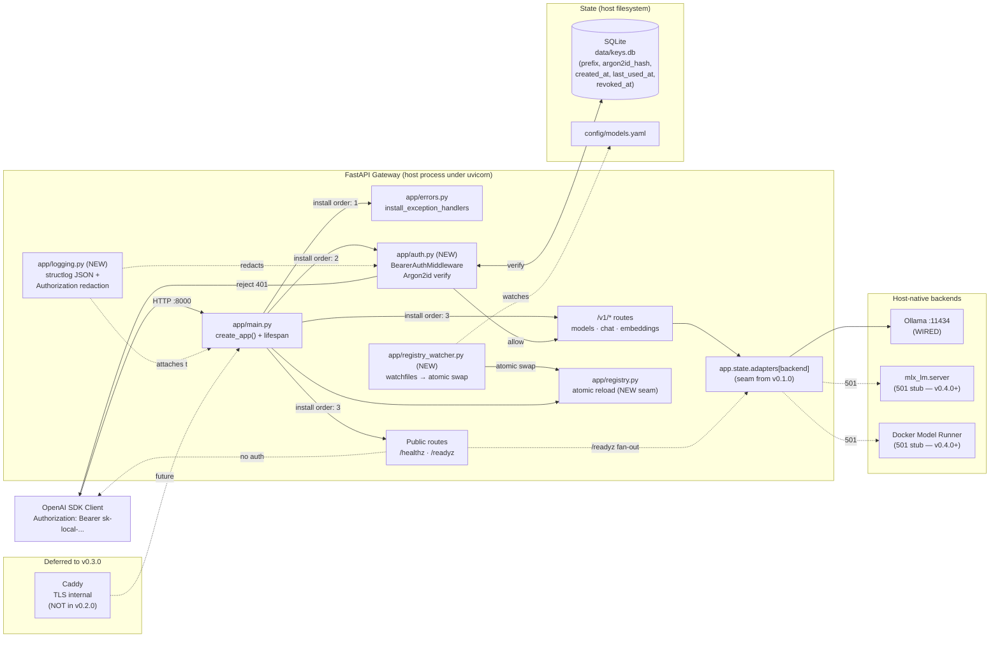
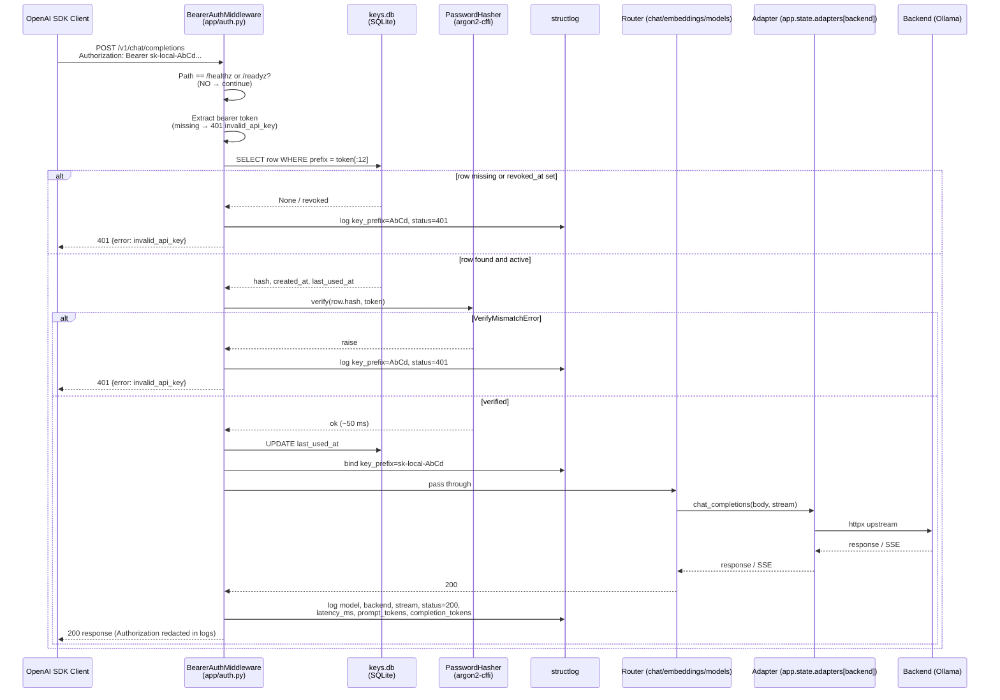
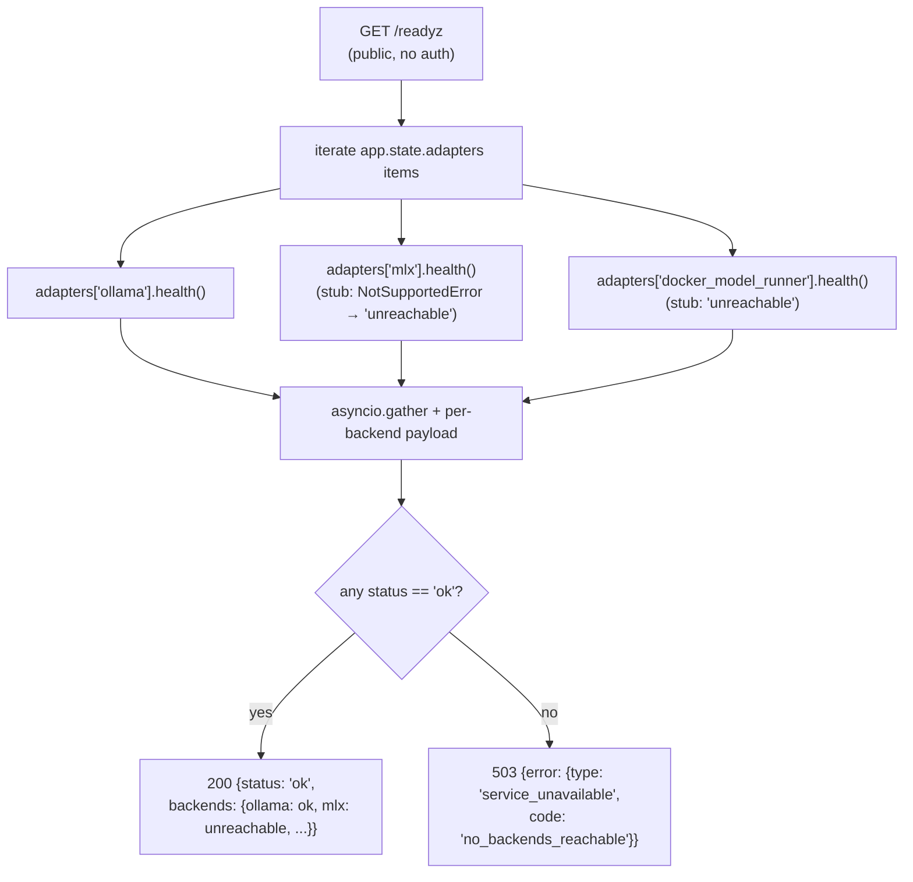
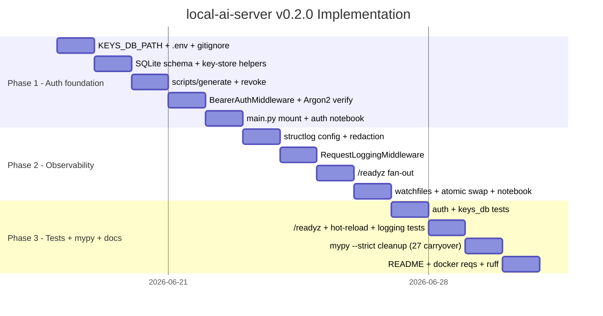

# local-ai-server v0.2.0 — Development Plan

## 1. Overview

- **Purpose**: layer API-key authentication and structured observability onto the v0.1.0 OpenAI-compatible gateway, hardening the LAN-internal seam that v0.1.0 deliberately left open. Additive, non-breaking — same wire shapes, same routing, same SDK clients.
- **Scope**: Argon2id-backed bearer auth on `/v1/*` with a SQLite key store; `structlog` JSON logging with `Authorization` redaction and per-request `key_prefix`; `/readyz` per-backend health composition over the existing `app.state.adapters[*].health()` seam; `watchfiles`-driven hot-reload of `config/models.yaml` with atomic registry swap; mypy `--strict` clean-up of the 27 findings carried forward from v0.1.0 Phase 3.
- **Baseline**: v0.1.0 shipped on `dev/local-ai-server` with PR #1 open against `main` (commit `094bf90`). The wired surface (Ollama adapter, three `/v1` routers, lifespan-built `app.state.adapters`, OpenAI error envelope, `OllamaAdapter.health()` already implemented per the ABC) is the seam this version extends.
- **Branch model**: continue on `dev/local-ai-server`; phases use `phase/local-ai-server/<N>-<name>` and merge back into `dev/local-ai-server`. Version-bump PR against `main` after all three phases land.
- **Out of scope (deferred)**: Caddy / TLS / `compose.yaml` / `Dockerfile.gateway` / LAN binding / `CORS_ORIGINS` / `LAN_IP` (v0.3.0); real MLX (`mlx_lm.server`) and Docker Model Runner adapters, host-side `Makefile` (v0.4.0+); per-key rate limits, quotas, usage metering, Prometheus, MLX tool-call normalization (post-v1, spec §15).

---

## 2. User Requirements

- **API-key authentication** — bearer token `sk-local-...` required on all `/v1/*` routes; `/healthz` and `/readyz` remain public; key format and SQLite schema match spec §7.1–§7.2 (`prefix` PK + `argon2id_hash` + `created_at` / `last_used_at` / `revoked_at` / `name`).
- **Argon2id verification** — never store plaintext; verify per request via `argon2-cffi`'s `PasswordHasher().verify()`; constant-time compare via the library; touch `last_used_at` on success.
- **Key-mint and revoke CLIs** — `python scripts/generate_api_key.py --name <name>` prints `sk-local-...` exactly once and writes the row; `python scripts/revoke_api_key.py --prefix <prefix>` sets `revoked_at`.
- **OpenAI envelope on auth failures** — 401 (missing / malformed / unknown / revoked / hash mismatch) returns `{"error": {"type": "invalid_request_error", "message": "...", "param": "Authorization", "code": "invalid_api_key"}}`; SDK clients see the same shape they get from OpenAI.
- **`/readyz` per-backend composition** — fans out to every `app.state.adapters[backend].health()`; returns 200 if any backend reachable with a payload listing per-backend status; returns 503 with the same envelope only if every backend is unreachable. The `health()` method is already on the ABC and already implemented for `OllamaAdapter` in v0.1.0.
- **Structured JSON logging** — replace stdlib `logging` with `structlog` everywhere; per-request fields per spec §8 (`key_prefix`, `model`, `backend`, `stream`, `status`, `latency_ms`, `prompt_tokens`, `completion_tokens`); global redaction of `Authorization` headers; stdout-only (Docker handles files in v0.3.0).
- **Hot-reload of `config/models.yaml`** — `watchfiles` watches the file; on change, the registry rebuilds atomically (whole `Registry` instance swap, never in-place mutation); no process restart; in-flight requests complete against the registry snapshot they entered with.
- **mypy `--strict` clean** — clear the 27 findings flagged in `pm/v0_1_0/phase-3-architecture.md` §11 row 2, plus any new findings introduced by auth and observability code.
- **Dev-container parity** — `docker/requirements.txt` extended with `argon2-cffi`, `structlog`, `watchfiles` so the dev environment matches the gateway runtime.
- **Notebook demos** — auth flow notebook (key-mint + authenticated request + 401 path) in Phase 1; `/readyz` + hot-reload notebook in Phase 2; no notebook in Phase 3 (no new user-facing surface).

---

## 3. Project Status

- [ ] Phase 1: Auth foundation — pending
- [ ] Phase 2: Observability — pending
- [ ] Phase 3: Tests + mypy + docs — pending

---

## 4. Architecture

### 4.1 System Architecture (v0.2.0)



### 4.2 Authenticated Request Sequence



### 4.3 `/readyz` Fan-out



### 4.4 Hot-reload of `config/models.yaml`

```mermaid
sequenceDiagram
    participant FS as filesystem
    participant W as watchfiles task<br/>(app/registry_watcher.py)
    participant M as app.state
    participant Req as in-flight request

    Note over W: started in lifespan startup;<br/>cancelled in lifespan shutdown
    Req->>M: enter handler — snapshot reg = app.state.registry
    FS->>W: change event on config/models.yaml
    W->>W: load_registry(path) → new_reg
    alt parse failure
        W->>W: log warning; keep current registry
    else parse ok
        W->>M: app.state.registry = new_reg (atomic ref swap)
    end
    Req->>Req: continues with old reg (no torn read)
    Note over Req: subsequent requests see new_reg
```

### 4.5 Auth Middleware Install Order

The middleware fires **after** Starlette's exception-handling stack is registered so that handler-emitted responses (422 from validation, 501 from `NotSupportedError`, 500 catch-all) still flow through the redaction layer. Concretely, `create_app()` orders:

1. `install_exception_handlers(app)` — registers `HTTPException`, `NotSupportedError`, `RequestValidationError`, and the catch-all (already shipped in v0.1.0).
2. `app.add_middleware(BearerAuthMiddleware)` — new in v0.2.0.
3. `app.include_router(...)` — health, models, chat, embeddings (unchanged from v0.1.0; `health.py` gains a `/readyz` route).

In Starlette, middleware added later wraps closer to the application; exception handlers wrap **outside** middleware. With this order, a router exception flows: router → middleware → exception handler → JSON response → middleware (sees the 401/etc. status for logging) → client.

---

## 5. Core Components

### 5.1 Authentication

**Module**: `app/auth.py` (NEW), `scripts/`

| Component | Responsibility |
|-----------|----------------|
| `app/auth.py` | `BearerAuthMiddleware` (ASGI middleware), `verify(token)`, key-store helpers (`get_row`, `touch`, `insert`, `revoke`), `PREFIX_LEN = 12`, public-path allowlist (`/healthz`, `/readyz`, `/docs`, `/openapi.json`, `/redoc`). |
| `scripts/generate_api_key.py` | CLI: generates `sk-local-<urlsafe-32>`, hashes via Argon2id, inserts row, prints plaintext exactly once. `--name <name>` required. |
| `scripts/revoke_api_key.py` | CLI: sets `revoked_at = now` on a `--prefix <prefix>` row; refuses unknown prefixes. |
| `data/keys.db` | SQLite file (gitignored). Schema per spec §7.2; created on first run if missing (script bootstraps the schema via `CREATE TABLE IF NOT EXISTS`). |

**Key-store schema** (mirrors spec §7.2 exactly):

```sql
CREATE TABLE IF NOT EXISTS api_keys (
  prefix       TEXT PRIMARY KEY,
  hash         TEXT NOT NULL,
  name         TEXT,
  created_at   INTEGER NOT NULL,
  last_used_at INTEGER,
  revoked_at   INTEGER
);
```

**Middleware contract**:

```python
class BearerAuthMiddleware:
    def __init__(self, app: ASGIApp, *, db_path: Path) -> None: ...
    async def __call__(self, scope: Scope, receive: Receive, send: Send) -> None:
        # 1. let lifespan / websocket scopes pass through unmodified
        # 2. for http: skip auth on PUBLIC_PATHS
        # 3. extract Authorization → 401 invalid_api_key on miss/malformed
        # 4. verify(token) → 401 on failure
        # 5. set scope['state'].key_prefix = token[:PREFIX_LEN]
        # 6. await self.app(scope, receive, send)
```

### 5.2 Observability

**Module**: `app/logging.py` (NEW), `app/middleware_logging.py` (NEW)

| Component | Responsibility |
|-----------|----------------|
| `app/logging.py` | `configure_structlog(level)`: configures structlog with `JSONRenderer`, `add_log_level`, `TimeStamper(fmt='iso', utc=True)`, `EventRenamer('event')`, and a custom `redact_authorization` processor that scrubs any `Authorization` value down to the 12-char prefix. Replaces all stdlib `logging.basicConfig` calls. |
| `app/middleware_logging.py` | `RequestLoggingMiddleware`: wraps each `/v1/*` request with timing; emits one structlog event per response containing `key_prefix`, `model`, `backend`, `stream`, `status`, `latency_ms`, and (when present in upstream `usage`) `prompt_tokens` and `completion_tokens`. Pulls `model` from the JSON body for `/v1/chat/completions` and `/v1/embeddings`; `backend` is resolved via `app.state.registry.lookup(model).backend`. |

**Field schema (per spec §8)**:

```json
{
  "ts": "2026-06-18T10:11:12Z",
  "level": "INFO",
  "event": "chat_completion",
  "key_prefix": "sk-local-AbCd",
  "model": "ollama-llama3",
  "backend": "ollama",
  "stream": true,
  "status": 200,
  "latency_ms": 1843,
  "prompt_tokens": 137,
  "completion_tokens": 412
}
```

For streaming responses, token counts come from the final upstream chunk if Ollama emits a `usage` block; if absent, the fields are omitted (never set to placeholder values). For non-streaming, they come from `response.json()["usage"]`.

### 5.3 `/readyz` per-backend health

**Module**: `app/routers/health.py` (extended)

| Component | Responsibility |
|-----------|----------------|
| `GET /healthz` | Unchanged from v0.1.0. Always 200. |
| `GET /readyz` | New. Iterates `request.app.state.adapters.items()`; calls `health()` on each via `asyncio.gather(..., return_exceptions=True)`; aggregates into `{"status": "ok"\|"degraded"\|"unreachable", "backends": {<name>: <payload>}}`. Returns 200 when any backend reports `ok`; 503 only when none do. Public — no auth required. |

### 5.4 Hot-reload

**Module**: `app/registry_watcher.py` (NEW), `app/registry.py` (no changes — atomic swap is at `app.state` level)

| Component | Responsibility |
|-----------|----------------|
| `app/registry_watcher.py` | `start_registry_watcher(app, settings)` returns an `asyncio.Task` that runs `watchfiles.awatch(settings.models_yaml_path)`; on each batched change event, calls `load_registry(path)` and assigns `app.state.registry = new_registry` only if the parse succeeds. Cancellation-safe. |
| Lifespan integration | The lifespan in `app/main.py` starts the watcher task at startup and cancels + awaits it at shutdown. Watcher errors never bring down the app — failed reloads are logged and the previous registry stays live. |

**Atomic-swap discipline**: `app.state.registry` is a reference holder. Routers must either (a) snapshot `request.app.state.registry` once at handler entry and use that snapshot throughout, or (b) tolerate a midstream swap (only the `/v1/models` listing handler does this safely, since it's a single read). The Phase 2 architecture document will pin the discipline in code review.

### 5.5 Configuration

**Module**: `app/config.py` (extended), `config/.env.example` (extended)

| Component | Responsibility |
|-----------|----------------|
| `app/config.py` | Adds `keys_db_path: Path` (alias `KEYS_DB_PATH`, default `Path("./data/keys.db")`). Existing fields unchanged. |
| `config/.env.example` | Documents `KEYS_DB_PATH`. `CORS_ORIGINS` and `LAN_IP` stay deferred to v0.3.0. |

### 5.6 Tests

**Module**: `tests/` (extended)

| Component | Responsibility |
|-----------|----------------|
| `tests/test_auth.py` | NEW. End-to-end via `TestClient` against a temp SQLite DB. Cases: missing header → 401; malformed header → 401; unknown prefix → 401; revoked key → 401; valid key → 200; envelope shape per spec; `last_used_at` updates after a successful call. |
| `tests/test_readyz.py` | NEW. `/readyz` is public (no auth). With Ollama up: 200 + `backends.ollama.status == "ok"`. With Ollama unreachable (httpx mock): 503 + `error.code == "no_backends_reachable"`. With one of three reachable: 200 + `backends.<x>.status == "ok"`. |
| `tests/test_hot_reload.py` | NEW. Boots the app with a temp `models.yaml`; mutates the file (adds an entry); polls `/v1/models`; asserts the new id appears within 2 s. Asserts `app.state.registry` is a different object after the swap. |
| `tests/test_logging.py` | NEW. Patches structlog's renderer to capture records; issues an authenticated request; asserts the JSON record contains `key_prefix`, `model`, `backend`, `stream`, `status`, `latency_ms`; greps the captured output for the literal string `Bearer sk-local-` and asserts **zero** occurrences (only the 12-char prefix may appear, never the full token). |
| `tests/test_keys_db.py` | NEW. Direct unit tests for `app.auth.{insert,get_row,touch,revoke}` against a temp SQLite. |
| `tests/conftest.py` | EXTENDED. Adds `temp_keys_db` fixture (creates a temp SQLite, mints one valid key, returns `(db_path, plaintext, prefix)`); adds `client_with_auth` fixture (TestClient with `KEYS_DB_PATH` pointed at the temp DB and an `Authorization: Bearer` header preset on the helper); existing fixtures unchanged. |
| `tests/test_*.py` (existing) | EXTENDED only as needed: existing v0.1.0 tests that hit `/v1/*` must use `client_with_auth` instead of `client` (or supply the header explicitly) so the tests stay green under the new middleware. The `live` marker / Ollama probe is unchanged. |

### 5.7 Notebooks

**Module**: `posts/`

| Component | Responsibility |
|-----------|----------------|
| `posts/v0_2_0_auth_demo.ipynb` | Phase 1 deliverable. Demonstrates `python scripts/generate_api_key.py --name claude-code` from a notebook cell, captures the printed key, and runs an authenticated `OpenAI` SDK call against `http://127.0.0.1:8000/v1`. Shows the 401 response body when no key is sent and when a revoked key is sent. |
| `posts/v0_2_0_readyz_hotreload_demo.ipynb` | Phase 2 deliverable. Probes `/readyz` (Ollama up vs simulated-down via temporarily wrong `OLLAMA_BASE_URL`); mutates `config/models.yaml` from a cell and shows `/v1/models` reflecting the change within ~1 s. |

No notebook in Phase 3 (no new user-facing surface).

---

## 6. Infrastructure

v0.2.0 still runs as a **plain host process** under `uv run uvicorn`. No Docker image, no Compose, no Caddy, no LAN binding — those land in v0.3.0.

- **Runtime host**: macOS Mac Studio; Python 3.12 via `uv`.
- **Backend dependency**: same as v0.1.0 — host-native `ollama serve` on `:11434` with `llama3.1:8b` and `nomic-embed-text` pulled. Phase 2 + Phase 3 test checkpoints assume this prereq.
- **State files**:
  - `data/keys.db` (SQLite) — created by `scripts/generate_api_key.py` on first run; gitignored.
  - `config/models.yaml` — same layout as v0.1.0; now hot-reloaded.
- **Network exposure**: gateway still binds to `127.0.0.1:8000` by default. LAN binding is v0.3.0.
- **Dev container**: `.devcontainer/` unchanged; `docker/requirements.txt` extended in Phase 3 with `argon2-cffi`, `structlog`, `watchfiles` for parity.

**Sample `config/.env.example` (v0.2.0)**:
```env
GATEWAY_HOST=127.0.0.1
GATEWAY_PORT=8000
MODELS_YAML_PATH=./config/models.yaml
LOG_LEVEL=INFO
OLLAMA_BASE_URL=http://localhost:11434
KEYS_DB_PATH=./data/keys.db
```

**Sample `.gitignore` additions (Phase 1)**:
```
data/
data/*.db
data/*.db-journal
```

---

## 7. Project Structure

```
local-ai-server/
├── app/
│   ├── __init__.py
│   ├── main.py                      # MODIFIED — middleware mount, watcher start, structlog wiring
│   ├── config.py                    # MODIFIED — add keys_db_path
│   ├── schemas.py                   # unchanged
│   ├── registry.py                  # unchanged (atomic swap is at app.state level)
│   ├── registry_watcher.py          # NEW — watchfiles task
│   ├── errors.py                    # unchanged from v0.1.0
│   ├── auth.py                      # NEW — BearerAuthMiddleware, key-store helpers
│   ├── logging.py                   # NEW — structlog configuration + redaction
│   ├── middleware_logging.py        # NEW — RequestLoggingMiddleware
│   ├── routers/
│   │   ├── __init__.py
│   │   ├── health.py                # MODIFIED — add /readyz
│   │   ├── models.py                # unchanged
│   │   ├── chat.py                  # unchanged
│   │   └── embeddings.py            # unchanged
│   └── adapters/                    # unchanged from v0.1.0
├── config/
│   ├── models.yaml
│   └── .env.example                 # MODIFIED — add KEYS_DB_PATH
├── data/                            # NEW (gitignored)
│   └── keys.db                      # SQLite key store, generated by scripts
├── scripts/                         # NEW directory
│   ├── generate_api_key.py          # NEW
│   └── revoke_api_key.py            # NEW
├── tests/
│   ├── conftest.py                  # MODIFIED — temp_keys_db, client_with_auth
│   ├── test_auth.py                 # NEW
│   ├── test_keys_db.py              # NEW
│   ├── test_readyz.py               # NEW
│   ├── test_hot_reload.py           # NEW
│   ├── test_logging.py              # NEW
│   ├── test_chat.py                 # MODIFIED — auth header
│   ├── test_chat_streaming.py       # MODIFIED — auth header
│   ├── test_embeddings.py           # MODIFIED — auth header
│   ├── test_models_endpoint.py      # MODIFIED — auth header
│   ├── test_registry.py             # unchanged
│   └── adapters/                    # unchanged
├── posts/
│   ├── v0_2_0_auth_demo.ipynb              # NEW (Phase 1)
│   └── v0_2_0_readyz_hotreload_demo.ipynb  # NEW (Phase 2)
├── docker/
│   └── requirements.txt             # MODIFIED — argon2-cffi, structlog, watchfiles
├── pyproject.toml                   # MODIFIED — bump version, add 3 runtime deps
├── README.md                        # MODIFIED — auth section, /readyz, hot-reload
├── ruff.toml                        # unchanged (quote-style fix from v0.1.0 stays clean)
├── .gitignore                       # MODIFIED — data/, *.db
└── pm/v0_2_0/
    ├── summary.md                   # existing
    └── development_plan.md          # this file
```

---

## 8. Implementation Plan

### Part A — Gantt Chart



Total: ~13 working days (1 = 5 d, 2 = 4 d, 3 = 4 d).

### Part B — Level of Effort Table

> **Note**: token estimates are output tokens (generated code + explanation). Input tokens add roughly **2-3x** on top.

| Phase | Component | Complexity | Est. Tokens | Model | Agent | Rationale |
|-------|-----------|------------|-------------|-------|-------|-----------|
| **1 - Auth foundation** | `app/config.py` extension (`KEYS_DB_PATH`) | Low | ~0.5K | Sonnet | Builder | One field on an existing pydantic-settings class. |
| | `config/.env.example` + `.gitignore` extension | Low | ~0.5K | Sonnet | Builder | Mechanical. |
| | SQLite schema + key-store helpers (`insert`, `get_row`, `touch`, `revoke`) | Med | ~2K | Sonnet | Builder | Schema is pinned by spec §7.2; standard `sqlite3` plumbing with parameterized queries. |
| | `scripts/generate_api_key.py` (urlsafe gen + Argon2 hash + insert + print-once) | Med | ~2K | Opus | Architect | "Print plaintext exactly once" is a security-load-bearing UX choice; CLI ergonomics matter. |
| | `scripts/revoke_api_key.py` | Low | ~1K | Sonnet | Builder | Trivial UPDATE. |
| | `app/auth.py` — `BearerAuthMiddleware` + `verify()` + public-path allowlist | High | ~4K | Opus | Architect | ASGI middleware ordering, async DB access, Argon2 verify error mapping, OpenAI envelope on 401, websocket/lifespan scope pass-through. Load-bearing security seam. |
| | `app/main.py` middleware mount in `create_app()` | Low | ~1K | Sonnet | Builder | One `add_middleware` line plus an import; ordering is spelled out in §4.5. |
| | `posts/v0_2_0_auth_demo.ipynb` | Med | ~2.5K | Sonnet | Builder | Notebook narrative + standard openai SDK calls; key-mint cell uses subprocess. |
| | **Phase 1 subtotal** | | **~13.5K** | | | |
| **2 - Observability** | `app/logging.py` (structlog config + Authorization redactor) | Med | ~2.5K | Opus | Architect | Processor-chain ordering and the redaction predicate are subtle; getting it wrong leaks tokens. |
| | `app/middleware_logging.py` (per-request structured event) | Med | ~2.5K | Opus | Architect | Reading `model` from a JSON body without consuming it for the downstream router (must `body()` re-issue) is the core gotcha. |
| | `app/main.py` — replace stdlib logging calls with structlog binders + start watcher task | Low | ~1K | Sonnet | Builder | Mechanical sweep. |
| | `app/routers/health.py` extension — `/readyz` fan-out | Med | ~2K | Sonnet | Builder | `asyncio.gather(return_exceptions=True)` over `app.state.adapters`; routing logic is small. |
| | `app/registry_watcher.py` (watchfiles task + atomic swap) | High | ~3K | Opus | Architect | Race-window analysis (in-flight requests vs swap), cancel-safety on lifespan shutdown, error containment when a malformed YAML is saved. |
| | `posts/v0_2_0_readyz_hotreload_demo.ipynb` | Med | ~2K | Sonnet | Builder | Demonstrate, don't design. |
| | **Phase 2 subtotal** | | **~13K** | | | |
| **3 - Tests + mypy + docs** | `tests/conftest.py` extensions (`temp_keys_db`, `client_with_auth`) | Med | ~2K | Sonnet | QA | Fixture wiring; pytest patterns. |
| | `tests/test_auth.py` (401 / 403 / 200 paths) | Med | ~2.5K | Opus | QA | Edge-case enumeration: missing / malformed / unknown / revoked / hash mismatch / valid; envelope shape assertions. |
| | `tests/test_keys_db.py` | Low | ~1K | Sonnet | QA | Direct CRUD over the helpers. |
| | `tests/test_readyz.py` (live + httpx-mocked unreachable) | Med | ~2K | Sonnet | QA | Mix of live and mock; standard pytest-httpx. |
| | `tests/test_hot_reload.py` (mutate yaml, poll /v1/models) | Med | ~2K | Opus | QA | Timing-sensitive — needs deterministic polling + atomic-swap assertion via id check. |
| | `tests/test_logging.py` (structured fields + redaction grep) | Med | ~2K | Opus | QA | Hooking structlog's renderer in tests is non-obvious; redaction grep is the load-bearing security check. |
| | Existing tests modified for auth header | Low | ~1K | Sonnet | QA | Mechanical fixture swap. |
| | mypy `--strict` cleanup (27 carryover + new from auth/obs) | Med | ~3K | Opus | Architect | Each finding needs a real fix (not `# type: ignore`); pulling on one thread (e.g. `errors.py` handler signatures) often surfaces several. |
| | README v0.2.0 rewrite (auth section, key mint flow, /readyz, hot-reload) | Med | ~3K | Opus | Architect | Public-facing doc; tone + accuracy. |
| | `docker/requirements.txt` extension | Low | ~0.5K | Sonnet | Builder | Three lines. |
| | `pyproject.toml` version bump + 3 deps | Low | ~0.5K | Sonnet | Builder | Mechanical. |
| | Final `ruff check .` pass | Low | ~0.5K | Sonnet | QA | Should be already clean (the v0.1.0 `quote-style` fix is in place); confirm and commit. |
| | **Phase 3 subtotal** | | **~20K** | | | |
| | **Grand total** | | **~46.5K** | | | |

### Part C — Per-Phase Detail

#### Phase 1 — Auth foundation

- **Goal**: bearer middleware on all `/v1/*` routes; SQLite key store with the spec §7.2 schema; key-mint and revoke CLIs working; `/healthz` and `/readyz` remain unauthenticated; existing `/v1/*` flows still work end-to-end with a freshly minted key.
- **Dependencies**: v0.1.0 merged on `dev/local-ai-server`.
- **Branch**: `phase/local-ai-server/1-auth`.
- **Notebook**: applicable — `posts/v0_2_0_auth_demo.ipynb`.

| Step | Task | Files |
|------|------|-------|
| 1.1 | Bump `pyproject.toml` to `version = "0.2.0"`; add `argon2-cffi>=23.1` to runtime deps; `uv sync`. | `pyproject.toml`, `uv.lock` |
| 1.2 | Extend `app/config.py` with `keys_db_path: Path = Field(default=Path("./data/keys.db"), alias="KEYS_DB_PATH")`. | `app/config.py` |
| 1.3 | Extend `config/.env.example` with `KEYS_DB_PATH=./data/keys.db`. | `config/.env.example` |
| 1.4 | Extend `.gitignore` with `data/`, `data/*.db`, `data/*.db-journal`. | `.gitignore` |
| 1.5 | Implement `app/auth.py` key-store helpers: `_init_db(path)` (CREATE TABLE IF NOT EXISTS), `insert(path, prefix, hash, name)`, `get_row(path, prefix) -> Row \| None`, `touch(path, prefix)`, `revoke(path, prefix) -> bool`. Use stdlib `sqlite3` with parameterized queries; open per-call connections (not a pool) — keys.db is low-traffic. | `app/auth.py` |
| 1.6 | Implement `scripts/generate_api_key.py`: parse `--name`; generate `sk-local-` + `secrets.token_urlsafe(32)`; compute Argon2id hash via `argon2.PasswordHasher().hash(token)`; insert row with `prefix = token[:12]`, `created_at = int(time.time())`; print plaintext to stdout exactly once. | `scripts/generate_api_key.py` |
| 1.7 | Implement `scripts/revoke_api_key.py`: parse `--prefix`; call `revoke(...)`; exit non-zero with a clear message if prefix unknown. | `scripts/revoke_api_key.py` |
| 1.8 | Implement `BearerAuthMiddleware` in `app/auth.py` per §5.1 contract: handle non-http scopes, public-path allowlist, missing/malformed Authorization → 401, `verify(token)` → `False` on miss/revoked/`VerifyMismatchError`, attach `key_prefix` to `scope['state']`, touch `last_used_at` on success. Emit OpenAI envelope on 401. | `app/auth.py` |
| 1.9 | Mount the middleware in `app/main.py` `create_app()` between `install_exception_handlers(app)` and the router includes (order per §4.5). Read `keys_db_path` from settings. | `app/main.py` |
| 1.10 | Author `posts/v0_2_0_auth_demo.ipynb`: cell 1 runs `python scripts/generate_api_key.py --name notebook-demo` via `subprocess`, captures stdout, parses out the `sk-local-...` line; cell 2 starts the gateway (or assumes it's running); cell 3 makes an authenticated `openai.OpenAI(base_url=..., api_key=token)` call; cell 4 demonstrates a no-key call and prints the 401 envelope. | `posts/v0_2_0_auth_demo.ipynb` |

**Test checkpoint** (Phase 1):

> Prereqs: `ollama serve` on `:11434` (for the round-trip step 7).

```bash
cd /Users/ramikrispin/Personal/tutorials/local-ai-server

# 1. install deps
uv sync

# 2. mint a key
mkdir -p data
KEY=$(uv run python scripts/generate_api_key.py --name claude-code | grep -oE 'sk-local-[A-Za-z0-9_-]+')
echo "minted: ${KEY:0:16}..."
# expected: minted: sk-local-XXXXXXXX...

# 3. verify schema + row exists
uv run python -c "
import sqlite3
c = sqlite3.connect('data/keys.db')
print(sorted(r[0] for r in c.execute('SELECT name FROM sqlite_master WHERE type=\"table\"')))
print(c.execute('SELECT prefix, name, revoked_at FROM api_keys').fetchall())
"
# expected: ['api_keys']
#           [('sk-local-XXXX', 'claude-code', None)]

# 4. boot the gateway
uv run uvicorn app.main:app --port 8000 &
sleep 2

# 5. /healthz public (no key)
curl -sS -o /dev/null -w "%{http_code}\n" http://127.0.0.1:8000/healthz
# expected: 200

# 6. /v1/models without key → 401 + envelope
curl -sS http://127.0.0.1:8000/v1/models | python -m json.tool
# expected: {"error": {"type": "invalid_request_error", "message": "...",
#                       "param": "Authorization", "code": "invalid_api_key"}}

# 7. /v1/models with key → 200
curl -sS -H "Authorization: Bearer $KEY" http://127.0.0.1:8000/v1/models \
  | python -c "import sys,json; print(len(json.load(sys.stdin)['data']))"
# expected: 4

# 8. revoke the key, retry → 401
PREFIX=${KEY:0:12}
uv run python scripts/revoke_api_key.py --prefix "$PREFIX"
curl -sS -o /dev/null -w "%{http_code}\n" -H "Authorization: Bearer $KEY" \
  http://127.0.0.1:8000/v1/models
# expected: 401

# 9. malformed header → 401
curl -sS -o /dev/null -w "%{http_code}\n" -H "Authorization: Token $KEY" \
  http://127.0.0.1:8000/v1/models
# expected: 401

kill %1
```

**Done when**: every step above produces the expected output; the auth notebook runs top-to-bottom; `/healthz` is public; `/v1/*` rejects missing / malformed / unknown / revoked tokens with the OpenAI 401 envelope; `last_used_at` updates after a successful call (verifiable via `sqlite3 data/keys.db "SELECT last_used_at FROM api_keys"`).

---

#### Phase 2 — Observability

- **Goal**: every log line is structured JSON with `Authorization` redacted; `/v1/*` request lines carry `key_prefix`, `model`, `backend`, `stream`, `status`, `latency_ms`, and (when available) token counts; `/readyz` returns per-backend status; mutating `config/models.yaml` causes `/v1/models` to reflect the change within ~1 s without process restart.
- **Dependencies**: Phase 1 merged.
- **Branch**: `phase/local-ai-server/2-observability`.
- **Notebook**: applicable — `posts/v0_2_0_readyz_hotreload_demo.ipynb`.

| Step | Task | Files |
|------|------|-------|
| 2.1 | Add `structlog>=24.4` and `watchfiles>=0.24` to `pyproject.toml` runtime deps; `uv sync`. | `pyproject.toml`, `uv.lock` |
| 2.2 | Implement `app/logging.py`: `configure_structlog(level)` with processor chain — `add_log_level`, `TimeStamper(fmt='iso', utc=True, key='ts')`, `EventRenamer('event')`, `redact_authorization` (custom processor), `JSONRenderer()`. Bridge stdlib loggers via `structlog.stdlib.ProcessorFormatter` so existing `logging.getLogger(...)` calls in app code emit JSON too. | `app/logging.py` |
| 2.3 | Implement `redact_authorization`: walks the event_dict; if any key matches `authorization` (case-insensitive) or any value is a string starting with `Bearer sk-local-` or `Bearer `, replace with `<redacted>` plus, when applicable, the 12-char prefix. Unit-tested in Phase 3. | `app/logging.py` |
| 2.4 | Implement `app/middleware_logging.py` `RequestLoggingMiddleware`: time the request, on response read `scope['state'].key_prefix` (set by auth middleware), best-effort extract `model` from cached request body (for `/v1/chat/completions`, `/v1/embeddings`), look up `backend` via `app.state.registry`, capture `stream` flag, capture upstream `usage` block when present (non-streaming: response body; streaming: final SSE chunk if upstream emits one). Emit one `event="request"` log entry with all fields. | `app/middleware_logging.py` |
| 2.5 | Wire both into `app/main.py`: replace `logging.basicConfig(...)` with `configure_structlog(settings.log_level)`; mount `RequestLoggingMiddleware` after `BearerAuthMiddleware` so the auth middleware's `key_prefix` is visible. Replace existing `logging.getLogger("app.main")` startup log with a structlog call that emits the same `registry loaded: ...` event (test assertion in Phase 3). | `app/main.py` |
| 2.6 | Extend `app/routers/health.py` with `GET /readyz`: iterate `request.app.state.adapters.items()`; `await asyncio.gather(*(a.health() for a in adapters.values()), return_exceptions=True)`; build `{"status": <agg>, "backends": {<name>: <payload-or-error>}}`. 200 if any `status == "ok"`, else 503 with the OpenAI envelope (`type=service_unavailable`, `code=no_backends_reachable`). | `app/routers/health.py` |
| 2.7 | Implement `app/registry_watcher.py`: `start_registry_watcher(app, settings) -> asyncio.Task` that awaits `watchfiles.awatch(path)` and on each batched event calls `load_registry(path)`. On parse success: `app.state.registry = new_registry` (atomic ref swap). On parse failure: log a warning event (`event="registry_reload_failed"`), keep the previous registry. Cancel-safe on lifespan shutdown. | `app/registry_watcher.py` |
| 2.8 | Wire the watcher task into the lifespan in `app/main.py`: start at startup, cancel + await at shutdown. The watcher does NOT rebuild adapters — adapters stay constructed from the startup registry; in v0.2.0, adding a model that targets an existing backend works (uses the existing adapter); adding a new backend would require a restart (documented as a v0.2.0 limitation in the README and in `Key Design Decisions` below). | `app/main.py` |
| 2.9 | Author `posts/v0_2_0_readyz_hotreload_demo.ipynb`: cell 1 GETs `/readyz` (Ollama up); cell 2 demonstrates per-backend payload; cell 3 shows the 503 path by temporarily setting `OLLAMA_BASE_URL=http://localhost:9` and rebooting (or by stopping `ollama serve`); cell 4 mutates `config/models.yaml` from a cell, sleeps 1 s, GETs `/v1/models`, asserts the new id. | `posts/v0_2_0_readyz_hotreload_demo.ipynb` |

**Test checkpoint** (Phase 2):

> Prereqs: same as Phase 1 + Ollama running. A valid key minted from Phase 1.

```bash
cd /Users/ramikrispin/Personal/tutorials/local-ai-server
KEY=$(cat .test-key 2>/dev/null || \
      uv run python scripts/generate_api_key.py --name p2-checkpoint | \
      grep -oE 'sk-local-[A-Za-z0-9_-]+' | tee .test-key)

# 1. boot, capture stdout to a file
uv run uvicorn app.main:app --port 8000 > /tmp/lai.log 2>&1 &
sleep 2

# 2. structlog: every line is JSON, including the startup line
head -5 /tmp/lai.log | python -c "
import json, sys
for line in sys.stdin:
    if line.strip():
        d = json.loads(line)
        assert 'event' in d, line
print('all startup lines parseable JSON')
"
# expected: all startup lines parseable JSON

# 3. /readyz
curl -sS http://127.0.0.1:8000/readyz | python -m json.tool
# expected: {"status": "ok", "backends": {"ollama": {"status": "ok", ...},
#                                          "mlx": {"status": "unreachable"}, ...}}

# 4. authenticated request → log line carries key_prefix, model, backend
curl -sS -H "Authorization: Bearer $KEY" -X POST \
  http://127.0.0.1:8000/v1/chat/completions \
  -H 'Content-Type: application/json' \
  -d '{"model":"ollama-llama3","messages":[{"role":"user","content":"hi"}]}' \
  > /dev/null
sleep 0.5
tail -20 /tmp/lai.log | python -c "
import json, sys
hits = []
for line in sys.stdin:
    if not line.strip(): continue
    d = json.loads(line)
    if d.get('event') == 'request' and d.get('model') == 'ollama-llama3':
        hits.append(d)
assert hits, 'no request event for ollama-llama3'
d = hits[-1]
for k in ('key_prefix','model','backend','stream','status','latency_ms'):
    assert k in d, f'missing {k}: {d}'
assert d['key_prefix'].startswith('sk-local-'), d
assert len(d['key_prefix']) == 12, d
print('request event ok:', d)
"
# expected: request event ok: {...}

# 5. redaction: Authorization header NEVER appears in plaintext
grep -F "Bearer $KEY" /tmp/lai.log && echo "FAIL: token leaked" || echo "redaction ok"
# expected: redaction ok

# 6. hot-reload: add a model, observe /v1/models
cp config/models.yaml /tmp/models.yaml.bak
python -c "
import yaml
p = 'config/models.yaml'
d = yaml.safe_load(open(p))
d['models'].append({'id':'hot-reload-canary','backend':'ollama',
                    'upstream_model':'llama3.1:8b','capabilities':['chat']})
open(p,'w').write(yaml.safe_dump(d))
"
sleep 1.5
curl -sS -H "Authorization: Bearer $KEY" http://127.0.0.1:8000/v1/models \
  | python -c "
import sys, json
ids = [m['id'] for m in json.load(sys.stdin)['data']]
assert 'hot-reload-canary' in ids, ids
print('hot reload ok:', ids)
"
# expected: hot reload ok: [..., 'hot-reload-canary']
mv /tmp/models.yaml.bak config/models.yaml
sleep 1.5

# 7. /healthz still public + JSON-shaped log line
curl -sS -o /dev/null -w "%{http_code}\n" http://127.0.0.1:8000/healthz
# expected: 200

kill %1
```

**Done when**: every step above produces the expected output; `/readyz` reflects per-backend health; mutating `config/models.yaml` is reflected in `/v1/models` within ~1.5 s; the demo notebook runs top-to-bottom; no `Authorization` plaintext appears in log output; the structlog migration emits a `registry loaded` startup event (preserving the v0.1.0 behavior in JSON form).

---

#### Phase 3 — Tests + mypy + docs

- **Goal**: live + mocked test suite green covering auth, `/readyz`, hot-reload, and structlog redaction; `mypy --strict` clean (27 carryover findings + any new ones); README rewritten for v0.2.0; `docker/requirements.txt` parity; `ruff check .` clean.
- **Dependencies**: Phase 2 merged.
- **Branch**: `phase/local-ai-server/3-tests-mypy-docs`.
- **Notebook**: not applicable.

| Step | Task | Files |
|------|------|-------|
| 3.1 | Extend `tests/conftest.py` with `temp_keys_db` (creates a temp SQLite, mints one key via the same helpers as the script, returns `(db_path, plaintext, prefix)`) and `client_with_auth` (TestClient over `create_app()` with `KEYS_DB_PATH` env override and a helper that injects `Authorization: Bearer ...`). Existing fixtures stay untouched. | `tests/conftest.py` |
| 3.2 | Implement `tests/test_keys_db.py` covering `insert` / `get_row` / `touch` / `revoke` directly. | `tests/test_keys_db.py` |
| 3.3 | Implement `tests/test_auth.py`: missing → 401; malformed (`Token X`, `Bearer ` empty, no scheme) → 401; unknown prefix → 401; revoked key → 401; valid key → 200; envelope shape per spec; `last_used_at` updated after success. Uses `client_with_auth`. | `tests/test_auth.py` |
| 3.4 | Implement `tests/test_readyz.py`: live Ollama path (when `ollama_alive` fixture is true) asserts 200 + ollama=ok + mlx/dmr=unreachable; pytest-httpx-mocked path forces all backends to be unreachable and asserts 503 with `code=no_backends_reachable`. | `tests/test_readyz.py` |
| 3.5 | Implement `tests/test_hot_reload.py`: copies `config/models.yaml` to a tempdir, sets `MODELS_YAML_PATH` to that path, boots the app via TestClient (lifespan starts the watcher), polls `/v1/models` for up to 3 s after appending a new entry to the temp YAML, asserts the new id appears, asserts `app.state.registry` object identity changed across the swap. | `tests/test_hot_reload.py` |
| 3.6 | Implement `tests/test_logging.py`: install a list-capturing structlog `ReturnLoggerFactory` for the test; issue an authenticated `/v1/models` call; assert at least one captured event has `event="request"` with all required fields; assert `key_prefix` is exactly the 12-char form; grep all captured events' string repr for `"Bearer "` and assert no occurrences. Also assert that a deliberately injected `_log.info(..., authorization="Bearer leak-me-please")` is redacted by the processor. | `tests/test_logging.py` |
| 3.7 | Update existing `tests/test_chat.py`, `tests/test_chat_streaming.py`, `tests/test_embeddings.py`, `tests/test_models_endpoint.py` to use `client_with_auth` (or to send the bearer header explicitly). No other behavior changes. | `tests/test_chat.py`, `tests/test_chat_streaming.py`, `tests/test_embeddings.py`, `tests/test_models_endpoint.py` |
| 3.8 | Run `uv run mypy app/ --strict`. Fix the 27 findings carried over from v0.1.0 Phase 3 plus any new findings introduced by `app/auth.py`, `app/logging.py`, `app/middleware_logging.py`, `app/registry_watcher.py`, and the `health.py` extension. Prefer real fixes (typed `dict[str, Any]`, narrowing, `cast` only for ASGI scope/state). The exception-handler `# type: ignore[arg-type]` lines in `errors.py` may stay if Starlette's signatures still don't admit the union — flag explicitly in the PR if any remain. | `app/**/*.py` |
| 3.9 | Rewrite `README.md` for v0.2.0: add an Auth section (key-mint flow, the `--name` flag, the print-once behavior, where the SQLite file lives), a `/readyz` example, a hot-reload note, an OpenAI SDK snippet that includes `api_key="sk-local-..."`, and a v0.2.0 entry in the version roadmap. Preserve the existing WIP banner and architecture diagram embed. | `README.md` |
| 3.10 | Extend `docker/requirements.txt` with `argon2-cffi`, `structlog`, `watchfiles` to mirror the runtime. | `docker/requirements.txt` |
| 3.11 | Run `uv run ruff check .` and confirm clean (the v0.1.0 `quote-style` fix in `ruff.toml` carries forward). Fix any new findings introduced in v0.2.0 code. | repo-wide |
| 3.12 | Final regression: run the entire Phase 1 + Phase 2 manual checkpoint scripts end-to-end on a fresh shell and confirm green. | n/a |

**Test checkpoint** (Phase 3):

> Prereqs: same as Phases 1–2 — `ollama serve` running with `llama3.1:8b` and `nomic-embed-text` pulled.

```bash
cd /Users/ramikrispin/Personal/tutorials/local-ai-server

# 1. full pytest suite
uv run pytest -q
# expected: all tests pass; exit 0

# 2. auth + obs tests in isolation (faster signal)
uv run pytest -q tests/test_auth.py tests/test_keys_db.py tests/test_readyz.py \
                 tests/test_hot_reload.py tests/test_logging.py
# expected: all pass

# 3. mypy --strict clean
uv run mypy app/ --strict
# expected: Success: no issues found in N source files

# 4. ruff clean
uv run ruff check .
# expected: All checks passed!

# 5. docker requirements parity
grep -E '^(argon2-cffi|structlog|watchfiles)' docker/requirements.txt
# expected: 3 lines

# 6. README mentions the new surfaces
grep -E '(generate_api_key|/readyz|hot-reload|sk-local-)' README.md | head
# expected: matches present

# 7. version bump landed
grep '^version' pyproject.toml
# expected: version = "0.2.0"
```

**Done when**: every command above succeeds; mypy reports zero errors under `--strict`; the v0.1.0 carryover findings list is now empty; README accurately describes auth + obs + `/readyz` + hot-reload; `docker/requirements.txt` includes the three new deps.

---

## 9. Key Design Decisions

| Decision | Choice | Rationale |
|----------|--------|-----------|
| Auth scheme | Bearer token, `sk-local-` + 32 urlsafe bytes, Argon2id-hashed | Spec §7.1 — matches OpenAI's bearer pattern so SDKs work unchanged; Argon2id is the OWASP-current default; never persists plaintext. |
| Key store backend | SQLite at `KEYS_DB_PATH` (default `./data/keys.db`) | Spec §7.2 — single-file, no service to run; perfect for low-volume key checks. The container path move (`/var/lib/local-ai-server/keys.db`) lands in v0.3.0 with Compose. |
| Verify-per-request | Argon2id `verify()` (~50 ms) is fine in the auth path | Auth is a per-connection / per-request gate, not a hot-loop primitive. 50 ms latency is acceptable for the LAN-local use case. Documented as a budget so future caching (e.g. session tokens) is a deliberate decision, not an emergency fix. |
| Middleware install order | `install_exception_handlers` → `BearerAuthMiddleware` → `RequestLoggingMiddleware` → routers | Exception handlers wrap outside middleware in Starlette so 422/501/500 responses still flow back through the logging middleware (which sees the final status). Auth fires before logging so `key_prefix` is bound onto the scope state by the time logging reads it. |
| Public-path allowlist | `/healthz`, `/readyz`, `/docs`, `/openapi.json`, `/redoc` | Health is operational; OpenAPI docs are convenient for dev. Everything else under `/v1/*` is authenticated. |
| Logging stack | `structlog` JSON renderer with stdlib bridge | Spec §8 — single processor chain, easy to add fields, single source of truth for redaction. The stdlib bridge means existing `logging.getLogger(...)` calls in `app/errors.py` and `app/adapters/ollama.py` keep working without rewrites. |
| Authorization redaction | Processor walks event_dict + scrubs any value starting with `Bearer ` to the 12-char prefix | Defense in depth — even if a future log call accidentally includes the header, redaction catches it. Tested in `tests/test_logging.py` with a deliberate leak attempt. |
| Hot-reload swap discipline | `app.state.registry = new_reg` (whole-instance ref swap) | The `Registry` object is treated as immutable post-load; mutation in place would race with in-flight `/v1/models` reads. Routers are expected to snapshot `request.app.state.registry` at handler entry. |
| Hot-reload scope | Adding/removing/editing models that target existing backends | Adding a *new backend type* (e.g. first-ever MLX entry where no MLX adapter has been built) would require adapter construction — out of scope for v0.2.0; documented as a known limitation. Adapter rebuild on hot-reload is a v0.4.0 follow-up when MLX/DMR adapters become real. |
| `/readyz` aggregation | 200 if any backend `ok`, 503 only if all unreachable | Spec §4.4 — graceful degradation; a single-backend outage shouldn't fail the whole gateway readiness probe. |
| Error envelope on 401 | `type=invalid_request_error`, `code=invalid_api_key`, `param=Authorization` | Matches OpenAI's documented 401 shape so SDK retry/backoff logic treats it identically to upstream OpenAI. |
| Test isolation for auth | Temp SQLite via `temp_keys_db` fixture | Production keys never touched; tests run hermetically; CI-friendly. |
| mypy `--strict` cleanup timing | Phase 3 (closing phase) | Same cadence as v0.1.0 (tests + housekeeping in the closing phase). Carrying the 27 findings forward isn't ideal but keeps Phase 1 and Phase 2 focused on their own surfaces. |
| Caddy / TLS / Compose | Still deferred to v0.3.0 | v0.2.0 is auth + observability only; bundling deployment changes would muddy the diff. |
| Real MLX / DMR adapters | Still deferred to v0.4.0+ | The 501 stubs already exercise the `/readyz` "unreachable" path; that's enough validation surface for v0.2.0. |

---

## 10. Environment Variables

| Variable | Purpose | Source |
|----------|---------|--------|
| `GATEWAY_HOST` | uvicorn bind host (default `127.0.0.1`). | `config/.env` (template: `config/.env.example`) |
| `GATEWAY_PORT` | uvicorn bind port (default `8000`). | `config/.env` |
| `MODELS_YAML_PATH` | Path to the model registry YAML. Watched by `watchfiles` in v0.2.0. | `config/.env` |
| `LOG_LEVEL` | Log level fed to `configure_structlog(...)`. | `config/.env` |
| `OLLAMA_BASE_URL` | Override for the Ollama upstream URL. | `config/.env` |
| **`KEYS_DB_PATH`** | **NEW in v0.2.0.** SQLite path for the API-key store. Default `./data/keys.db`. | `config/.env` |

> **Not in v0.2.0**: `CORS_ORIGINS`, `LAN_IP` — both land with Caddy in v0.3.0.

---

## 11. Evaluation & Success Criteria

### Functional

- [ ] `python scripts/generate_api_key.py --name <name>` mints a key once; the same key passes auth on `/v1/*`; the key plaintext is printed exactly once and never persisted.
- [ ] `python scripts/revoke_api_key.py --prefix <prefix>` flips the key to 401 on subsequent requests.
- [ ] All `/v1/*` routes return 401 with the OpenAI envelope on missing / malformed / unknown / revoked / hash-mismatched keys.
- [ ] `/healthz` and `/readyz` remain public (no auth required); `/healthz` always 200; `/readyz` returns per-backend status with 200 if any backend reachable, 503 if none.
- [ ] Mutating `config/models.yaml` causes `/v1/models` to reflect the change within ~1 s; the gateway process is **not** restarted; in-flight requests are not interrupted.
- [ ] OpenAI Python SDK works against `http://127.0.0.1:8000/v1` with `api_key="sk-local-..."` — no other code changes vs. v0.1.0.

### Quality

- [ ] `uv run pytest -q` is fully green against a live Ollama (`llama3.1:8b` + `nomic-embed-text` pulled).
- [ ] `uv run mypy app/ --strict` reports **zero** errors (the 27 v0.1.0 carryovers + any new ones from auth/obs code).
- [ ] `uv run ruff check .` is clean.
- [ ] No secrets committed; `data/` and `*.db` are gitignored; `.env` already covered from v0.1.0.

### Observability

- [ ] Every gateway log line on stdout is parseable JSON.
- [ ] `/v1/*` request log lines carry `key_prefix`, `model`, `backend`, `stream`, `status`, `latency_ms`; non-streaming chat completions also carry `prompt_tokens` and `completion_tokens` when upstream emits a `usage` block.
- [ ] `key_prefix` is exactly the 12-char `sk-local-XXXX` form; full tokens never appear in any log line (verified by a grep test in `tests/test_logging.py`).
- [ ] The v0.1.0 startup line `registry loaded: N models (...)` is preserved as a structlog event (regression-tested in Phase 3).

### Documentation

- [ ] `README.md` documents the auth flow (mint, revoke, header format, 401 envelope), the `/readyz` payload, and the hot-reload behavior.
- [ ] `posts/v0_2_0_auth_demo.ipynb` and `posts/v0_2_0_readyz_hotreload_demo.ipynb` run top-to-bottom against a live Ollama.
- [ ] `docker/requirements.txt` lists `argon2-cffi`, `structlog`, `watchfiles`.

### Risks & Mitigations

| Risk | Likelihood | Impact | Mitigation |
|------|------------|--------|------------|
| Hot-reload races a streaming request — registry swapped mid-iteration | Med | High (torn read / wrong backend) | Atomic ref swap of the entire `Registry` instance, never in-place mutation. Routers snapshot `request.app.state.registry` once at handler entry. Asserted by `tests/test_hot_reload.py` (object identity changes) and by the streaming test running concurrent with a YAML mutation. |
| Argon2id `verify()` latency (~50 ms) shows up in p99 of cold paths | Med | Low | Spec-acknowledged budget; auth happens once per request, not per token. Documented in §9 ("Verify-per-request") so any future caching is a deliberate choice. |
| structlog migration regresses the v0.1.0 startup event `registry loaded: N models ...` | Med | Low | Phase 3 adds a regression test that captures structlog output and asserts `event="registry_loaded"` (or equivalent) is emitted at startup with the model count. |
| Authorization plaintext leaks into logs (e.g. via FastAPI's request-logging middleware default formatter) | Low | High (security) | The `redact_authorization` processor scrubs any value starting with `Bearer ` regardless of key name; `tests/test_logging.py` deliberately injects a plaintext into a log event and asserts redaction. |
| Auth middleware ordering vs exception handlers wraps responses incorrectly (e.g. 422 from validation slips past `RequestLoggingMiddleware` without `key_prefix`) | Med | Low | Install order is pinned in §4.5 + §9 and verified by `tests/test_logging.py` issuing an intentionally invalid body and asserting the request log entry still carries `key_prefix` (auth ran first) and `status=422`. |
| `watchfiles` fires multiple events for a single editor save (write-then-rename) | Med | Low | `watchfiles.awatch` already debounces by default; the watcher additionally guards against duplicate reloads by checking the new registry has actually changed (compare `tuple(model.id for model in registry)` cheaply) — log a single `registry_reloaded` event. |
| Malformed `models.yaml` saved during edit takes the gateway down | Low | High | Watcher `try/except` around `load_registry`: on failure, log `registry_reload_failed` with the exception and keep the previous registry live. Tested in Phase 3. |
| `data/keys.db` accidentally committed | Low | High (security) | `.gitignore` extension lands in step 1.4; pre-merge check via `git ls-files | grep keys.db` returns empty in the PR review checklist. |
| Existing v0.1.0 tests break under the new auth middleware (no header) | High | Low (mechanical) | `client_with_auth` fixture lands in step 3.1 before any existing test is modified; the migration is a single-line fixture swap per file. |
| `quote-style` regression in `ruff.toml` reappears | Low | Low | The v0.1.0 fix is in place; Phase 3 step 3.11 confirms `ruff check .` clean before merge. |
| Scope creep into Caddy / Compose / real MLX during the auth phase | High | Med (delays v0.2.0) | This plan and the §1 + §9 entries explicitly enumerate what's deferred. Phase 1 must not touch `caddy/`, `compose.yaml`, `Dockerfile.gateway`, `Makefile`, or any `app/adapters/{mlx,docker_model_runner}.py` body. |
